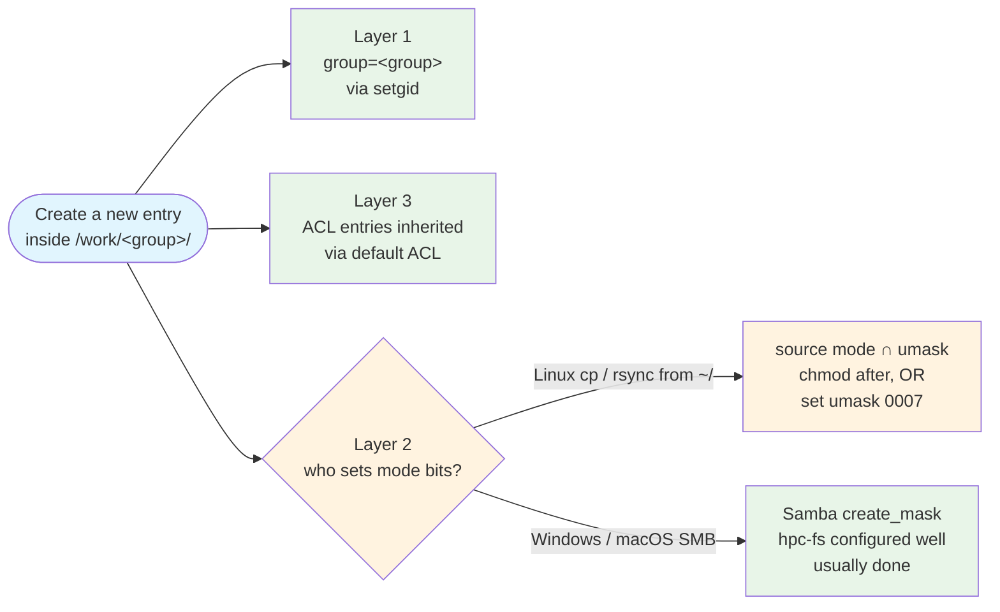

# Permissions Don't Move: A `/work/<group>` Survival Guide

<!-- markdownlint-configure-file { "MD051": false } -->

Putting files into a shared `/work/<group>/` folder is a ==three-layer problem==: get the ==group== right, get the ==mode bits== right, and get the ==ACL== inherited. `/work/<group>/` automatically wires layers 1 and 3 when you ==create== new entries inside; layer 2 depends on ==how you transferred the file== (Linux `cp` / `rsync` needs `chmod` — or set `umask 0007` up front; Windows Explorer and macOS Finder via SMB let Samba fill it). `mv` from `~/` breaks all three.

!!! tip "Companion pages"
    - :material-school: [Lesson 2 — Tooling Setup](../tutorials/lesson-2.md) — `/home` vs `/scratch` placement
    - :material-server-network: [Know Your Nodes — Storage internals](../scheduler/Know-Your-Nodes.md#storage-internals) — the broader Aqua filesystem picture
    - :material-link-variant: [QUT eResearch — Filesystem and data management](https://docs.eres.qut.edu.au/hpc-filesystem)[^1] — the canonical line on `/work/`

---

## :material-cog: The mental model

A shareable file in `/work/<group>/` needs ==three things working together==:

| Layer | What it means | Who sets it |
|---|---|---|
| **1. Group** | File group = `<group>` (so collaborators are in-group) | Automatic on `create`, via the dir's setgid bit |
| **2. Mode bits** | File mode group bits include the access you want (`rw` for edit, `r` for read) | **Depends on the transfer method** — see [§ How your transfer method sets layer 2](#transfer-method) |
| **3. ACL** | `group:<group>:rwx` entry + default ACL for future children | Automatic on `create`, via the dir's default ACL |

### What `/work/<group>/` gives you — and doesn't — automatically



The ==mode-bit gap only fires when the transfer propagates source mode bits==. Linux `cp` and `rsync -rlt --no-perms` do — they inherit layers 1 + 3 from the parent dir but push the source file's mode bits into layer 2 (usually too restrictive because your umask defaults to `0022`). Windows Explorer and macOS Finder via SMB don't — there's no POSIX mode on the client side to propagate, so Samba's server-side `create_mask` fills layer 2 instead. See [§ How your transfer method sets layer 2](#transfer-method) for the client-by-client breakdown.

Empirically for Linux transfers on `/work/<group>` with default `umask 0022`:

| What you bring in from `~/` via `cp` or `rsync --no-perms` | Mode at destination | Effective group access |
|---|---|---|
| File created with plain `touch` / `cp` (mode `0644`) | `-rw-r-----+` | `r--` — group can read, not write |
| File you `chmod 600` for privacy | `-rw-------+` | `---` — group can't even read |
| File you explicitly `chmod 664` | `-rw-rw----+` | `rw-` — group can read + write ✓ |

The ACL entry says `group:<group>:rwx` in all three cases, but the file's mode-bit mask gates effective access down to whatever the source mode permitted. **For Linux transfers with default umask, you either `chmod` after each transfer or set `umask 0007` up front** — see the tip at the top of [§ Shared-edit transfers](#shared-edit-transfers).

Here's what a correctly-wired shared folder looks like:

```text
$ ls -ld /work/<group>
drwxrws---+ <user> <group> /work/<group>

$ getfacl -p /work/<group>
# file: /work/<group>
# owner: <user>
# group: <group>
# flags: -s-
user::rwx
group::rwx
other::---
default:user::rwx
default:group::rwx
default:group:<group>:rwx
default:mask::rwx
default:other::---
```

Two markers in `ls -ld`: `s` in column 6 = setgid (layer 1), `+` at the end = default ACLs present (layer 3). Both fire on **create**; neither sets layer 2. If either marker is missing, the folder isn't fully wired — open an [eResearch Help Centre](https://eresearchqut.atlassian.net/servicedesk/customer/portals) ticket.

### What `mv` from `~/` breaks

`mv` is a rename, not a create. It bypasses both layer 1 and layer 3 inheritance AND propagates your `~/` mode bits to layer 2. You inherit nothing useful and keep three problems:

- **Group**: your `default`, not `<group>` (collaborators are out-group)
- **Mode bits**: whatever the file had in `~/` (probably restrictive)
- **ACL**: none at all (no entry, no future inheritance)

==`mv` is the worst case== — every other "wrong" method gets at least one layer right.

---

## :material-swap-horizontal: How your transfer method sets layer 2 { #transfer-method }

Layers 1 and 3 depend on ==where== the file lands (the parent dir's setgid + default ACL — see [§ The mental model](#the-mental-model)). Layer 2 depends on ==how== it lands, and that varies by transfer method:

| Transfer method | Source of layer-2 mode bits | Typical result on `/work/<group>` | Post-transfer `chmod`? |
|---|---|---|---|
| Linux `mv` from `~/` | Source file, preserved wholesale (rename, no create) | `-rw-------` typical | Yes (`chgrp` + `chmod`) |
| Linux `cp` from `~/` (default `umask 0022`) | Source mode bits, masked by umask | `-rw-r-----+`, group `r--` only | Yes (`chmod g+w`) |
| Linux `cp` from `~/` with `umask 0007` | Source mode bits, masked by permissive umask | `-rw-rw----+`, group `rw-` effective | **No** ✓ |
| Linux `rsync --no-perms` from `~/` | Same behavior as `cp` — masked by umask | `-rw-r-----+` with default `umask 0022`; `-rw-rw----+` with `umask 0007` | Yes with default umask; **no** with `umask 0007` ✓ |
| Linux `rsync --chmod=Dg+rwX,Fg+rw,o-rwx` from `~/` | Explicit override at transfer time — dirs get `rwx`, files get `rw` | Dirs `drwxrws---+`, files `-rw-rw----+`; group `rwx` / `rw-` effective | **No** ✓ |
| Linux `rsync -a` from `~/` | Source file's exact mode bits (breaks layer 1 too) | Same as source; source group leaks | Yes (`chgrp` + `chmod`) |
| Windows Explorer via SMB (`\\hpc-fs\work`) | **Samba's server-side `create_mask`** | Folders `drwxrws---+` (2770); files `-rw-rw----+` (660) or `-rw-rwx---+` (670); group `rwx` effective | **No** for shared-edit; `chmod u+x` for scripts (see [Windows tab](#shared-edit-transfers)) |
| macOS Finder via SMB (`smb://hpc-fs/work/`) | Same Samba as Windows Explorer | Same three-layer shape as Windows | **No** for shared-edit — but Finder emits `._filename` sidecars per file (see [Finder tab](#shared-edit-transfers)) |

The Linux rows share one root cause — the transfer preserves the source file's mode bits, and those bits are usually too restrictive because they were shaped by your umask on a single-user `~/`. Change the umask (or use `rsync --chmod`) and the gap closes without any post-transfer `chmod`. The SMB rows break the pattern entirely: there's no POSIX mode on the client side to propagate, so Samba writes fresh mode bits from its server-side `create_mask` (QUT's `hpc-fs` has this configured to open group `rw`).

---

## :material-help-circle: Decide your intent

One question decides everything: **will your collaborators write to these files?**

| Answer | Layers you need | Right workflow |
|---|---|---|
| **Yes** — shared-edit (group reads + writes + deletes) | 1 + 2 (`rw`) + 3 | [§ Shared-edit transfers](#shared-edit-transfers) |
| **No** — read-only (group reads only) | 1 + 2 (`r--`); skip 3 | [§ Read-only sharing](#read-only-sharing) |
| Already inside `/work/<group>` | All three already set | [§ Moving within `/work/<group>`](#moving-within-work) |

==Pick before you transfer.== Most "I just moved stuff and my collaborators can't edit it" trouble comes from solving the wrong subset of layers.

---

## :material-pencil: Shared-edit transfers { #shared-edit-transfers }

Pattern: **create + chmod** (Linux) or **drag + drop** (Windows / macOS SMB). Create lands you layers 1 + 3 for free; the transfer method decides whether layer 2 needs your attention.

??? tip "Linux: skip the chmod step — set your umask, or use `rsync --chmod`"

    Layer 2 needs `chmod` after Linux transfers only because your umask defaults to `0022`, which produces mode `0644` files (group `r--`). Change the umask up front and layer 2 lands correctly on `/work/<group>/` without any post-transfer step.

    **Recommended — `umask 0007` in `~/.bashrc`** (or `~/.zshrc`):

    ```bash
    # Add to ~/.bashrc or ~/.zshrc
    umask 0007
    ```

    New files land at mode `0660` (`rw-rw----`); new dirs at `0770` (`rwxrwx---`). On `/work/<group>/`, effective group access is `rw-` (or `rwx` on dirs) — shared-edit-ready with no `chmod`.

    ==Why 0007 over the alternatives==: strictly tighter than the system default. Default `umask 0022` leaves your `~/` files world-readable at mode `0644`; `umask 0007` closes off world access on ALL new files (including `~/`) while opening group `rw`. On Aqua's default per-user private groups (your `default` group contains only you), opening group `rw` on `~/` is harmless. Net: your `~/` gets stricter than default, AND `/work/<group>/` shared-edit just works.

    **Alternative — `umask 0002`**: same effect on `/work/<group>/` shared-edit, but keeps `~/` files at mode `0664` — world-readable (same posture as system default, just adds group write). Pick this if you want minimal behavioral change from the default and don't care about the `~/` world-readable exposure.

    **Per-command alternative — `rsync --chmod`**: no shell rc change; override source mode bits at transfer time.

    ```bash
    rsync -rlt --no-owner --no-group \
          --chmod=Dg+rwX,Fg+rw,o-rwx \
          "$SRC"/ "$DST"/
    ```

    Alias it in `~/.bashrc` if you use it often.

    **Empirical outcomes** on `/work/<group>` (same `cp` command, different umask or override):

    | Method | Resulting mode | Mask | Effective group |
    |---|---|---|---|
    | `cp` with `umask 0022` (system default) | `-rw-r-----+` | `r--` | `r--` — chmod needed |
    | `cp` with `umask 0002` | `-rw-rw----+` | `rw-` | `rw-` ✓ |
    | `cp` with `umask 0007` | `-rw-rw----+` | `rw-` | `rw-` ✓ + no `other` access |
    | `rsync --chmod=Dg+rwX,Fg+rw,o-rwx` | `-rw-rw----+` (files); `drwxrws---+` (dirs) | `rw-` (files); `rwx` (dirs) | `rw-` / `rwx` ✓ |

    **Caveats:**

    - Only affects **newly-created** files. Files already in `~/` at restrictive mode still land at that mode if you `mv` them in — umask does not touch renames.
    - Both umasks affect ALL new files everywhere, not just `/work/<group>/`. On Aqua's default per-user private groups, this is harmless.
    - Check your current umask with `umask` (from a login shell) before deciding whether to change it.

=== "Single file"

    ```bash
    GROUP=your-group-name                                        # (1)!
    cp ~/script.py "/work/$GROUP/project/"                       # (2)!
    chmod g+rw,o-rwx "/work/$GROUP/project/script.py"            # (3)!
    # Executable script? Use `chmod 770` instead.
    ```

    1. Replace with your actual group name.
    2. `cp` creates a new file → layers 1 + 3 inherited → group=`<group>`, ACL entry present.
    3. Open layer 2 group bits. `o-rwx` keeps the file group-private.

=== "Directory"

    ```bash
    GROUP=your-group-name
    SRC=~/project_folder
    DST="/work/$GROUP/project_folder"

    mkdir "$DST"                                                       # (1)!
    rsync -rlt --no-owner --no-group --no-perms "$SRC"/ "$DST"/        # (2)!
    chmod -R g+rwX,o-rwx "$DST"                                        # (3)!

    # Verify content matches (empty output = identical)
    rsync -rltni --no-owner --no-group --no-perms "$SRC"/ "$DST"/      # (4)!

    # Once verified, drop the source
    rm -rf "$SRC"
    ```

    1. Fresh directory inside `/work/<group>` → inherits setgid + default ACLs → layers 1 + 3 done.
    2. Copy contents. `-rlt` recurses + preserves symlinks + mtime. `--no-perms` + the `--no-*` flags propagate source mode bits without source group/owner — layers 1 + 3 stay inherited per file.
    3. **Required with default umask.** Opens layer 2 group bits across the tree — `--no-perms` propagated source mode bits which are usually too restrictive. Capital `X` adds exec only to dirs + already-exec files (preserves scripts, leaves data files non-exec). Skip this step if you already set `umask 0007` (see the tip at the top of this section).
    4. `-n` = dry-run; `-i` = itemize. Verifies content match, not perms.

=== "Windows Explorer via SMB"

    Mount `\\hpc-fs\work` as a network drive in Windows Explorer (VPN if off-campus, `qutad\<username>` credentials — see the [QUT eResearch — Transferring files page](https://docs.eres.qut.edu.au/hpc-transferring-files-tofrom-hpc)[^1]). Drag files or folders into `\\hpc-fs\work\<group>\`.

    That's it. ==No `chmod` needed== for the shared-edit case — Samba's server-side `create_mask` on `hpc-fs` fills layer 2 correctly (see the [transfer-method matrix](#transfer-method)).

    Optional verify from an Aqua shell:

    ```bash
    getfacl "/work/<group>/<the-thing-you-copied>" | head -10
    ```

    Expect: `# group: <group>`, `mask::rwx`, `default:group:<group>:rwx` (present if it's a folder). Effective group access should be `rw-` or `rwx`, never `r--` or `---`.

    !!! warning "Scripts drop owner-exec"
        Windows Explorer via SMB leaves scripts (`.sh`, `.py`) at mode `670` (`-rw-rwx---`): **group can execute**, but **owner cannot**. If you want to run your own script from an Aqua shell, run `chmod u+x /work/<group>/<your-script>` afterward. Samba-specific — scripts moved via the Linux tabs stay owner-executable.

    !!! note "CRLF line endings"
        Text files edited with Notepad or other Windows editors may carry CRLF line endings that break shell scripts on Aqua. Fix with `dos2unix <filename>` on the Aqua side, or configure your editor to save with LF.

=== "macOS Finder via SMB"

    In Finder: **Go → Connect to Server**, enter `smb://hpc-fs/work/` (VPN if off-campus). Authenticate with your QUT username + password. Navigate to `/work/<group>/` and drag files or folders.

    ==Layer results are identical to Windows Explorer== — three layers land correctly, no `chmod` needed for shared-edit.

    !!! danger "Finder emits `._filename` sidecars for xattr storage"
        Finder writes an AppleDouble sidecar (`._<original-filename>`, ~4 KB) whenever macOS needs to preserve extended attributes on a file — the shared filesystem doesn't natively store macOS xattrs, so AppleDouble is the fallback. This fires on Finder copy/move (files typically arrive carrying Gatekeeper `com.apple.quarantine` markers, resource-fork xattrs, or Finder tags), and can fire during passive Finder operations that touch metadata (tagging, icon-info viewing, Spotlight indexing). At any real dataset scale that's one sidecar per file — doubled inode count and cluttered `ls` / `find` / `du` / `rsync` output for every collaborator downstream.

    **Recommended alternatives** (both avoid `._` sidecars entirely):

    - **[Cyberduck](https://cyberduck.io/)** / **[Transmit](https://panic.com/transmit/)** — SFTP-based GUI clients, drop-in Finder-workflow replacements.
    - Terminal `rsync -e ssh <src>/ <your-username>@aqua.qut.edu.au:/work/<group>/` — cleanest for repeatable transfers.

    !!! tip "If you already copied via Finder, sweep the sidecars"

        ```bash
        # Preview what would be deleted (dry run):
        find /work/<group>/<path> -name '._*' -print

        # Delete once you're happy with the preview:
        find /work/<group>/<path> -name '._*' -delete
        ```

        On macOS: `dot_clean -m /Volumes/work/<group>/<path>` also works if the share is still mounted.

    !!! note "`.DS_Store` behavior is inconsistent"
        `.DS_Store` files are NOT blocked by Samba on `hpc-fs`, so Finder can drop them at any point. Prevent future ones by running this on your Mac (once):

        ```bash
        defaults write com.apple.desktopservices DSDontWriteNetworkStores -bool TRUE
        ```

        Sweep any that already landed:

        ```bash
        find /work/<group>/<path> -name .DS_Store -delete
        ```

??? note "Why these rsync flags and not `-a`?"
    `-a` (archive mode) expands to `-rlptgoD`. The `p` (perms), `g` (group), and `o` (owner) flags preserve source metadata — which keeps your `default` group on the destination, breaking layer 1.

    | Flag | What it does | Safe for `~/` → `/work/<group>/`? |
    |---|---|:---:|
    | `-r` | Recurse into directories | ✓ |
    | `-l` | Preserve symlinks as symlinks | ✓ |
    | `-t` | Preserve modification times | ✓ |
    | `--no-perms` | Destination uses source-mode + umask, not source's exact mode bits | ✓ — needs the follow-up `chmod` to open layer 2 |
    | `--no-owner` | Don't copy source owner | ✓ — `chown` across users needs root anyway |
    | `--no-group` | Don't copy source group | ✓ — destination inherits layer 1 via setgid |
    | `-p` (in `-a`) | Preserve source mode bits | ✗ — locks layer 2 to source's bits |
    | `-g` (in `-a`) | Preserve source group | ✗ — breaks layer 1 |
    | `-o` (in `-a`) | Preserve source owner | ✗ — would fail anyway, but noisy |

!!! failure "Linux methods that LOOK right but fail at one or more layers"

    | Command | Layer 1 (group) | Layer 2 (mode) | Layer 3 (ACL) |
    |---|---|---|---|
    | `mv ~/dir /work/$GROUP/` | ✗ default | ✗ source's | ✗ none |
    | `cp -a ~/dir /work/$GROUP/` | ✗ default | ✗ source's | partial (setgid bit only) |
    | `cp -p ~/dir /work/$GROUP/` | ✗ default | ✗ source's | ✗ none |
    | `rsync -a ~/dir/ /work/$GROUP/dir/` | ✗ default | ✗ source's | ✓ inherited (but mask = `---`) |

    Each preserves source metadata at the cost of layer 1 (group). `rsync -a` paradoxically gets layer 3 right via inheritance but still locks collaborators out via layer 2. Windows Explorer and macOS Finder via SMB don't appear here — different mechanism (Samba `create_mask`), different failure modes (see the [transfer-method matrix](#transfer-method) and the [Windows/Finder tabs above](#shared-edit-transfers)).

??? info "What the modes look like after `chmod -R g+rwX,o-rwx`"

    Verified live against `/work/<group>`:

    | Source | Mode after `chmod -R g+rwX,o-rwx` | What it gives the group |
    |---|---|---|
    | Directory (any starting mode) | `drwxrws---+` mask=`rwx` | `rwx` — `cd`, list, create, delete |
    | Data file `-rw-------` | `-rw-rw----+` mask=`rw-` | `rw-` — read + write, no exec |
    | Script `-rwx------` | `-rwxrwx---+` mask=`rwx` | `rwx` — exec preserved |
    | NEW file/dir created later | `-rw-rw----+` / `drwxrws---+` | inheritance keeps firing |

---

## :material-eye: Read-only sharing { #read-only-sharing }

Different goal: collaborators read, you write. Layers 1 + 2 are enough — you don't need layer 3 because you're not setting up an ongoing area where new entries appear.

```bash
GROUP=your-group-name
mv ~/project_folder "/work/$GROUP/"                               # (1)!
chgrp -R "$GROUP" "/work/$GROUP/project_folder"                   # (2)!
chmod -R g+rX,o-rwx "/work/$GROUP/project_folder"                 # (3)!
```

1. `mv` is fine here — fastest move (rename, no copy), and we're about to fix layers 1 + 2 explicitly anyway.
2. Fix layer 1 (group identity).
3. Fix layer 2 for read-only. Capital `X` (not `x`) gives traverse for dirs + exec for already-exec scripts; lowercase `x` would falsely mark data files executable.

!!! tip "Already copied via Explorer or Finder as shared-edit?"
    Dial back to read-only from an Aqua shell without re-transferring:

    ```bash
    GROUP=your-group-name
    chmod -R g-w,o-rwx "/work/$GROUP/<the-thing-you-copied>"
    ```

    Removes group write while keeping group read + traverse. Default ACL entries stay in place (shadowed by the mode-bit mask).

!!! note "When this stops working"
    Any file you ADD LATER won't auto-inherit (no layer 3 / default ACL). You'll need to re-run `chgrp + chmod` each time, or graduate to the [§ Shared-edit](#shared-edit-transfers) workflow. Use this pattern for one-time publish-style sharing — results snapshots, archive drops, things you won't touch again.

---

## :material-arrow-right: Moving within `/work/<group>` { #moving-within-work }

```bash
GROUP=your-group-name
mv "/work/$GROUP/project1/data.csv" "/work/$GROUP/project2/"
```

Plain `mv` is correct here. Source already has all three layers — nothing to break. The trap only fires when you cross from outside `/work/<group>` into it.

---

## :material-bandage: If you got it wrong

No matter how the wrong perms got there — Linux `mv` from `~/`, `rsync -a`, or a Windows-dropped script missing owner-exec — the fix runs Linux-side. Pick by intent.

=== "Make it read-only (small fix — layers 1 + 2)"

    ```bash
    GROUP=your-group-name
    DST="/work/$GROUP/the_moved_thing"

    chgrp -R "$GROUP" "$DST"               # layer 1
    chmod -R g+rX,o-rwx "$DST"             # layer 2
    ```

=== "Make it shared-edit (full fix — layers 1 + 2 + 3)"

    ```bash
    GROUP=your-group-name
    DST="/work/$GROUP/the_moved_thing"

    chgrp -R "$GROUP" "$DST"                              # (1)!
    find "$DST" -type d -exec chmod 2770 {} \;            # (2)!
    find "$DST" -type f -exec chmod g+rwX,o-rwx {} \;     # (3)!
    setfacl -R  -m g:"$GROUP":rwx "$DST"                  # (4)!
    setfacl -Rd -m g:"$GROUP":rwx "$DST"                  # (5)!
    ```

    1. Layer 1 — fix group identity.
    2. Layer 2 for dirs — `2770` = setgid bit + group rwx + no other access.
    3. Layer 2 for files — `g+rw` opens group write; capital `X` (not `x`) conditionally adds group exec **only** to files that already had exec set, so scripts stay executable and data files don't get falsely marked exec; `o-rwx` strips other access.
    4. Layer 3 current ACL — applies to entries that exist now.
    5. Layer 3 default ACL — applies to entries created later, so `DST` keeps behaving correctly going forward.

    Verified: after the full fix, new entries created inside DST inherit layers 1 + 3 automatically — `DST` is now configured the same way as `/work/<group>/` itself.

=== "Fix a Windows-dropped script's owner-exec bit"

    Single-line fix — the file already has correct layers 1 + 3 and group-exec; only owner-exec needs opening.

    ```bash
    GROUP=your-group-name
    chmod u+x "/work/$GROUP/<your-script>"
    ```

    See the [Windows Explorer tab under Shared-edit](#shared-edit-transfers) for why Samba drops this specific bit.

!!! warning "Ownership transfer needs a re-create"
    `chgrp` to a group you're in works fine. `chown` to a different **user** requires root — even if a colleague gave you the files, you can't take ownership directly. To "transfer" ownership, copy the tree into a fresh destination you create as yourself ([§ Shared-edit directory workflow](#shared-edit-transfers)). The copy's new inodes will be owned by you.

---

## :material-information: What QUT eResearch documents (and doesn't)

- The [Filesystem and data management page](https://docs.eres.qut.edu.au/hpc-filesystem)[^1] says new entries in `/work/` inherit parent permissions. ==True for layers 1 + 3; false for layer 2.== Mode bits come from whatever the transfer method supplies (source mode bits for Linux `cp` / `rsync`; Samba's `create_mask` for Windows Explorer or macOS Finder). The page doesn't define create-vs-move, doesn't mention setgid or default ACLs, and doesn't warn about `mv`.
- The [Transferring files page](https://docs.eres.qut.edu.au/hpc-transferring-files-tofrom-hpc)[^1] documents `rsync -a` as the recommended flag set. Fine for `/home` ↔ `/home`; for `~/` → `/work/<group>/` shared-edit, `-a` preserves your `default` group and breaks layer 1. Use the [Linux Directory workflow](#shared-edit-transfers) instead.
- The same page shows `\\hpc-fs\<username>` for Windows home and `smb://hpc-fs/work/` for macOS `/work`, but doesn't spell out `\\hpc-fs\work` for Windows or describe Samba's `create_mask` behavior on the server side. This page fills that gap: the [Windows Explorer and Finder tabs](#shared-edit-transfers) are the tested + documented SMB paths.
- New shared folder requests go through the [eResearch Help Centre portal](https://eresearchqut.atlassian.net/servicedesk/customer/portals) (`HPC request` → `New shared folder`).

---

## :material-arrow-right-circle: Where next

- :material-school: [Lesson 2 — Tooling Setup](../tutorials/lesson-2.md) — `/home` vs `/scratch` placement
- :material-server-network: [Know Your Nodes — Storage internals](../scheduler/Know-Your-Nodes.md#storage-internals) — Aqua filesystem capacity picture
- :material-link-variant: [QUT eResearch — Filesystem and data management](https://docs.eres.qut.edu.au/hpc-filesystem)[^1]
- :material-link-variant: [QUT eResearch — Transferring files to/from HPC](https://docs.eres.qut.edu.au/hpc-transferring-files-tofrom-hpc)[^1]
- Linux refs: `acl(5)`, `getfacl(1)`, `setfacl(1)`, `chmod(1)`

[^1]: Access only in QUT network. Please use VPN to access the documentation when off-campus.
