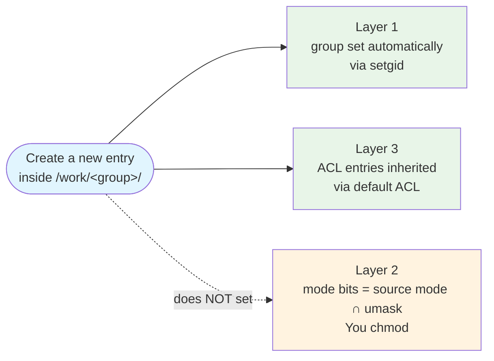

# Permissions Don't Move: A `/work/<group>` Survival Guide

Putting files into a shared `/work/<group>/` folder is a two-part problem: get the ==group== right (`<group>`, not your private `default`), and get the ==mode bits== right (open enough for collaborators to do what you intend). `/work/<group>/` solves the group half automatically when you ==create== new entries inside; you solve the mode half with `chmod`. `mv` from `~/` solves neither.

!!! tip "Companion pages"
    - :material-school: [Lesson 2 — Tooling Setup](../tutorials/lesson-2.md) — `/home` vs `/scratch` placement
    - :material-server-network: [Know Your Nodes — Storage internals](../scheduler/Know-Your-Nodes.md#storage-internals) — the broader Aqua filesystem picture
    - :material-link-variant: [QUT eResearch — Filesystem and data management](https://docs.eres.qut.edu.au/hpc-filesystem)[^1] — the canonical line on `/work/`

---

## :material-cog: The mental model

A shareable file in `/work/<group>/` needs ==three things working together==:

| Layer | What it means | Who sets it |
|---|---|---|
| **1. Group** | File group = `<group>` (so collaborators are in-group) | Automatic on `create`, via the dir's setgid bit |
| **2. Mode bits** | File mode group bits include the access you want (`rw` for edit, `r` for read) | **Always you, with `chmod`** |
| **3. ACL** | `group:<group>:rwx` entry + default ACL for future children | Automatic on `create`, via the dir's default ACL |

### What `/work/<group>/` gives you — and doesn't — automatically



The ==mode-bit gap is the load-bearing detail nobody documents==. Both `cp` and `rsync -rlt --no-perms` inherit layer 1 + layer 3 from the parent dir, but they propagate the ==source file's mode bits== for layer 2. Empirically (verified against `/work/<group>` with system umask `0022`):

| What you bring in from `~/` | Mode at destination | Effective group access |
|---|---|---|
| File created with plain `touch` / `cp` (mode `0644`) | `-rw-r-----+` | `r--` — group can read, not write |
| File you `chmod 600`'d for privacy | `-rw-------+` | `---` — group can't even read |
| File you explicitly `chmod 664`'d | `-rw-rw----+` | `rw-` — group can read + write ✓ |

The ACL entry says `group:<group>:rwx` in all three cases, but the file's mode-bit mask gates the effective access down to whatever the source mode permitted. ==You always need `chmod` to normalize layer 2==, regardless of how you transferred the file.

Here's what a correctly-wired shared folder looks like:

```text
$ ls -ld /work/<group>
drwxrws---+ <user> <group> /work/<group>

$ getfacl -p /work/<group>
# file: /work/<group>
# owner: <user>
# group: <group>
# flags: -s-
user::rwx
group::rwx
other::---
default:user::rwx
default:group::rwx
default:group:<group>:rwx
default:mask::rwx
default:other::---
```

Two markers in `ls -ld`: `s` in column 6 = setgid (layer 1), `+` at the end = default ACLs present (layer 3). Both fire on **create**; neither sets layer 2. If either marker is missing, the folder isn't fully wired — open an [eResearch Help Centre](https://eresearchqut.atlassian.net/servicedesk/customer/portals) ticket.

### What `mv` from `~/` breaks

`mv` is a rename, not a create. It bypasses both layer 1 and layer 3 inheritance AND propagates your `~/` mode bits to layer 2. You inherit nothing useful and keep three problems:

- **Group**: your `default`, not `<group>` (collaborators are out-group)
- **Mode bits**: whatever the file had in `~/` (probably restrictive)
- **ACL**: none at all (no entry, no future inheritance)

==`mv` is the worst case== — every other "wrong" method gets at least one layer right.

---

## :material-help-circle: Decide your intent

One question decides everything: **will your collaborators write to these files?**

<!-- markdownlint-disable MD051 -->

| Answer | Layers you need | Right workflow |
|---|---|---|
| **Yes** — shared-edit (group reads + writes + deletes) | 1 + 2 (`rw`) + 3 | [§ Shared-edit transfers](#shared-edit-transfers) |
| **No** — read-only (group reads only) | 1 + 2 (`r--`); skip 3 | [§ Read-only sharing](#read-only-sharing) |
| Already inside `/work/<group>` | All three already set | [§ Moving within `/work/<group>`](#moving-within-work) |

<!-- markdownlint-enable MD051 -->

==Pick before you transfer.== Most "I just moved stuff and my collaborators can't edit it" trouble comes from solving the wrong subset of layers.

---

## :material-pencil: Shared-edit transfers { #shared-edit-transfers }

Pattern: **create + chmod**. Create lands you layers 1 + 3 for free; chmod opens layer 2.

=== "Single file"

    ```bash
    GROUP=your-group-name                                        # (1)!
    cp ~/script.py "/work/$GROUP/project/"                       # (2)!
    chmod g+rw,o-rwx "/work/$GROUP/project/script.py"            # (3)!
    # Executable script? Use `chmod 770` instead.
    ```

    1. Replace with your actual group name.
    2. `cp` creates a new file → layers 1 + 3 inherited → group=`<group>`, ACL entry present.
    3. Open layer 2 group bits. `o-rwx` keeps the file group-private.

=== "Directory"

    ```bash
    GROUP=your-group-name
    SRC=~/project_folder
    DST="/work/$GROUP/project_folder"

    mkdir "$DST"                                                       # (1)!
    rsync -rlt --no-owner --no-group --no-perms "$SRC"/ "$DST"/        # (2)!
    chmod -R g+rwX,o-rwx "$DST"                                        # (3)!

    # Verify content matches (empty output = identical)
    rsync -rltni --no-owner --no-group --no-perms "$SRC"/ "$DST"/      # (4)!

    # Once verified, drop the source
    rm -rf "$SRC"
    ```

    1. Fresh directory inside `/work/<group>` → inherits setgid + default ACLs → layers 1 + 3 done.
    2. Copy contents. `-rlt` recurses + preserves symlinks + mtime. `--no-perms` + the `--no-*` flags propagate source mode bits without source group/owner — layers 1 + 3 stay inherited per file.
    3. **Required.** Opens layer 2 group bits across the tree — `--no-perms` propagated source mode bits which are usually too restrictive (see the mental model above). Capital `X` adds exec only to dirs + already-exec files (preserves scripts, leaves data files non-exec).
    4. `-n` = dry-run; `-i` = itemize. Verifies content match, not perms.

??? note "Why these rsync flags and not `-a`?"
    `-a` (archive mode) expands to `-rlptgoD`. The `p` (perms), `g` (group), and `o` (owner) flags preserve source metadata — which keeps your `default` group on the destination, breaking layer 1.

    | Flag | What it does | Safe for `~/` → `/work/<group>/`? |
    |---|---|:---:|
    | `-r` | Recurse into directories | ✓ |
    | `-l` | Preserve symlinks as symlinks | ✓ |
    | `-t` | Preserve modification times | ✓ |
    | `--no-perms` | Destination uses source-mode + umask, not source's exact mode bits | ✓ — needs the follow-up `chmod` to open layer 2 |
    | `--no-owner` | Don't copy source owner | ✓ — `chown` across users needs root anyway |
    | `--no-group` | Don't copy source group | ✓ — destination inherits layer 1 via setgid |
    | `-p` (in `-a`) | Preserve source mode bits | ✗ — locks layer 2 to source's bits |
    | `-g` (in `-a`) | Preserve source group | ✗ — breaks layer 1 |
    | `-o` (in `-a`) | Preserve source owner | ✗ — would fail anyway, but noisy |

!!! failure "Methods that LOOK right but fail at one or more layers"

    | Command | Layer 1 (group) | Layer 2 (mode) | Layer 3 (ACL) |
    |---|---|---|---|
    | `mv ~/dir /work/$GROUP/` | ✗ default | ✗ source's | ✗ none |
    | `cp -a ~/dir /work/$GROUP/` | ✗ default | ✗ source's | partial (setgid bit only) |
    | `cp -p ~/dir /work/$GROUP/` | ✗ default | ✗ source's | ✗ none |
    | `rsync -a ~/dir/ /work/$GROUP/dir/` | ✗ default | ✗ source's | ✓ inherited (but mask = `---`) |

    Each preserves source metadata at the cost of layer 1 (group). `rsync -a` paradoxically gets layer 3 right via inheritance but still locks collaborators out via layer 2.

??? info "What the modes look like after `chmod -R g+rwX,o-rwx`"

    Verified live against `/work/<group>`:

    | Source | Mode after `chmod -R g+rwX,o-rwx` | What it gives the group |
    |---|---|---|
    | Directory (any starting mode) | `drwxrws---+` mask=`rwx` | `rwx` — `cd`, list, create, delete |
    | Data file `-rw-------` | `-rw-rw----+` mask=`rw-` | `rw-` — read + write, no exec |
    | Script `-rwx------` | `-rwxrwx---+` mask=`rwx` | `rwx` — exec preserved |
    | NEW file/dir created later | `-rw-rw----+` / `drwxrws---+` | inheritance keeps firing |

---

## :material-eye: Read-only sharing { #read-only-sharing }

Different goal: collaborators read, you write. Layers 1 + 2 are enough — you don't need layer 3 because you're not setting up an ongoing area where new entries appear.

```bash
GROUP=your-group-name
mv ~/project_folder "/work/$GROUP/"                               # (1)!
chgrp -R "$GROUP" "/work/$GROUP/project_folder"                   # (2)!
chmod -R g+rX,o-rwx "/work/$GROUP/project_folder"                 # (3)!
```

1. `mv` is fine here — fastest move (rename, no copy), and we're about to fix layers 1 + 2 explicitly anyway.
2. Fix layer 1 (group identity).
3. Fix layer 2 for read-only. Capital `X` (not `x`) gives traverse for dirs + exec for already-exec scripts; lowercase `x` would falsely mark data files executable.

<!-- markdownlint-disable MD051 -->

!!! note "When this stops working"
    Any file you ADD LATER won't auto-inherit (no layer 3 / default ACL). You'll need to re-run `chgrp + chmod` each time, or graduate to the [§ Shared-edit](#shared-edit-transfers) workflow. Use this pattern for one-time publish-style sharing — results snapshots, archive drops, things you won't touch again.

<!-- markdownlint-enable MD051 -->

---

## :material-arrow-right: Moving within `/work/<group>` { #moving-within-work }

```bash
GROUP=your-group-name
mv "/work/$GROUP/project1/data.csv" "/work/$GROUP/project2/"
```

Plain `mv` is correct here. Source already has all three layers — nothing to break. The trap only fires when you cross from outside `/work/<group>` into it.

---

## :material-bandage: If you got it wrong

If `mv` already happened and you want to fix it in place, pick by intent.

=== "Make it read-only (small fix — layers 1 + 2)"

    ```bash
    GROUP=your-group-name
    DST="/work/$GROUP/the_moved_thing"

    chgrp -R "$GROUP" "$DST"               # layer 1
    chmod -R g+rX,o-rwx "$DST"             # layer 2
    ```

=== "Make it shared-edit (full fix — layers 1 + 2 + 3)"

    ```bash
    GROUP=your-group-name
    DST="/work/$GROUP/the_moved_thing"

    chgrp -R "$GROUP" "$DST"                              # (1)!
    find "$DST" -type d -exec chmod 2770 {} \;            # (2)!
    find "$DST" -type f -exec chmod g+rwX,o-rwx {} \;     # (3)!
    setfacl -R  -m g:"$GROUP":rwx "$DST"                  # (4)!
    setfacl -Rd -m g:"$GROUP":rwx "$DST"                  # (5)!
    ```

    1. Layer 1 — fix group identity.
    2. Layer 2 for dirs — `2770` = setgid bit + group rwx + no other access.
    3. Layer 2 for files — `g+rw` opens group write; capital `X` (not `x`) conditionally adds group exec **only** to files that already had exec set, so scripts stay executable and data files don't get falsely marked exec; `o-rwx` strips other access.
    4. Layer 3 current ACL — applies to entries that exist now.
    5. Layer 3 default ACL — applies to entries created later, so `DST` keeps behaving correctly going forward.

    Verified: after the full fix, new entries created inside DST inherit layers 1 + 3 automatically — `DST` is now configured the same way as `/work/<group>/` itself.

<!-- markdownlint-disable MD051 -->

!!! warning "Ownership transfer needs a re-create"
    `chgrp` to a group you're in works fine. `chown` to a different **user** requires root — even if a colleague gave you the files, you can't take ownership directly. To "transfer" ownership, copy the tree into a fresh destination you create as yourself ([§ Shared-edit directory workflow](#shared-edit-transfers)). The copy's new inodes will be owned by you.

<!-- markdownlint-enable MD051 -->

---

## :material-information: What QUT eResearch documents (and doesn't)

- The [Filesystem and data management page](https://docs.eres.qut.edu.au/hpc-filesystem)[^1] says new entries in `/work/` inherit parent permissions. ==True for layers 1 + 3; false for layer 2.== Mode bits come from your creating process (rsync, cp, touch), not from the parent. The page doesn't define create-vs-move, doesn't mention setgid or default ACLs, and doesn't warn about `mv`.
- The [Transferring files page](https://docs.eres.qut.edu.au/hpc-transferring-files-tofrom-hpc)[^1] documents `rsync -a` as the recommended flag set. Fine for `/home` ↔ `/home`; for `~/` → `/work/<group>/` shared-edit, `-a` preserves your `default` group and breaks layer 1.
- New shared folder requests go through the [eResearch Help Centre portal](https://eresearchqut.atlassian.net/servicedesk/customer/portals) (`HPC request` → `New shared folder`).

---

## :material-arrow-right-circle: Where next

- :material-school: [Lesson 2 — Tooling Setup](../tutorials/lesson-2.md) — `/home` vs `/scratch` placement
- :material-server-network: [Know Your Nodes — Storage internals](../scheduler/Know-Your-Nodes.md#storage-internals) — Aqua filesystem capacity picture
- :material-link-variant: [QUT eResearch — Filesystem and data management](https://docs.eres.qut.edu.au/hpc-filesystem)[^1]
- :material-link-variant: [QUT eResearch — Transferring files to/from HPC](https://docs.eres.qut.edu.au/hpc-transferring-files-tofrom-hpc)[^1]
- Linux refs: `acl(5)`, `getfacl(1)`, `setfacl(1)`, `chmod(1)`

[^1]: Access only in QUT network. Please use VPN to access the documentation when off-campus.
