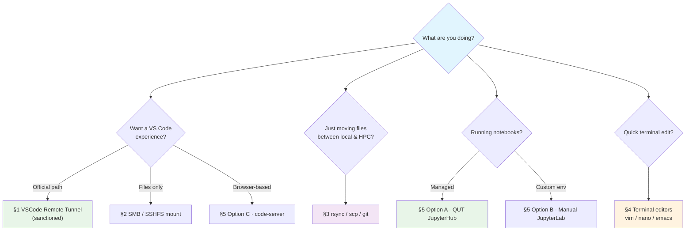

# Surviving without VS Code Remote SSH

> *"Or: 'They took away my extension, but not my will to code.'"*

!!! info "Last updated"
    2026-06-21. URLs, install paths, and tool versions drift. Cross-check with [QUT eResearch HPC docs](https://docs.eres.qut.edu.au)[^1] if anything below feels off.

!!! failure "VS Code Remote SSH is banned"
    QUT Aqua banned the VS Code Remote SSH extension due to high workload on the login node. Any attempt to connect via Remote-SSH gets disconnected after ~30 seconds.

    The QUT eResearch-sanctioned replacement is ==**VSCode Remote Tunnel**== — see [Section 1 below](#1-vscode-remote-tunnel-the-sanctioned-replacement). Full official walkthrough: [VS Code Usage on Aqua](https://docs.eres.qut.edu.au/hpc-vscode-usage)[^1].

So... you're trying to develop on QUT Aqua, but the server gods have other plans. Maybe you want VS Code. Maybe you just want files. Either way — here's how I've kept my sanity while developing on remote HPC systems.

## :material-map-marker-path: Pick your weapon

Click any node below to jump to that section.



---

???+ tip "Before you start: Recommended — add a shortcut to `~/.ssh/config`"
    If you're using SSH keys to connect to the HPC, a `~/.ssh/config` entry saves a lot of typing. QUT eResearch has a [setup guide for passwordless login](https://docs.eres.qut.edu.au/hpc-getting-started-with-high-performance-computin#how-you-log-into-aqua-depends-on-the-operating-system-of-your-computer)[^1].

    ```bash
    # Add to your ~/.ssh/config
    Host aqua
        HostName aqua.qut.edu.au
        User your-username
        IdentityFile ~/.ssh/id_ed25519_aqua # (1)!
        ServerAliveInterval 60
    ```

    1.  ==ed25519== is the modern key type — smaller, faster, and the default for OpenSSH 8.x+. If you still have an `id_rsa` key, it'll keep working, but generating a fresh `ed25519` key with `ssh-keygen -t ed25519` is the current best practice.

    Then connect with `ssh aqua`. You can also use `aqua` to replace `your-username@aqua.qut.edu.au` in every command below.

---

## :material-tunnel-outline: 1. VSCode Remote Tunnel — The Sanctioned Replacement

This is QUT eResearch's official replacement for the banned Remote-SSH extension. Instead of connecting *into* the login node, you run a small **VS Code CLI tunnel server** inside an interactive PBS job, and your local VS Code connects to it through a Microsoft-hosted relay.


### Setup

Run these inside an interactive PBS job:

```bash
# 1. Start an interactive job (CPU example; for GPU swap in `ngpus=1`)
qsub -I -l select=1:ncpus=4:mem=16GB -l walltime=04:00:00

# 2. (Once per home dir) Fetch the VS Code CLI
curl -Lk 'https://code.visualstudio.com/sha/download?build=stable&os=cli-alpine-x64' \
  --output vscode_cli.tar.gz
mkdir -p ~/bin
tar -xf vscode_cli.tar.gz -C ~/bin/
rm vscode_cli.tar.gz

# 3. Start the tunnel and follow the device-code prompt
~/bin/code tunnel
```

On your local machine: open VS Code, click the green **Remote** icon (bottom-left of the status bar), choose **Connect to Tunnel**, and pick your HPC node from the list.

??? info "What the tunnel asks at first login"
    ```text
    *
    * Visual Studio Code Server
    *
    * By using the software, you agree to ...
    *
    ? How would you like to log in to Visual Studio Code? ›
    ❯ Microsoft Account
      GitHub Account
    ```

    Pick the account type, copy the device code (e.g. `ABCDEFGHI`), and authenticate at [microsoft.com/devicelogin](https://microsoft.com/devicelogin) or [github.com/login/device](https://github.com/login/device).

!!! tip "Cleanup when you're done"
    On the HPC terminal: hit ++ctrl+c++ to cancel the remote connection, then `exit` the interactive job. The tunnel stops the moment the PBS job ends.

!!! success "Pros"
    - ==**Sanctioned**==. eRes set this up specifically so users don't reach for Remote-SSH.
    - You get the **full VS Code experience** — extensions, integrated terminal, debugger, the whole thing — without breaking server policy.
    - **No SSH config required** on the local side. Authentication is Microsoft/GitHub OAuth.

!!! failure "Cons"
    - Your session lives inside an **interactive PBS job**. When the job's walltime expires, the tunnel dies.
    - Interactive jobs are capped at ==12 hours== (`cpu_inter_exec`/`gpu_inter_exec`). Not for "leave VS Code open all week" workflows.
    - First-time auth flows through Microsoft's cloud relay. If your data is sensitive enough that even the metadata worries you, talk to eResearch first.

??? info "Full screenshot walkthrough"
    QUT eResearch has the screenshot-by-screenshot version with every dialog box captured: [VS Code Usage — Option 2: VSCode Remote Tunnel](https://docs.eres.qut.edu.au/hpc-vscode-usage#option-2-vscode-remote-tunnel)[^1].

---

## :material-folder-network: 2. Fake it with SSH-mounted folders

If the official Tunnel doesn't fit (you want a non-VS-Code editor, or you just want files to "appear" locally), mount the HPC's home directory and pretend it's local.

### :cheese: Option A: Mount via Finder (SMB)

Quick guide for macOS users. Other OSes: see [QUT eResearch's file transfer guide](https://docs.eres.qut.edu.au/hpc-transferring-files-tofrom-hpc#using-file-explorer-or-finder-to-mount-or-map-a-drive-to-the-hpc)[^1].

1. Open **Finder** → `Go` → `Connect to Server...`
2. Enter (replace `your-username`):

    ```text
    smb://hpc-fs/your-username/
    ```

    For the shared `/work/` folder, use `smb://hpc-fs/work/` instead.

3. Mount it, then open the folder in VS Code like it's 1999.

!!! success "Pros"
    - Zero install — uses Finder's built-in SMB support.
    - Files literally appear in the macOS file picker.
    - Good for quick file edits and shuffling.

!!! failure "Cons"
    - ==**No shell**, **no Git**, no terminal tantrums== — it's like eating cake without the frosting.
    - Connection drops mid-session freeze the share.
    - macOS leaves `.DS_Store` files everywhere on the HPC.

??? info "The full comedy of errors"
    You've mounted an SMB share to your Finder. Congratulations! You've just volunteered for the following:

    1. **Git Limitations** — Your version control system becomes severely limited over SMB. Git operations that work fine locally will fail or behave unpredictably through the mounted share.
    2. **VS Code Terminal Issues** — The integrated terminal in VS Code won't work properly with mounted SMB shares. You'll get `Command not found` errors for most terminal operations.
    3. **Connection Stability** — SMB connections can drop unexpectedly, especially during longer work sessions or when the network is unstable.
    4. **HPC Dependency** — Since all your files live on the server, any HPC maintenance or downtime makes your work completely inaccessible.
    5. **The .DS_Store Problem (macOS)** — Your Mac will create `.DS_Store` files in every folder you visit through Finder. These desktop service files clutter the HPC filesystem and serve no purpose on the server.

??? tip "For macOS users only: How to fix the .DS_Store and ._* files issue"
    

    Check out [The .DS_Store Strikes Back: Finder Edition](./The-DS_Store-Strikes-Back.md) about why this is a problem and how to solve it (or not).

### :wrench: Option B: SSHFS — Mount through SSH Wizardry

Mount your HPC home directory *directly* via SSH, no Finder fluff. It's like having your HPC filesystem in your pocket.

=== ":material-apple: macOS"
    ```bash
    # Install the prerequisites (because your Mac doesn't come
    # with everything, despite what Apple claims)
    brew install macfuse
    brew install gromgit/fuse/sshfs-mac

    # Mount your HPC home (1)!
    mkdir ~/aqua
    sshfs your-username@aqua.qut.edu.au:/home/your-username ~/aqua # (2)!

    # When you're done pretending these files are local
    umount ~/aqua
    # Or if that fails spectacularly (as technology loves to do)
    diskutil unmount ~/aqua
    ```

    1.  On first run you'll be asked to go to **System Settings → Privacy & Security** and click **Allow** for the macFUSE system extension, then restart your Mac.
    2.  You can use `aqua` to replace `your-username@aqua.qut.edu.au` if you have the SSH config shortcut from above.

=== ":material-linux: Linux (Ubuntu)"
    ```bash
    # Install SSHFS (because of course Linux makes you work for everything)
    sudo apt install sshfs

    # Mount your HPC home, telling the laws of physics to take a break
    mkdir -p ~/aqua
    sshfs your-username@aqua.qut.edu.au:/home/your-username ~/aqua -o follow_symlinks

    # To send these files back to their natural habitat
    fusermount -u ~/aqua
    ```

=== ":material-microsoft-windows: Windows"
    Install [WinFSP](https://github.com/winfsp/winfsp/releases) and [SSHFS-Win](https://github.com/winfsp/sshfs-win/releases) — Windows needs two separate things to do what other systems accomplish with one. Then use Windows Explorer (which Microsoft keeps renaming as if that will make us forget its bugs) to map a network drive:

    ```text
    \\sshfs\your-username@aqua.qut.edu.au
    ```

Then open the mounted folder in VS Code like you've just performed a miracle:

```bash
code ~/aqua
```

!!! success "Pros"
    - Looks local. Feels local.
    - Git operations work... until they mysteriously don't.

!!! failure "Cons"
    - Feels **too** local for large files. Might lag.
    - If the connection drops, your filesystem freezes like it's seen a ghost.

??? warning "Apple Silicon caveat (M1 / M2 / M3 / M4)"
    macFUSE is a kernel extension, so installing it on Apple Silicon requires:

    1. Booting to **Recovery Mode** (hold the power button at startup until you see "Loading startup options").
    2. **Startup Security Utility → Reduced Security** → tick "Allow user management of kernel extensions from identified developers".
    3. Reboot, install macFUSE, approve the extension under **System Settings → Privacy & Security**, reboot again.

    If that's too much ceremony, ==**rclone**== with its `serve sftp` / `mount` commands works entirely in user space — no kext, no Reduced Security:

    ```bash
    brew install rclone
    rclone config   # set up an SFTP remote pointing at Aqua
    rclone mount aqua:/home/your-username ~/aqua --vfs-cache-mode writes
    ```

??? tip "Performance tips that might help (no promises)"
    - Use `-o cache=yes` to create the illusion of performance (side effects may include file synchronization existential crises).
    - Add `-o compression=yes` to squeeze your data through the internet tubes more efficiently.
    - If everything hangs, adjust your `ServerAliveInterval` settings — like giving your connection a gentle nudge every few minutes to check it's still breathing.

??? info "Working with Git over SSHFS: a tragicomedy"
    When using Git over SSHFS, you're essentially asking Git to perform a synchronized swimming routine while blindfolded. For anything more complex than a simple commit, consider SSH-ing directly into the server and running Git commands there. Your future self will thank you for not testing the limits of your patience.

??? tip "For macOS users only: Still cannot get rid of the .DS_Store and ._* files?"
    

    Check out [The .DS_Store Strikes Back: Finder Edition](./The-DS_Store-Strikes-Back.md) about why this is a problem and how to solve it (or not).

---

## :material-sync: 3. `rsync`, `scp`, and `git`: Your old-school sync buddies

### :gear: Option A: `rsync` & `scp` — The Reliable Workhorse

```bash
# Sync your local code to HPC
rsync -avz ./my-project/ your-username@aqua.qut.edu.au:/home/your-username/projects/

# Sync back from HPC
rsync -avz your-username@aqua.qut.edu.au:/home/your-username/projects/ ./my-project/
```

Or for a quick one-file fling:

```bash
scp script.py your-username@aqua.qut.edu.au:/home/your-username/projects/
```

It's not fancy, but it works — like duct tape.

??? tip "Useful rsync flags"
    - `-h` — human-readable sizes.
    - `--progress` — see what's actually transferring.
    - `--delete` — mirror the source (remove files at destination that aren't in source). ==**Dangerous**== — dry-run first.
    - `--dry-run` — show what would happen without doing it. Use this before `--delete`.

### :simple-git: Option B: Git — The Version Control Way

If you are version-controlling your life (as you should), Git is clean and reliable.

=== "Via GitHub / GitLab (recommended)"
    Push to a remote you already use, pull on HPC. Works through QUT's outbound network without any HPC-side server setup.

    ```bash
    # On your local machine
    git push origin main

    # On the HPC
    git pull origin main
    ```

=== "Direct HPC bare repo (self-hosted)"
    If you don't want a third party in the loop, set up a bare repository on HPC and push to it directly.

    ```bash
    # On your local machine
    git init
    git add .
    git commit -m "Initial commit"
    git remote add aqua your-username@aqua.qut.edu.au:/path/to/repo.git
    git push aqua main

    # On the HPC
    git clone your-username@aqua.qut.edu.au:/path/to/repo.git
    ```

!!! success "Pros"
    Clean history, branch control, reproducibility.

!!! failure "Cons"
    Needs initial setup. Your SSH keys must behave.

---

## :material-console: 4. The Terminal-Only Approach

When all else fails, embrace the terminal:

```bash
ssh your-username@aqua.qut.edu.au
```

Then pick your weapon of choice:

- `vim` — for the brave.
- `nano` — for the sane.
- `neovim` — for the modern.
- `emacs` — for the... unique.

:direct_hit: *Bonus*: Fast, keyboard-driven, and doesn't require GUI permission forms.

!!! note "Coming someday"
    I'm planning a separate page on configuring `neovim` + plugins as a lightweight VS Code replacement over SSH. Watch this space.

---

## :material-web: 5. The Web-Based Approach

### :simple-jupyter: Option A: QUT JupyterHub (Recommended — managed)

QUT eResearch hosts a managed JupyterHub at ==**[https://jupyterhub.eres.qut.edu.au](https://jupyterhub.eres.qut.edu.au)**==[^1]. You log in with your QUT username and password, click **Start My Server**, and a backing PBS job spins up automatically — default `Aqua - 1 core, 8 GB, 8 hours`.

!!! success "Pros"
    - ==**Browser-only**==. No SSH tunnel, no port forwarding, no installing anything.
    - PBS job is scheduled for you. No `qsub` line to write.

!!! failure "Cons"
    - First connect can take up to ~10 minutes while your job queues.
    - You're stuck with JupyterHub's shipped envs and the default resource bundle.

!!! info "When to fall back to Option B"
    - You need a **custom conda env** beyond what JupyterHub ships.
    - You need a specific GPU type, more cores, or walltime > 8 hours.

??? info "Full walkthrough"
    [How to use JupyterHub](https://docs.eres.qut.edu.au/how-to-use-jupyterhub)[^1] — login → start server → wait → work.

### :simple-jupyter: Option B: Manual Jupyter Lab (port-forwarded)

For when JupyterHub's defaults don't fit. You install Jupyter yourself and tunnel the port over SSH.

!!! info "Install Jupyter Lab in HPC before you start"
    The official Aqua documentation provides a [guide](https://docs.eres.qut.edu.au/hpc-accessing-available-software#install-conda)[^1] on how to install Miniconda in HPC.

=== "On the login node (light work)"
    Good for tiny notebooks — quick edits, a few plots. Don't run heavy code here.

    ```bash
    # On the HPC
    # I prefer to use Jupyter Lab instead of Jupyter Notebook
    jupyter lab --no-browser --port=8888 # (1)!

    # On your local machine, forward the port 8888 to your local machine
    # local_port:localhost:remote_port
    ssh -N -L 8888:localhost:8888 your-username@aqua.qut.edu.au # (2)!
    ```

    1.  If port 8888 is already in use, try `8889` or any unused port.
    2.  `-N` means no command to run on the remote machine. `-L` means forward the local port to the remote port. Both local and remote ports are 8888 in this case.

    Open in your browser:

    ```text
    http://localhost:8888/?token=...
    ```

    !!! warning "Login node etiquette"
        The login node is shared with everyone. Running long, heavy notebooks here is what got Remote-SSH banned. Keep login-node Jupyter for ==short, light== work — for anything bigger, switch to the compute-node tab.

=== "On a compute node (recommended for GPU / heavy)"
    For GPU work or anything CPU-intensive — runs inside a real PBS job.

    ```bash
    # Step 1. Request an interactive job on a compute node
    qsub -I -S /bin/bash -l select=1:ncpus=4:ngpus=1:mem=32GB -l walltime=02:00:00

    # Step 2. Once inside the compute node (e.g., gpu1n005), start Jupyter Lab
    jupyter lab --no-browser --port=8889 --ip=$(hostname -i)   # (1)!

    # Step 3. On your local machine, forward the port via the login node
    # Replace 10.xx.xx.xx with the IP address shown in Jupyter's startup message
    ssh -N -L 8889:10.xx.xx.xx:8889 your-username@aqua.qut.edu.au   # (2)!
    ```

    1.  `--ip=$(hostname -i)` makes Jupyter listen on the compute node's internal IP (e.g., `10.13.30.24`). The port can be changed to any unused port.
    2.  Use that IP in the tunnel command so the login node can route traffic.

    Open in your browser:

    ```text
    http://localhost:8889/lab?token=...
    ```

    ??? tip "Tips for Jupyter Lab on the compute node"
        - Keep ==**both**== the Jupyter Lab session and the SSH tunnel open. Closing either disconnects the browser.
        - Each compute node allocation gives you a different internal IP (`10.xx.xx.xx`), so update your tunnel command every time.
        - For repeated use, simplify the tunnel with an SSH config entry (`~/.ssh/config`).
        - See [Know Your Nodes](../scheduler/Know-Your-Nodes.md) for hostname patterns (`cpu1n00X`, `gpu0n00X`, `gpu1n00X`, `mem1n001`).

### :material-microsoft-visual-studio-code: Option C: VS Code in Browser (code-server)

!!! warning "This might require a sysadmin's blessing"
    Fortunately, the server gods haven't locked *everything* down — `code-server` runs in user space.

1. Install [`code-server`](https://github.com/coder/code-server) on the HPC.

    ```bash
    # On HPC server
    # Install code-server to your home directory
    curl -fsSL https://code-server.dev/install.sh | sh -s -- --method standalone --prefix=$HOME
    # code-server will be installed to $HOME/bin/code-server

    # check if code-server is installed
    code-server --version

    # Start code-server
    code-server --bind-addr 127.0.0.1:8080 --disable-telemetry --disable-update-check --auth none

    # On your local machine
    # Forward the port 8080 to your local machine
    ssh -N -L 8080:127.0.0.1:8080 your-username@aqua.qut.edu.au
    ```

2. Open it in your browser:

    ```text
    http://localhost:8080
    ```

3. Marvel as VS Code rises from the ashes — web-style.

??? tip "Sync VS Code settings to code-server"
    You can import your VS Code settings to code-server by importing the profile from VS Code. Check out [this page](https://code.visualstudio.com/docs/configure/profiles#_share-profiles) for more details about how to export and import profiles. However, this isn't a perfect solution. Not all VS Code extensions are available for code-server — some are restricted to Microsoft VS Code. Only the extensions available for code-server are listed in [Open VSX Registry](https://open-vsx.org/).

??? tip "Run code-server in the background with `tmux`"
    You can run code-server in the background with `tmux` to avoid the session being killed after you disconnect from the HPC.

    ```bash
    # Start a new tmux session
    tmux new -s code

    # Run code-server in the background
    code-server --bind-addr 127.0.0.1:8080 --disable-telemetry --disable-update-check --auth none

    # Detach from the tmux session: ++ctrl+b++, then ++d++

    # Reattach to the tmux session
    tmux attach -t code

    # Kill the tmux session
    tmux kill-session -t code

    # If you forget the session name, list all sessions
    tmux ls
    ```

??? failure "Known issue: Integrated terminal and Extension Host instability"
    I found that the terminal and the extension host are not stable when using code-server on the login node. The issue revolves around the **ptyHost**, **File Watcher**, and **Extension Host**, and they're **repeatedly killed by SIGTERM**.

    :brain: **What's happening?**

    ```log
    [12:18:01] ptyHost terminated unexpectedly with code null
    [12:18:01] [File Watcher (universal)] restarting watcher after unexpected error: terminated by itself with code null, signal: SIGTERM (ETERM)
    [12:18:01] [127.0.0.1][d0f383fd][ExtensionHostConnection] <3126357> Extension Host Process exited with code: null, signal: SIGTERM.
    [12:18:02] [127.0.0.1][d0f383fd][ExtensionHostConnection] Unknown reconnection token (seen before).
    [12:18:02] [127.0.0.1][368c67ad][ExtensionHostConnection] New connection established.
    [12:18:02] [127.0.0.1][368c67ad][ExtensionHostConnection] <3132486> Launched Extension Host Process.
    ```

    From the logs:

    * :collision: The `ptyHost` process (responsible for terminal sessions) crashed or was killed — possibly due to system resource limits or policy.
    * :card_file_box: File watcher was forcefully killed (SIGTERM) — system or job policy likely did this.
    * :puzzle_piece: Extension host was also killed — same reason, likely tied to HPC rules.
    * :arrows_counterclockwise: code-server tried to reconnect to the crashed extension host but failed.
    * :new: code-server restarted the extension host process automatically.

    **Workaround**: Run code-server inside an interactive PBS job (using the Option B compute-node pattern) rather than on the login node — the SIGTERMs are the login-node guardian processes telling you not to.

---

## TL;DR — What Works (and What Requires Sacrifice)

| :hammer_and_wrench: Method | :woman_technologist: Edit in VS Code | :desktop_computer: Terminal Access | :file_folder: Where Files Live      | :frame_photo: GUI Needed | :zap: Vibe Check                  |
| -------------------------- | ----------------------------------- | --------------------------------- | ----------------------------------- | ------------------------ | --------------------------------- |
| **VSCode Remote Tunnel** ✨ | :white_check_mark: Full experience  | :white_check_mark: Integrated      | :file_cabinet: Remote (compute node) | :white_check_mark: Yes  | :tada: "The sanctioned way"        |
| **SMB (Finder)**           | :white_check_mark: Yes, like it's local | :x: Nope, just files          | :file_cabinet: Remote (mounted)     | :white_check_mark: Yes  | :cheese: "Cheesy but it works"    |
| **SSHFS**                  | :white_check_mark: Yes (mostly)     | :x: Not really                    | :file_cabinet: Remote (mounted)     | :x: Nope                | :turtle: "Kinda slow, kinda cool" |
| **rsync / Git**            | :white_check_mark: Edit local, sync later | :white_check_mark: Full control | :house: Local (then synced)         | :x: Nope                | :toolbox: "Old school, solid"     |
| **Terminal Editors**       | :x: No GUI, no problem              | :white_check_mark: Born in terminal | :file_cabinet: Remote (SSH only)   | :x: Nope                | :crossed_swords: "Shell warriors" |
| **QUT JupyterHub** ✨       | :white_check_mark: Via browser      | :white_check_mark: If allowed     | :file_cabinet: Remote (JupyterHub)  | :white_check_mark: Yes  | :test_tube: "Just works"          |
| **Manual Jupyter**         | :white_check_mark: Via browser      | :white_check_mark: Yes            | :file_cabinet: Remote (port-forwarded) | :white_check_mark: Yes | :microscope: "Science with effort" |
| **code-server**            | :white_check_mark: Web-based        | :question: Unstable on login node | :file_cabinet: Remote (in browser)  | :white_check_mark: Yes  | :genie: "Feels like cheating"     |

✨ = new this update (2026-06-21).

---

## :material-link-variant: Further Reading

- [Prerequisites Checklist](../tutorials/prerequisites.md) — the page that links here, with a shorter intro to all five remote-dev paths.
- [Know Your Nodes](../scheduler/Know-Your-Nodes.md) — node taxonomy + hostname patterns relevant for compute-node tunnels/Jupyter.
- [VS Code Usage on Aqua](https://docs.eres.qut.edu.au/hpc-vscode-usage)[^1] — QUT eResearch's official guide (screenshot-heavy).
- [How to use JupyterHub](https://docs.eres.qut.edu.au/how-to-use-jupyterhub)[^1] — JupyterHub setup walkthrough.
- [Transferring files to/from the HPC](https://docs.eres.qut.edu.au/hpc-transferring-files-tofrom-hpc)[^1] — Windows Map Drive, Mac Finder smb, WinSCP, the dedicated SFTP DTN at `eresdtn01.qut.edu.au`.

---

## Final Words

Remote development on HPC doesn't have to be a pain. Pick your poison, set up your workflow, and remember: the best development environment is the one that doesn't make you want to throw your computer out the window.

Happy coding, and may your HPC connections be stable! 🚀

[^1]: Access only in QUT network. Please use VPN to access the documentation when off-campus.
