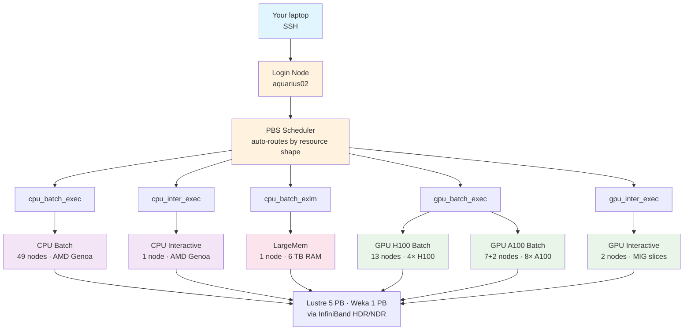
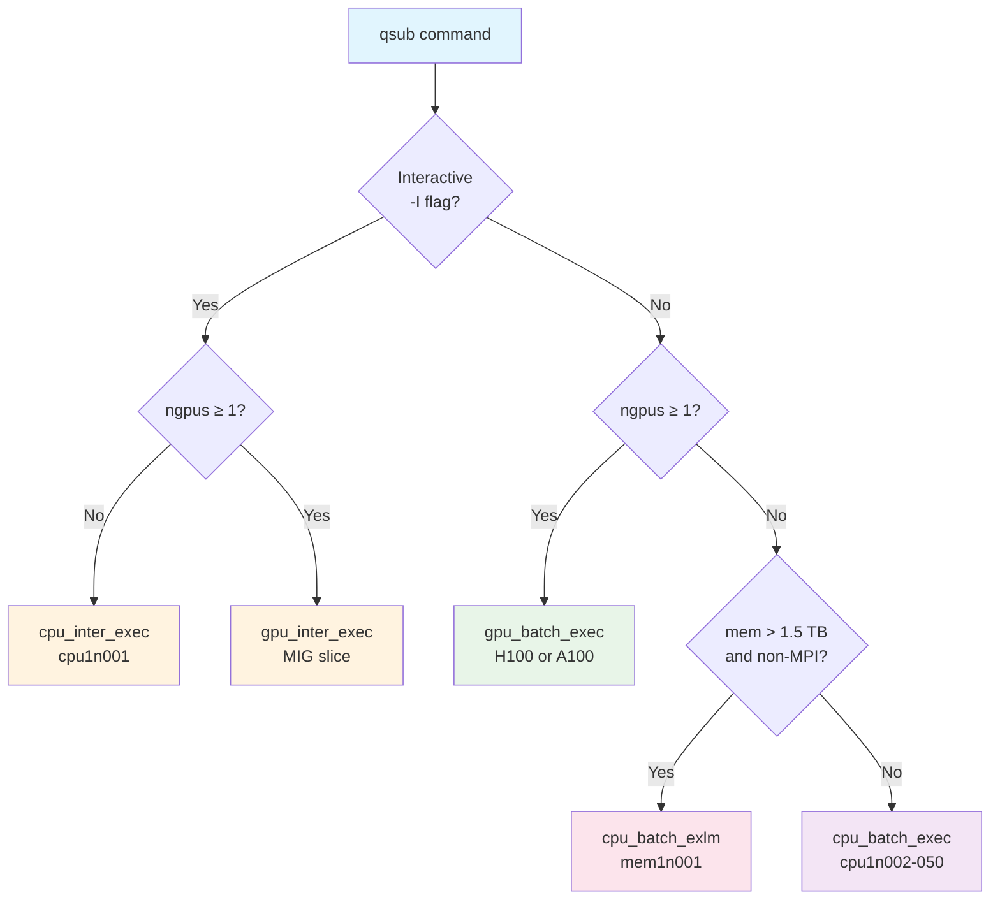

# Know Your Nodes: A Field Guide to HPC Resources

!!! info "Last updated"
    2026-06-21. Hardware specs change. **Always** run `pbsnodeinfo` on the cluster before sizing a serious job — the tables below are a snapshot, not a contract.

## :material-server: What's on the Menu?

So you want to run your code, but what hardware should you order? Welcome to the **HPC buffet** — where some dishes are fast but small, others are huge but slow, and the good stuff always seems to be reserved for someone else.

This field guide identifies which computational beasts are available on Aqua and how to lure them into running your jobs with minimum fuss.



!!! tip "Three tiers — read until you're full"
    - **Tier 1 — What You Need.** A comparison table and five copy-paste `qsub` lines that cover ~80% of jobs. Stop here if you're in a hurry.
    - **Tier 2 — What You Should Know.** Per-node deep dives, the PBS interface, discovery commands, and the rules of the house.
    - **Tier 3 — What You Don't Need (But Can Know).** Vendor silicon, MIG slicing, storage internals, the quirky nodes nobody talks about — all collapsed by default.

---

## Tier 1 — What You Need

### The cluster, at a glance

| Tier              | Count  | Cores / node | RAM / node | GPUs / node     | Pick when…                                  |
| ----------------- | ------ | ------------ | ---------- | --------------- | ------------------------------------------- |
| CPU Batch         | 49     | 188          | 1478 GB    | —               | Long CPU work, MPI, the default             |
| CPU Interactive   | 1      | 376 (HT)     | 1478 GB    | —               | A shell on a real compute node, ≤ 12 h      |
| Large Memory      | 1      | 180          | 6014 GB    | —               | Single-process workloads above ==1.5 TB== RAM |
| GPU H100 Batch    | 13     | 168          | 974 GB     | 4× H100 80 GB   | AI training, FP8/BF16, biggest VRAM         |
| GPU A100 Batch    | 7 + 2* | 124          | 974 GB     | 8× A100 40 GB   | Cheaper GPU time than H100, smaller VRAM OK |
| GPU Interactive   | 2      | 168 / 120    | 974 GB     | MIG slices      | Quick GPU experiments, debugging, dry runs  |

`*` Two A100 batch nodes are oddballs — see **GPU A100 Batch — the legacy classic** in Tier 2.

### Five lines that cover 80% of jobs

=== "1. Interactive CPU"
    ```bash
    # 4 cores, 16 GB, 2 hours
    qsub -I -l select=1:ncpus=4:mem=16GB -l walltime=02:00:00
    ```
    Lands you in a shell on `cpu1n001`. Exit with ++ctrl+d++ when you're done — there's only one of these nodes.

=== "2. Interactive GPU"
    ```bash
    # 1 MIG slice on H100, 6 cores, 32 GB host RAM, 12 hours
    qsub -I -l select=1:ncpus=6:ngpus=1:mem=32GB -l walltime=12:00:00
    ```
    `ngpus=1` here means **one MIG slice** (≈ 1/7 of a card, ~10 GB VRAM). Good for sanity-checking a model loads. Bad for real training.

=== "3. Batch CPU"
    ```bash
    # AMD Genoa-pinned MPI: 4 chunks × 8 cores, 32 GB / chunk, 24 hours
    qsub -l select=4:ncpus=8:mem=32GB:cpu_id=AMD-25-17:mpiprocs=8 \
         -l place=scatter -l walltime=24:00:00 script.pbs
    ```
    `cpu_id=AMD-25-17` keeps every chunk on the same Genoa silicon — essential for MPI sanity. Drop it if your job is embarrassingly parallel and CPU-family-agnostic.

=== "4. Batch GPU (H100)"
    ```bash
    # 2 GPUs on one node, 8 cores host, 128 GB host RAM, 24 hours
    qsub -l select=1:ncpus=8:ngpus=2:mem=128GB:gpu_id=H100 \
         -l walltime=24:00:00 script.pbs
    ```
    Swap `gpu_id=H100` → `gpu_id=A100` if H100 queues are full and 40 GB VRAM is enough.

=== "5. LargeMem (auto-routes)"
    ```bash
    # 180 cores, 4 TB RAM — PBS auto-routes anything > 1.5 TB to mem1n001
    qsub -l select=1:ncpus=180:mem=4000GB -l walltime=24:00:00 script.pbs
    ```
    No `-q` needed. The scheduler routes by your `mem` value alone.

### Picking quickly

!!! question "What are you running?"
    - **A quick experiment under 12 h** → interactive (Tab 1 for CPU, Tab 2 for GPU)
    - **Long CPU work (hours-to-days)** → batch CPU (Tab 3)
    - **AI training, FP8/BF16, 80 GB+ VRAM** → batch GPU on H100 (Tab 4)
    - **Looser GPU needs, willing to queue less** → batch GPU on A100 (swap `gpu_id` in Tab 4)
    - **In-memory work above 1.5 TB** → auto-routes to LargeMem (Tab 5)
    - **Need >48 h walltime?** Read **House Rules** in Tier 2 — you'll need checkpointing.

---

## Tier 2 — What You Should Know

### :material-silverware-fork-knife: The Dishes

Aqua has **73 compute nodes** across five categories. Each subsection below is a card — specs, copy-paste line, and one quirk to file away.

#### CPU Batch — the workhorse (49 nodes)

| Field         | Value                                          |
| ------------- | ---------------------------------------------- |
| Hostnames     | `cpu1n002` through `cpu1n050`                  |
| Cores / node  | 188 user-addressable (192 physical)            |
| RAM / node    | 1478 GB DDR5                                   |
| CPU silicon   | 2× AMD EPYC 9684X (Zen 4 Genoa-X)              |
| `cpu_id`      | `AMD-25-17`                                    |
| Interconnect  | 200 Gbit InfiniBand HDR                        |
| Queue         | `cpu_batch_exec` (auto-routed)                 |

```bash
# Genoa-pinned MPI: 4 chunks × 8 cores, 32 GB / chunk, 24 hours
qsub -l select=4:ncpus=8:mem=32GB:cpu_id=AMD-25-17:mpiprocs=8 \
     -l place=scatter -l walltime=24:00:00 script.pbs
```

!!! info "Quirk: the two 'old image' nodes"
    `cpu1n024` and `cpu1n031` may show `0/188` in `pbsnodeinfo` even when the cluster is otherwise jammed — they're online but flagged ==old image== by the operators (re-image pending). Confirm with `pbsnodestatus`. PBS won't dispatch jobs to them until they're refreshed.

#### CPU Interactive — the appetiser (1 node)

| Field         | Value                                                  |
| ------------- | ------------------------------------------------------ |
| Hostname      | `cpu1n001` (the only one)                              |
| Cores         | 376 logical (hyper-threading enabled — same chips, more threads exposed) |
| RAM           | 1478 GB                                                |
| CPU silicon   | 2× AMD EPYC 9684X, same as batch nodes                 |
| Queue         | `cpu_inter_exec` (auto-routed when you use `-I`)       |
| Per-job cap   | 8 cores, 34 GB, 12 h                                   |
| Per-user cap  | 8 cores, 34 GB total across all your interactive jobs  |

```bash
# Throwaway interactive shell — 4 cores, 16 GB, 2 hours
qsub -I -l select=1:ncpus=4:mem=16GB -l walltime=02:00:00
```

!!! warning "There's ==only one== of these"
    The entire QUT user base shares `cpu1n001` for interactive CPU work. Eight people each grabbing 1 CPU saturates the queue. Don't book a 12 h shell and walk away — hit ++ctrl+d++ when you're done so someone else can have it.

#### LargeMem — the buffet (1 node)

| Field         | Value                                                     |
| ------------- | --------------------------------------------------------- |
| Hostname      | `mem1n001`                                                |
| Cores         | 180 user-addressable                                      |
| RAM           | 6014 GB DDR5                                              |
| CPU silicon   | 2× AMD EPYC 9684X (same Genoa-X as CPU batch)             |
| Interconnect  | 2× 400 Gbit InfiniBand NDR                                |
| Queue         | `cpu_batch_exlm` (auto-routed when `mem > 1.5 TB`)        |
| Per-job range | 1479 GB – 6015 GB, 1–180 cores, 48 h max                  |

```bash
# 4 TB in-memory analysis, 24 hours
qsub -l select=1:ncpus=180:mem=4000GB -l walltime=24:00:00 script.pbs
```

!!! tip "It auto-routes — but only above the threshold"
    Request `mem ≥ 1479 GB` and PBS sends you here without `-q`. Request less and you'll land in `cpu_batch_exec` instead (which is fine, but you don't get the 6 TB ceiling).

!!! warning "One node, four concurrent jobs cluster-wide"
    `cpu_batch_exlm`'s per-queue limit is ==4 running jobs total==, summed across all users. If someone else has 4 × 48 h sessions running, you wait. Plan accordingly.

#### GPU H100 Batch — chef's special (13 nodes)

| Field         | Value                                                  |
| ------------- | ------------------------------------------------------ |
| Hostnames     | `gpu1n002` through `gpu1n014`                          |
| Cores / node  | 168 user-addressable                                   |
| RAM / node    | 974 GB                                                 |
| GPUs / node   | 4× NVIDIA H100 SXM5, ==80 GB HBM3== each               |
| Host silicon  | 2× Intel Xeon Platinum 8468 (Sapphire Rapids)          |
| `cpu_id`      | `Intel-6-143`                                          |
| `gpu_id`      | `H100`                                                 |
| Interconnect  | 2× 400 Gbit InfiniBand NDR                             |
| Queue         | `gpu_batch_exec` (auto-routed)                         |

```bash
# 2× H100 on one node, 8 cores host, 128 GB host RAM, 24 hours
qsub -l select=1:ncpus=8:ngpus=2:mem=128GB:gpu_id=H100 \
     -l walltime=24:00:00 script.pbs
```

!!! info "Why these hosts run Intel"
    Unlike everywhere else on Aqua, H100 nodes use Sapphire Rapids — for **AMX** (Advanced Matrix Extensions, BF16/INT8 tile multiplies) and PCIe 5.0 host↔GPU bandwidth. If your training pipeline does heavy CPU-side preprocessing (tokenisation, data augmentation), AMX is worth knowing about. Otherwise it doesn't change how you submit jobs.

#### GPU A100 Batch — the legacy classic (7 normals + 2 oddballs) { #a100-batch }

| Field         | Value                                                  |
| ------------- | ------------------------------------------------------ |
| Hostnames     | `gpu0n002`, `gpu0n004` through `gpu0n009` (no `gpu0n003`) |
| Cores / node  | 120 – 124 user-addressable                             |
| RAM / node    | 974 GB (most) or ==470 GB (`gpu0n002`)==               |
| GPUs / node   | 8× A100 (most), ==4× (`gpu0n002`)==, ==16× (`gpu0n004`)== |
| GPU memory    | 40 GB HBM2 per card                                    |
| Host silicon  | 2× AMD EPYC (Zen 3 Milan, retained from previous Lyra cluster) |
| `cpu_id`      | `AMD-25-1`                                             |
| `gpu_id`      | `A100`                                                 |
| Queue         | `gpu_batch_exec` (auto-routed)                         |

```bash
# 4× A100 on one node, 16 cores host, 256 GB host RAM, 24 hours
qsub -l select=1:ncpus=16:ngpus=4:mem=256GB:gpu_id=A100 \
     -l walltime=24:00:00 script.pbs
```

!!! warning "Three batch A100 nodes are not like the others"
    Six A100 batch nodes follow the standard recipe (8× A100, 974 GB RAM). Two are oddballs:

    - **`gpu0n002`** — 4× A100 and ==470 GB RAM== (half-populated board, half the memory). If you `select=1:ngpus=8` the scheduler can't land you here, so it effectively becomes the home for ≤ 4-GPU jobs.
    - **`gpu0n004`** — ==16× A100==, 974 GB RAM (double-density). The *only* Aqua node where `ngpus=16` is satisfiable in a single chunk.

    `gpu0n003` is currently absent from `pbsnodeinfo` — decommissioned or off-line; not user-visible.

!!! tip "When to pick A100 over H100"
    The H100 queue is usually busier. If your model fits in 40 GB VRAM and you don't need FP8 acceleration, A100 gets you to "actually running" faster than waiting in the H100 queue.

#### GPU Interactive — the tasting flight (2 nodes, MIG-sliced)

| Field         | Value                                                          |
| ------------- | -------------------------------------------------------------- |
| Hostnames     | `gpu1n001` (28 H100 MIG slices) and `gpu0n001` (3 A100 MIG slices) |
| Per-job cap   | 12 cores, 64 GB, ==1 MIG slice==, 12 h                         |
| Per-user cap  | 12 cores, 64 GB, ==2 MIG slices== total                        |
| What `ngpus=1` means | One MIG **1g.10gb** profile — roughly 1/7 of an H100, ~10 GB VRAM |
| Queue         | `gpu_inter_exec` (auto-routed when you combine `-I` with `ngpus`) |

```bash
# 1 MIG slice (10 GB VRAM), 6 cores, 32 GB host RAM, 12 hours
qsub -I -l select=1:ncpus=6:ngpus=1:mem=32GB -l walltime=12:00:00
```

!!! info "MIG, not a whole GPU"
    Interactive GPU jobs run on **MIG (Multi-Instance GPU) slices** — small hardware partitions of a single physical card. Each MIG instance has its own memory, compute, and L2 cache, isolated from neighbours. `ngpus=1` interactively means one slice; `ngpus=2` is **not allowed** because the slices don't talk to each other without specialised code.

!!! tip "What this is good for"
    - Loading a model and confirming it actually fits + runs before you queue a batch job
    - Quick `nvidia-smi`, CUDA toolkit checks, debugging build issues
    - Profiling small kernels
    - **Not for**: actual training, anything that needs > 10 GB VRAM

### :material-cog: How to Order (the PBS interface)

#### The `select` chunk syntax

```bash
-l select=N:ncpus=C:mem=M[:ngpus=G][:cpu_id=ID][:gpu_id=ID][:mpiprocs=P]
```

`select=N`

: Request **N chunks**. Each chunk lands on one node. `select=4` ≈ four nodes worth of resources.

`ncpus=C`

: CPUs per chunk.

`mem=M`

: RAM per chunk. `G`, `GB`, or `gb` all accepted.

`ngpus=G`

: GPUs per chunk. Only meaningful for GPU queues. Interactively, each `=1` is one MIG slice.

`cpu_id=ID`

: Restrict to a specific CPU family. Defaults to `any`. Use `AMD-25-17` to keep MPI chunks on identical silicon.

`gpu_id=ID`

: Restrict to a specific GPU model. Defaults to `any`. Valid: `H100`, `A100`. (`MI100`/`MI200` are documented but unavailable.)

`mpiprocs=P`

: MPI ranks per chunk.

!!! warning "Resources multiply"
    Every resource multiplies by the chunk count. `select=4:ncpus=8:mem=32GB` is ==32 cores and 128 GB total==, not 8 and 32.

#### Auto-routing — you almost never need `-q`

PBS reads your resource request and routes you automatically:



If you find yourself reaching for `-q <queue>`, double-check that auto-routing isn't already doing what you want.

#### Placement: scatter / pack / group=cpu_id

=== "scatter"
    ```bash
    #PBS -l place=scatter
    ```
    Spread chunks across distinct nodes. ==MPI default== — keeps ranks from sharing memory bandwidth on a single host.

=== "pack"
    ```bash
    #PBS -l place=pack
    ```
    Pack chunks together onto the same node where possible. Use for shared-memory style sub-jobs that benefit from being co-located.

=== "group=cpu_id"
    ```bash
    #PBS -l place=group=cpu_id
    ```
    All chunks land on the same CPU family. Use when you didn't pin `cpu_id` explicitly — keeps your MPI ranks off mixed Genoa/Milan/Sapphire-Rapids hosts.

#### Array jobs

```bash
#PBS -J 0-9999         # 10000 indexed subjobs (sweep over a parameter)
#PBS -J 1-1000%20      # 1000 subjobs, max 20 running concurrently
```

Inside each subjob, `$PBS_ARRAY_INDEX` gives you the current index. Each subjob inherits the parent's resource request — so if you ask for 128 GB per array job times 1000 subjobs, that's 128 TB worth of reservations queued.

#### Dependencies

```bash
#PBS -W depend=afterok:5551111.aqua
```

Job runs only after `5551111.aqua` finishes with exit code 0. Other useful types: `afterany` (success or failure), `afternotok` (failure only), `before` (the inverse — block another job from starting).

### :material-eye: Checking the Kitchen (discovery)

Aqua wraps the raw PBS admin tools in user-friendly scripts. They live in `/usr/local/bin/` (symlinks to `/pkg/hpc/scripts/`).

| Script                  | Best for                                                                 |
| ----------------------- | ------------------------------------------------------------------------ |
| `pbsnodeinfo`           | **The canonical "what's busy"** — per-node CPU%, mem%, GPU type + count. Coloured table. |
| `pbsnodestatus`         | Offline nodes + operator comments (`old image`, `maintenance`, etc.).    |
| `pbsusage`              | Same data as `pbsnodeinfo`'s percent columns, plain text — friendlier to grep. |
| `qjobs`                 | Your own jobs. `qjobs -x` for historical, `-r` running-only, `-t` array subjobs. |
| `time_until_outage.sh`  | Hours until the next maintenance window. Quick walltime sanity check.   |
| `pbs_mem_bytes`         | Helper for memory-size unit conversion.                                  |
| `cat /etc/motd`         | Login banner — shows the time until next maintenance as you log in.     |

!!! failure "Raw PBS tools are admin-restricted"
    `pbsnodes`, `qmgr`, `qstat -Q`, `qstat -B`, and similar return `command not found` for ordinary users. The QUT wrappers above cover everything you actually need. Don't waste time fighting the bare PBS commands.

### :material-gavel: House Rules { #house-rules }

=== "Per-job ceilings"
    Maximum resources a **single job** can request:

    | Queue              | Walltime  | Memory          | CPUs    | GPUs    |
    | ------------------ | --------- | --------------- | ------- | ------- |
    | `cpu_batch_exec`   | ≤ 48 h    | 1 GB – 16384 GB | 1–2048  | 0       |
    | `cpu_inter_exec`   | ≤ 12 h    | 1 GB – 34 GB    | 1–8     | 0       |
    | `gpu_batch_exec`   | ≤ 48 h    | 1 GB – 1920 GB  | 1–256   | 1–8     |
    | `gpu_inter_exec`   | ≤ 12 h    | 1 GB – 68 GB    | 1–12    | 1–2 MIG |
    | `cpu_batch_exlm`   | ≤ 48 h    | 1479 GB – 6015 GB | 1–180 | 0       |

=== "Per-queue ceilings"
    Sum of **your running jobs** in that queue:

    | Queue              | Running jobs | Memory     | CPUs  | GPUs |
    | ------------------ | ------------ | ---------- | ----- | ---- |
    | `cpu_batch_exec`   | 3072         | 24576 GB   | 3072  | 0    |
    | `cpu_inter_exec`   | 8            | 34 GB      | 8     | 0    |
    | `gpu_batch_exec`   | 32           | 7680 GB    | 1024  | 32   |
    | `gpu_inter_exec`   | 2            | 68 GB      | 12    | 2    |
    | `cpu_batch_exlm`   | 4            | 6015 GB    | 180   | 0    |

    All queues share a ==rate cap of 60 job launches per minute== — relevant if you submit 1000-subjob arrays and want to know how fast they actually start.

=== "Per-user (cluster-wide)"
    - **10 000** jobs queued maximum
    - **3 382** jobs running maximum

#### Walltime, maintenance, and the 48-hour wall

- ==48 hours is the hard cap== on every batch queue. There is no `-l walltime=49:00:00` form that wins.
- If you need longer, the answer is **checkpointing** — save state at intervals, restart from last checkpoint, re-queue. QUT eResearch documents the pattern at [Breaking the 48-hour barrier](https://docs.eres.qut.edu.au/breaking-the-48hr-barrier)[^1] and [Checkpointing](https://docs.eres.qut.edu.au/checkpointing)[^1].
- Maintenance happens on the **third Wednesday of every month**. If your requested walltime is longer than the time until next maintenance, your job sits queued until afterwards. Check with `time_until_outage.sh` before submitting anything large.

---

## Tier 3 — What You Don't Need (But Can Know)

This section is the part of the menu you'd skip on a busy day. Each block is collapsed — click to expand if you like silicon.

### :material-chip: Architecture nerd corner

??? note "AMD EPYC 9684X (Genoa-X) — the CPU + LargeMem hosts"
    96 cores per socket, dual-socket per node, Zen 4 microarchitecture, 5 nm TSMC process. The "X" in 9684X is **3D V-Cache** — an extra die stacked on top of the L3 region, bumping each CPU to about ==1.1 GB of combined L3 cache==. Twelve DDR5-4800 memory channels per socket, ~460 GB/s memory bandwidth. 400 W TDP.

    The V-Cache helps cache-bound workloads (CFD, EDA, certain in-memory databases) and is essentially neutral for cache-blind workloads — you get the same per-core throughput either way.

??? note "Intel Xeon Platinum 8468 (Sapphire Rapids) — the H100 hosts"
    48 cores per socket, dual-socket per node, 2.1 GHz base / 3.8 GHz turbo, 105 MB L3, 350 W TDP. Eight DDR5-4800 channels per socket.

    Why Intel and not AMD here? Two reasons:

    1. **AMX** (Advanced Matrix Extensions) — hardware BF16 and INT8 tile multiplication, useful for inference and AI host-side prep.
    2. **PCIe 5.0** — doubles the host↔GPU bandwidth compared to PCIe 4.0.

    Both genuinely matter when you're feeding an H100.

??? note "AMD EPYC ~Milan (Zen 3) — the A100 hosts"
    Reported as `AMD-25-1` by PBS, which decodes to AMD CPU family 25, model 1 — Milan-era Zen 3 silicon. These hosts were retained from QUT's previous "Lyra" cluster when Aqua was built. eRes about-aqua doesn't name the specific SKU, so this is the one architectural detail that's not 100% pinned down. (Confirmable with `lscpu` from a batch job on `gpu0n005`, but not load-bearing.)

??? note "NVIDIA H100 SXM5"
    The flagship of Aqua. Hopper architecture, ==80 GB HBM3== memory per card, ~3.35 TB/s memory bandwidth, 700 W TDP, fourth-generation NVLink at 900 GB/s between GPUs on the HGX baseboard.

    Theoretical throughput numbers (per card, with sparsity):

    | Precision | TFLOPS |
    | --------- | ------ |
    | FP32      | 67     |
    | TF32      | 989    |
    | BF16/FP16 | 1979   |
    | FP8       | 3958   |

    Real-world workloads usually hit 30–70% of these peaks. **FP8 is Hopper's marquee feature** — Aqua's H100s let you train at 8-bit if your framework supports it.

??? note "NVIDIA A100 SXM4 (40 GB)"
    Ampere architecture, ==40 GB HBM2== per card on Aqua (the original Ampere SKU; the 80 GB variant came later), ~1.55 TB/s memory bandwidth, 400 W TDP, third-generation NVLink at 600 GB/s.

    Per card, with sparsity:

    | Precision | TFLOPS |
    | --------- | ------ |
    | FP32      | 19.5   |
    | TF32      | 312    |
    | BF16/FP16 | 624    |

    Roughly half an H100's throughput in everything but FP8 (Ampere doesn't have native FP8 support). If your model needs more than 40 GB VRAM, you can't fit on A100 — use H100.

??? note "What MIG actually does"
    NVIDIA's hardware partitioning: one physical GPU is sliced into up to **7 isolated GPU instances**, each with its own SM (Streaming Multiprocessor) partition, dedicated L2 cache slice, and dedicated HBM memory range. The instances are firewalled from each other — one user's MIG slice can't see or interfere with another's.

    ```mermaid
    graph LR
        H100[1× NVIDIA H100<br/>80 GB HBM3<br/>132 SMs]
        H100 --> S1[Slice 1g.10gb<br/>10 GB · 18 SMs]
        H100 --> S2[Slice 1g.10gb<br/>10 GB · 18 SMs]
        H100 --> S3[Slice 1g.10gb<br/>10 GB · 18 SMs]
        H100 --> S4[Slice 1g.10gb<br/>10 GB · 18 SMs]
        H100 --> S5[Slice 1g.10gb<br/>10 GB · 18 SMs]
        H100 --> S6[Slice 1g.10gb<br/>10 GB · 18 SMs]
        H100 --> S7[Slice 1g.10gb<br/>10 GB · 18 SMs]

        style H100 fill:#e8f5e8
    ```

    Aqua's interactive GPU queue uses the **1g.10gb** profile: 1 compute slice + 10 GB VRAM = roughly 1/7 of a card. The `gpu1n001` interactive H100 node carves its 4 cards into 28 such slices; `gpu0n001` carves its A100s into 3.

    You can't `ngpus=2` interactively because two MIG instances don't share memory — they're isolated by design. For multi-GPU work, you need a batch GPU job on a whole-card allocation.

### :material-database: Storage internals

Two parallel filesystems, both mounted on every compute node via InfiniBand.

| Filesystem | Mount                                  | Capacity | IOPS | Throughput | Backed up? | Lifetime                      |
| ---------- | -------------------------------------- | -------- | ---- | ---------- | ---------- | ----------------------------- |
| Lustre     | `/home/$USER`, `/work/`, `/work/datasets/` | 5 PB     | 800 K | 100 GB/s  | yes        | persistent                    |
| Weka       | `/scratch/<USER_project>/`, `$TMPDIR`  | 1 PB     | 17 M | 500 GB/s  | no         | ==30-day inactivity sweep==   |

Weka is the high-performance tier — NVMe-only, 21 M IOPS underneath, designed for the I/O patterns of HPC scratch. Inside a batch job, `$TMPDIR` is a Weka-backed temporary directory that gets auto-cleaned when your job exits.

??? tip "Practical implications"
    - Source code, binaries, conda envs → `/home/$USER` (Lustre, backed up).
    - Input data being actively read, scratch outputs, anything I/O-heavy → `/scratch/<USER_project>/` (Weka, fast, will be swept if untouched for 30 days).
    - Long-term shared data → `/work/` (request a folder via a QUT eResearch ticket).
    - In-job temporary files → `$TMPDIR` (already Weka, already cleaned on exit).

For the higher-level filesystem orientation, see L0's [QUT Aqua's File Systems section](../tutorials/lesson-0.md). This page focuses on the *node-level* picture.

### :material-bug: Per-node quirks worth knowing

- ==**`cpu1n024` and `cpu1n031` show 0% usage**== — both flagged `old image` by the operators via `pbsnodestatus`. Online but excluded from job dispatch until re-imaged.
- **`gpu0n003` is missing** — the A100 batch nodes go `gpu0n002, gpu0n004, gpu0n005, …`. Either decommissioned or off-line; not user-visible.
- **`gpu0n002` has half the RAM** of every other A100 node (470 GB vs 974 GB) and only 4 GPUs. Quietly the home for small-batch A100 jobs.
- **`gpu0n004` has 16 GPUs** — twice the A100 density of every other node. The only place `ngpus=16` lands in one chunk.
- ==**Login node ≠ compute node.**== When you SSH in, you land on `aquarius02`, an EPYC 9274F (Zen 4, single socket, 24 cores, 187 GB RAM). It is **not** a compute node. Don't benchmark there, don't run long scripts there — submit through PBS.
- **Mixed CPU families on GPU nodes.** A100 hosts run AMD Zen 3, H100 hosts run Intel Sapphire Rapids. If you compile vendor-conditional code (AMX vs AVX-512 vs nothing), this matters. For most users it doesn't.

---

## When to come back

The cluster's hardware is stable but its **load** changes every minute. Before you size a serious job:

- [ ] **`pbsnodeinfo`** — see who's busy right now.
- [ ] **`time_until_outage.sh`** — confirm your walltime fits inside the next maintenance window.
- [ ] **`pbsnodestatus`** — confirm no operator comments on the nodes you'd land on.

For the broader picture:

- :material-book-open-page-variant: [Lesson 0: HPC Fundamentals](../tutorials/lesson-0.md) — clusters, nodes, cores, file systems at a beginner level.
- :material-clock-outline: [Guess, Request, Regret: The Art of Walltime](The-Art-of-Walltime.md) — how to size walltime so you don't overshoot or undershoot.
- :material-link-variant: [About Aqua](https://docs.eres.qut.edu.au/about-aqua)[^1] — QUT eResearch's authoritative cluster description (vendor specs, pricing, maintenance schedule).
- :material-link-variant: [Queues and limits](https://docs.eres.qut.edu.au/hpc-queue-limits)[^1] — the source-of-truth tables that underlie House Rules above.

[^1]: Access only in QUT network. Please use VPN to access the documentation when off-campus.
