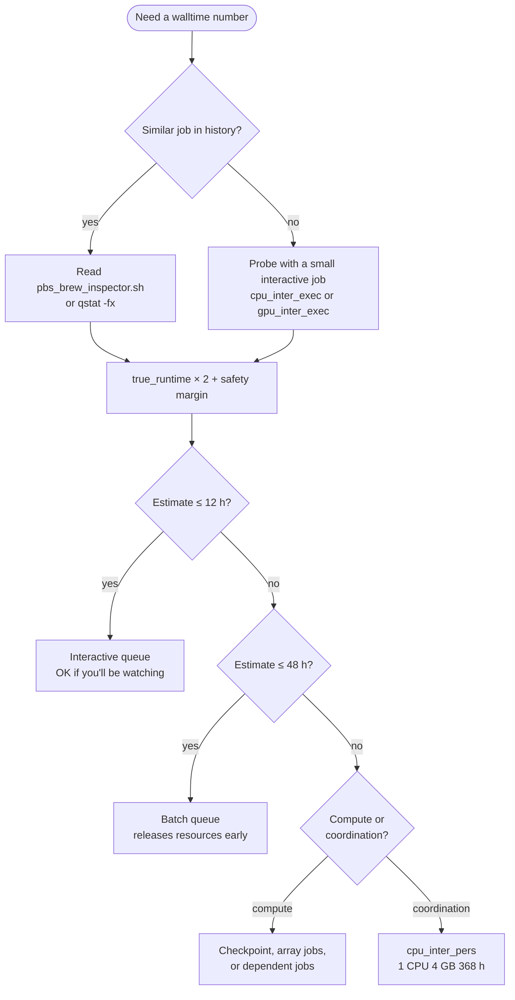

# Guess, Request, Regret: The Art of Walltime

## :material-timer-sand: The Great Walltime Dilemma

So, you're staring at the PBS script prompt, cursor blinking accusingly at `#PBS -l walltime=??:??:??`, and you're playing that familiar game: *"How long will this actually take?"* Welcome to **The Art of Walltime** — where every estimate is a guess, every request is a prayer, and every job termination is potential regret.

This guide is essentially a survival manual that:

- :material-tea: Helps you interpret your historical job data (like reading tea leaves, but with actual numbers).
- :material-scale-balance: Shows you how to make walltime decisions that won't keep you up at night.
- :material-clock-alert: Teaches you to balance between "too short and doomed to fail" and "so long you'll die of old age in the queue".
- :material-shield-clock: Respects the sacred 48-hour limit (with one tiny escape hatch — see below).

**Result:** *Jobs that actually finish, queue priority that doesn't make you weep, and the sweet, sweet feeling of resource efficiency.*

!!! tip "Companion pages"
    - :material-server-network: [Know Your Nodes](Know-Your-Nodes.md) — the hardware behind each queue (H100s, A100 MIG slices, large-mem boxes, watchdog cores).
    - :material-book-open-variant: [PBS Brew Inspector](../pbs-scripts/PBS-Brew-Inspector.md) — extract walltime ground truth from your own job history.
    - :material-school: QUT eResearch — [Queues and limits](https://docs.eres.qut.edu.au/hpc-queue-limits)[^1], [Estimating/optimising resources](https://docs.eres.qut.edu.au/hpc-estimatingoptimising-resources-to-request-for-)[^1], [Running jobs longer than 48 hours](https://docs.eres.qut.edu.au/breaking-the-48hr-barrier)[^1], [Checkpointing](https://docs.eres.qut.edu.au/checkpointing)[^1].

---

## :material-clipboard-list-outline: Know Your Cluster: Queue Limits

The walltime number you write is *only valid inside the queue it lands in*. Pick the wrong queue and the same number means different things — or means nothing, because PBS rejects the job before it starts.

### The six execution queues

| Queue | Walltime cap | CPUs / job | Memory / job | GPUs / job | Best for |
|---|---|---|---|---|---|
| `cpu_inter_exec` | **12 h** | 1–8 | 1–34 GB | – | Quick interactive testing, building conda envs, sanity-checking scripts |
| `gpu_inter_exec` | **12 h** | 1–12 | 1–68 GB | 1–2 | Interactive GPU debugging, single-card experiments |
| `cpu_batch_exec` | **48 h** | 1–2048 | 1 GB–16 TB | – | The default workhorse: most CPU jobs land here |
| `gpu_batch_exec` | **48 h** | 1–256 | 1 GB–1920 GB | 1–8 | Multi-GPU training, finetuning, inference at scale |
| `cpu_batch_exlm` | **48 h** | 1–180 | **1479 GB**–6015 GB | – | Single-node large-memory CPU jobs (request ≥1479 GB to land here) |
| `cpu_inter_pers` | **368 h (≈15.3 days)** | **1** | **1–4 GB** | – | Pipeline coordinators, persistent SSH sessions, Nextflow controllers — **not compute** |

!!! info "Where these numbers came from"
    Live from `qstat -Qf` on Aqua, cross-checked with [eResearch's Queues and limits page](https://docs.eres.qut.edu.au/hpc-queue-limits)[^1]. The `cpu_inter_pers` row isn't on the eResearch page — it's a tiny watchdog queue intended for orchestration, and this is one of the few public references that names its caps. See [Know Your Nodes](Know-Your-Nodes.md) for which physical hardware backs each queue.

### The two queues that actually trap people

??? warning "`cpu_inter_pers` is not a long-runtime compute queue"
    The 368-hour cap looks like a backdoor for "I need 10 days of GPU training". It is not. The queue is hard-capped at **1 CPU and 4 GB of RAM**. It exists for:

    - Nextflow / Snakemake / Airflow controllers that *submit* compute jobs and wait
    - Persistent SSH tunnels and `tmux` sessions
    - Long-running monitors and watchdog scripts

    If you need real compute beyond 48 h, the answer is checkpointing, array jobs, or dependent jobs (see [§ Recovery toolkit](#step-3-recovery-toolkit-when-walltime-kills-the-job) below and eResearch's [Running jobs longer than 48 hours](https://docs.eres.qut.edu.au/breaking-the-48hr-barrier)[^1]).

??? warning "Batch vs interactive — who holds the resources?"
    - **Batch jobs** (`*_batch_*`) release resources the moment they finish, even if your walltime request had hours left over. Be generous with the estimate; you pay only for what you use.
    - **Interactive jobs** (`*_inter_*`) hold every requested CPU, GB and GPU for the *entire* walltime — even if your task finished at minute three. Be tight with the estimate; you pay for the whole envelope.

    *The longer the walltime, the longer the queue wait. It's not just policy — it's physics. Or politics. Or both.*

### Per-user run caps (the other limit you forgot about)

Even if your job fits the per-job table above, the *queue* limits how many of your jobs can run at once:

| Queue | Concurrent running jobs | Total CPUs across your jobs | Total memory | Total GPUs |
|---|---|---|---|---|
| `cpu_batch_exec` | 3072 | 3072 | 24 576 GB | – |
| `cpu_inter_exec` | 8 | 8 | 34 GB | – |
| `gpu_batch_exec` | 32 | 1024 | 7680 GB | 32 |
| `gpu_inter_exec` | 2 | 12 | 68 GB | 2 |
| `cpu_batch_exlm` | 4 | 180 | 6015 GB | – |
| `cpu_inter_pers` | 1 | 1 | 4 GB | – |

PBS also rate-limits job launches at **60/min/queue** — if you fire 200 jobs at once, the first batch starts immediately and the rest trickle in over the next few minutes.

---

## :material-scale-balance: The Walltime Calculation Ritual

### Step 1 — Check your history (know yourself)

Before you guess, see what your past jobs tell you. Two complementary tools:

=== ":material-glass-mug-variant: pbs_brew_inspector.sh"

    Project-local script — gives you *aggregate* patterns across many jobs.

    ```bash
    ./pbs_brew_inspector.sh -g   # GPU jobs
    ./pbs_brew_inspector.sh -c   # CPU jobs
    ```

    What to read:

    - **True runtime vs requested walltime** — how much of your envelope did you actually use?
    - **Walltime usage %** — consistently low means you're hoarding. Aim for 75–85%.
    - **Job consistency** — are similar jobs taking similar time, or wildly variable?

    Full recipe: [PBS Brew Inspector](../pbs-scripts/PBS-Brew-Inspector.md).

=== ":material-magnify-scan: qstat -fx"

    Vendor-blessed per-job accounting. Drop this at the end of your script:

    ```bash
    qstat -fx $PBS_JOBID > resource_usage_$PBS_JOBID
    ```

    The file captures every `resources_used.*` field — `walltime`, `cpupercent`, `cput`, `mem`, `vmem`, `ncpus` — alongside what you *requested* (`Resources_List.*`). Compare the two and you'll see exactly where the slack is.

    Useful even on a single job; doesn't need a history. Source: [eResearch's Estimating/optimising resources page](https://docs.eres.qut.edu.au/hpc-estimatingoptimising-resources-to-request-for-)[^1].

=== ":material-radar: Live monitoring"

    For long jobs, watch them breathe in real time:

    - [eResearch Grafana dashboard](https://hpc-monitoring.eres.qut.edu.au/)[^1] — per-job CPU, memory, GPU utilisation.
    - `qstat -f $PBS_JOBID` while running — same fields as `-fx` but for live jobs.

### Step 2 — The Golden Ratio: the 2× rule

Take your best guess at how long your job will run. Now double it. This isn't pessimism; it's realism with a safety cushion.

Why it works:

- :material-database-alert: Accounts for dataset quirks you haven't seen yet
- :material-account-multiple: Covers random slowdowns from shared resources
- :material-eye-check: Gives you time to *notice* something has gone horribly wrong

A small formal version, for when you want to scale a baseline:

$$ T_{\text{estimated}} = T_{\text{baseline}} \times S + M $$

- $T_{\text{baseline}}$ — runtime of a similar job you already ran
- $S$ — scaling factor (see § Practical Walltime Science below for the full menu)
- $M$ — safety margin (1 h for short jobs, 4+ h for multi-day runs)

### Step 3 — Recovery toolkit (when walltime kills the job)

PBS does not deliver an apology email. When the walltime expires, the job is signal-9'd, your output ends mid-line, and you get to debug with the corpse. Three habits make this survivable:

#### Trace the crime scene with `set -x`

Add `set -x` near the top of every job script. Every command and variable expansion gets echoed to the log, so even a sudden termination leaves a breadcrumb trail of "we got to step N before the executioner arrived".

```bash
#!/bin/bash -l
set -eoux pipefail   # exit on error, undefined var, pipe failure; print every command
cd $PBS_O_WORKDIR
# ... your work here ...
```

#### Checkpoint with PBS's built-in mechanism

PBS will auto-resubmit a checkpointable job when its walltime expires. Two pieces:

```bash title="In the PBS directives"
#PBS -c w=30        # ask PBS to signal a checkpoint every 30 min of walltime
# Alternatives:
#PBS -c c=600       # every 600 min of cputime
#PBS -c s           # only on node shutdown
```

```bash title="In the script body — handle the signals"
checkpoint() { :; }          # save your state here
checkpoint_abort() { :; }    # save and exit cleanly here
trap checkpoint USR1
trap checkpoint_abort USR2
```

Without those `trap`s, the default action for `USR1`/`USR2` is to terminate the shell before your handler can save state — your job dies *during* the checkpoint instead of surviving it.

Full reference: [eResearch Checkpointing](https://docs.eres.qut.edu.au/checkpointing)[^1] and [Implementing checkpointing](https://docs.eres.qut.edu.au/implementing-checkpointing)[^1].

#### Outrun the 48-hour cap without `cpu_inter_pers`

When your real job *is* compute and won't fit in 48 hours, the structural answers are array jobs (split inputs across many short jobs) and dependent jobs (chain stages on the command line with `qsub -W depend=afterok:<upstream_jobid> stage2.pbs`, substituting the ID returned by the previous `qsub`). Both bypass the 48-hour wall without burning a watchdog slot. Recipes: [eResearch — Running jobs longer than 48 hours](https://docs.eres.qut.edu.au/breaking-the-48hr-barrier)[^1].

---

## :material-chef-hat: Walltime Recipes

Pick the closest profile to your job and copy-paste. All recipes assume you've already read [Know Your Nodes](Know-Your-Nodes.md) so you know which hardware you're landing on.



=== ":material-flash: Quick Test"

    ```bash
    #PBS -l walltime=01:00:00
    #PBS -l select=1:ncpus=4:mem=8gb
    #PBS -q cpu_inter_exec

    # GPU variant — swap the resource line + queue:
    # -l select=1:ncpus=4:mem=8gb:ngpus=1
    # -q gpu_inter_exec
    ```

    **Best for:** checking the code runs at all, debugging startup, building conda envs, trying module combinations. You'll be watching.

=== ":material-school: Standard Training"

    ```bash
    #PBS -l walltime=24:00:00
    #PBS -l select=1:ncpus=12:mem=64gb:ngpus=1
    #PBS -q gpu_batch_exec
    ```

    **Best for:** most ML model training, medium-sized data processing, jobs with established completion patterns. Batch releases the GPU early if you finish at hour 18.

=== ":material-help-circle: I Have No Idea"

    ```bash
    #PBS -l walltime=04:00:00
    #PBS -l select=1:ncpus=4:mem=16gb
    #PBS -q cpu_batch_exec
    ```

    **Best for:** first runs of new code, exploratory analysis, when you genuinely can't estimate but don't want to clog the interactive queue. Long enough to be useful, short enough to schedule fast.

=== ":material-calendar-weekend: Weekend Warrior"

    ```bash
    #PBS -l walltime=48:00:00
    #PBS -l select=1:ncpus=16:mem=128gb:ngpus=2
    #PBS -q gpu_batch_exec
    ```

    **Best for:** Friday submissions you want done by Monday, large jobs you've already tested, runs where you won't be available to restart failures. Hit the cap and hope. (Better: combine with `#PBS -c w=60` so PBS auto-resubmits.)

=== ":material-pipe: Pipeline Master"

    ```bash
    #PBS -l walltime=168:00:00     # 7 days; the queue allows up to 368 h
    #PBS -l select=1:ncpus=1:mem=2gb
    #PBS -q cpu_inter_pers
    ```

    **Best for:** Nextflow / Snakemake controllers that submit and wait, persistent `tmux` orchestrators, long-lived monitoring scripts. **One CPU and 4 GB max** — do *not* try to compute here, just coordinate.

---

## :material-flask-outline: Practical Walltime Science (The Math)

For when the 2× rule isn't enough and you need to scale a baseline rigorously. The scaling factor $S$ in $T_{\text{est}} = T_{\text{baseline}} \cdot S + M$ depends on what changed.

### Symbol legend

| Symbol | Meaning | Where it appears |
|---|---|---|
| $n$ | Input data size (generic) | CPU complexity classes |
| $N$ | Number of training samples | GPU data scaling |
| $b$ | Batch size | GPU training |
| $x$ | Input dimension (features, pixels) | Simplified GPU formula |
| $s$ | Sequence length | RNN, Transformer |
| $d$ | Embedding / hidden dimension | Transformer, RNN |
| $h$ | Hidden state size | RNN |
| $l$ | Number of layers | Transformer, RNN |
| $p$ | Parameter count | Model size scaling |
| $k$ | Convolution kernel size | CNN |
| $c$ | Channel count (in / out) | CNN |
| $e$ | Efficiency factor (0.7–0.9 typical) | Hardware scaling |
| $C, G$ | CPU cores, GPU count | Hardware scaling |

### CPU-bound: scale by complexity class

=== "$O(n)$ Linear"

    $$ S \approx \frac{n_{\text{new}}}{n_{\text{baseline}}} $$

    Examples: data parsing, point-wise operations, streaming analytics. **Doubling data doubles runtime.**

=== "$O(n \log n)$ Log-linear"

    $$ S \approx \frac{n_{\text{new}}}{n_{\text{baseline}}} \times \frac{\log n_{\text{new}}}{\log n_{\text{baseline}}} $$

    Examples: sorting, FFTs, divide-and-conquer, heap operations. **Doubling data ≈ 2.1–2.3× runtime.**

=== "$O(n^2)$ Quadratic"

    $$ S \approx \left(\frac{n_{\text{new}}}{n_{\text{baseline}}}\right)^2 $$

    Examples: pairwise distance matrices, naive string matching, nested loops. **Doubling data quadruples runtime.**

=== "$O(n^3)$ Cubic"

    $$ S \approx \left(\frac{n_{\text{new}}}{n_{\text{baseline}}}\right)^3 $$

    Examples: 3D simulations, molecular dynamics, dense matrix ops. **Doubling data → 8× runtime — gets impractical fast.**

=== "$O(n^k)$ Polynomial"

    $$ S \approx \left(\frac{n_{\text{new}}}{n_{\text{baseline}}}\right)^k, \quad k > 3 $$

    Examples: k-clique finding, some dynamic programming, naive polynomial evaluation. **Avoid for large datasets unless you've simplified.**

=== "$O(2^n)$ Exponential"

    $$ S \approx \frac{2^{n_{\text{new}}}}{2^{n_{\text{baseline}}}} $$

    Examples: brute-force TSP, power set generation, exhaustive combinatorial search. **Small input increases → astronomical runtime.** Reach for approximations.

=== "$O(n!)$ Factorial"

    $$ S \approx \frac{n_{\text{new}}!}{n_{\text{baseline}}!} $$

    Examples: exact combinatorial optimisation, NP-complete brute force. **Practical only for $n < 12$.**

### GPU deep-learning workloads

#### Quick-and-dirty: the multiplicative formula

When you don't know the architecture details, multiply everything you changed:

$$ S \approx \frac{b_{\text{new}} \cdot p_{\text{new}} \cdot x_{\text{new}} \cdot E_{\text{new}}}{b_{\text{baseline}} \cdot p_{\text{baseline}} \cdot x_{\text{baseline}} \cdot E_{\text{baseline}}} $$

where $p =$ parameters, $x =$ input dimension, $E =$ epochs (distinct from the efficiency factor $e$ in the legend). Fine for sanity checks; for production planning, use the sharper rules below.

#### Data-size scaling

- **Linear models:** $S \approx N_{\text{new}} / N_{\text{baseline}}$
- **Neural networks:** $S \approx \left(N_{\text{new}} / N_{\text{baseline}}\right)^c$ with $c \approx 0.8$–$0.9$

The sub-linear exponent comes from vectorisation gains, GPU kernel efficiency at scale, and the fact that diverse data sometimes converges in fewer epochs.

#### Batch-size scaling

Two effects fight each other:

- **Throughput** (work per wall second) improves with batch size:
  $$ S_{\text{throughput}} \approx \left(\frac{b_{\text{baseline}}}{b_{\text{new}}}\right)^c, \quad c \approx 0.8\text{–}0.9 $$
  (Sub-linear because memory bandwidth and kernel launch overhead bite.)
- **Convergence** often *worsens* — larger batches need more epochs to hit the same accuracy:
  $$ S_{\text{epochs}} \approx \left(\frac{b_{\text{new}}}{b_{\text{baseline}}}\right)^{0.1\text{–}0.3} $$

Multiply both for the net effect.

#### Model-size scaling

| Regime | Scaling | Notes |
|---|---|---|
| Dense, model fits in GPU memory | $S \approx p_{\text{new}} / p_{\text{baseline}}$ | Linear in parameters |
| Sparse (MoE, pruning) | $S \approx (p_{\text{new}} / p_{\text{baseline}})^c, \ c < 1$ | Sub-linear |
| Very large, memory-bound | $S \approx (p_{\text{new}} / p_{\text{baseline}})^d, \ d > 1$ | Cache and access-pattern penalties |
| **Doesn't fit in GPU memory** | 10–100× | Gradient checkpointing or model parallelism kicks in |

If you're near the memory limit, see [Know Your Nodes](Know-Your-Nodes.md) for MIG slicing on A100 (sometimes a 1/7 slice is enough and arrives faster than a full card).

### Architecture-specific FLOPs (forward + backward)

??? math "Click for the per-architecture scaling factors"

    === "Feedforward NN"

        $$ S \approx \frac{b_{\text{new}} \cdot N_{\text{new}} \cdot \sum_i n_i n_{i+1}}{b_{\text{baseline}} \cdot N_{\text{baseline}} \cdot \left(\sum_i n_i n_{i+1}\right)_{\text{baseline}}} $$

        $n_i$ = neurons in layer $i$.

    === "CNN"

        $$ S \approx \frac{b_{\text{new}} \cdot \sum_i (h_i w_i) \cdot \sum_j (k_j^2 c_{j,\text{in}} c_{j,\text{out}})}{\text{(same expression, baseline values)}} $$

        $h, w$ = feature-map height/width, $k$ = kernel size, $c$ = channels.

    === "RNN / LSTM / GRU"

        $$ S \approx \frac{b_{\text{new}} \cdot s_{\text{new}} \cdot h_{\text{new}}^2 \cdot l_{\text{new}} \cdot (1 + d_{\text{new}})}{\text{(same expression, baseline values)}} $$

        $s$ = sequence length, $h$ = hidden dim, $l$ = layers, $d \in \{0,1\}$ = bidirectional flag.

    === "Transformer"

        $$ S \approx \frac{b_{\text{new}} \cdot s_{\text{new}}^2 \cdot d_{\text{new}} \cdot l_{\text{new}}}{b_{\text{baseline}} \cdot s_{\text{baseline}}^2 \cdot d_{\text{baseline}} \cdot l_{\text{baseline}}} $$

        This captures the **attention** term ($b \cdot s^2 \cdot d \cdot l$). For wide-but-short-context models ($d \gtrsim s$), the **feed-forward** term $4 \cdot b \cdot s \cdot d^2 \cdot l$ dominates instead. A more complete approximation is:

        $$ \text{FLOPs} \propto b \cdot l \cdot \left(4 \cdot s \cdot d^2 + 2 \cdot s^2 \cdot d\right) $$

        Use whichever term is bigger for your model.

!!! tip "Convergence variability"
    Stochastic training takes 0.5–2× the expected number of epochs. Always include a buffer of at least **1.5×** on top of the deterministic estimate.

### Hardware scaling (when you're changing the box, not the workload)

??? note "CPU multi-threading"
    - **Ideal:** $S \approx C_{\text{baseline}} / C_{\text{new}}$
    - **Reality:** $S \approx C_{\text{baseline}} / (C_{\text{new}} \cdot e)$ with $e \approx 0.7$–$0.9$
    - **Amdahl:** $S \approx \dfrac{1}{(1-p) + p \cdot C_{\text{baseline}} / C_{\text{new}}}$ where $p$ is the parallelisable fraction

??? note "GPU scaling"
    - **Data parallelism:** $S \approx G_{\text{baseline}} / (G_{\text{new}} \cdot e)$ with $e \approx 0.7$–$0.9$
    - **Model parallelism:** typically worse efficiency than data parallelism
    - **Multi-node:** $S_{\text{multi}} \approx S_{\text{single}} \cdot e_{\text{comm}}$ with $e_{\text{comm}} < 1$ from inter-node communication

??? note "Memory and I/O"
    - **Memory bandwidth (memory-bound jobs):** $S \approx B_{\text{baseline}} / (B_{\text{new}} \cdot e)$ with $e \approx 0.6$–$0.8$ — *more bandwidth shrinks $S$, i.e. runs faster*
    - **Swapping:** if memory requirements exceed RAM, expect **10–100× slowdown**
    - **NUMA:** multi-socket access can lose 5–15% efficiency
    - **Cache locality:** good locality means cores scale better than raw bandwidth

??? info "Memory-bound vs compute-bound — which are you?"
    - **Memory-bound** (large data processing, sparse linear algebra): more memory bandwidth helps more than more cores.
    - **Compute-bound** (dense numerical simulations, training small models): more cores / GPUs help more than more memory.

    Run a small profile (`qstat -fx`, Grafana dashboard, `nvidia-smi` during a training step) to see which side of the line you're on before you scale up.

### :material-rocket-launch: Resource vs walltime trade-off

There's almost always a tension between resources requested (which shorten compute time) and queue wait (which lengthens it).

| Approach | Walltime | Resources | Queue wait (illustrative) | Total time |
|---|---|---|---|---|
| High-resource | 12 h | 4× H100 | 24 h+ | 36 h+ |
| Balanced | 24 h | 2× H100 | 8 h | 32 h |
| Low-resource | 36 h | 1× H100 | 2 h | 38 h |

!!! note "Numbers above are illustrative — check live load"
    Wait times depend on cluster state. Read the [eResearch Grafana dashboard](https://hpc-monitoring.eres.qut.edu.au/)[^1] or run `qstat -B` / `qstat -Q` before you commit. The relative ordering (more resources → longer wait) holds; the absolute numbers swing day to day.

**Things to weigh:**

- :material-account-group: **Queue congestion** — bigger asks wait longer
- :material-piggy-bank: **Allocation efficiency** — fewer resources for longer is usually cheaper
- :material-fire: **Urgency** — if the deadline is in 6 h, throw resources at it
- :material-trending-up: **Scalability** — not every workload scales with more cards
- :material-content-save: **Checkpoint cost** — longer jobs need more frequent checkpoints

### :material-lightbulb-on: Worked example: scaling a ResNet finetune

You ran ResNet-50 on **10 000 images** with a single H100 in **2 hours**. Now you want to scale to **100 000 images** on the same card. Apply the neural-net data-scaling rule ($c = 0.85$):

$$ S \approx \left(\frac{100\,000}{10\,000}\right)^{0.85} \approx 10^{0.85} \approx 7.1 $$

Deterministic estimate: $2\text{ h} \times 7.1 = 14.2 \text{ h}$.

Apply the 1.5× convergence buffer: $14.2 \times 1.5 \approx 21.3 \text{ h}$.

Round up and add a safety margin: **walltime 24 h, queue `gpu_batch_exec`**. Comfortably inside the 48 h cap with room to spare. Drop `#PBS -c w=60` if you want PBS to auto-resubmit on the off chance you blew the estimate.

---

## :material-alert-circle-outline: Warning Signs and Troubleshooting

### Walltime sins and their punishments

- :material-emoticon-cool-outline: **The Miniaturist** — requesting 1 h for a 50-epoch training run. *Punishment: endless cycle of failed jobs and lost progress.*
- :material-archive: **The Hoarder** — requesting 7 days for a 4-hour job. *Punishment: your job ages like fine wine in the queue while your deadline approaches like a freight train.*
- :material-puzzle-remove: **The Queue Mismatched** — a 24-hour job into a 12-hour interactive queue. *Punishment: guaranteed failure halfway through, bonus frustration.*
- :material-content-copy: **The Copy-Paster** — same walltime for every job, regardless of work. *Punishment: a reputation with HPC admins who tell stories about you at holiday parties.*
- :material-emoticon-happy-outline: **The Optimist** — *"it'll definitely be faster this time!"* *Punishment: explaining to your supervisor why there are no results for the meeting.*
- :material-pig-variant: **The Resource Hog** — minor tasks in batch queues with max resources. *Punishment: everyone at the Uni quietly resenting you.*

### When jobs die too young

| Symptom | First thing to try |
|---|---|
| Hit walltime on every run | Add `#PBS -c w=N` + USR1/USR2 traps so PBS auto-resubmits |
| Job dies with no diagnosis | Add `set -x` at the top of the script |
| 47 h job needs 49 h | Split the work into stages with `qsub -W depend=afterok:<upstream_jobid> stage2.pbs` |
| Many similar runs | Use a job array (`#PBS -J 1-100`) — see [eResearch — Breaking the 48hr barrier](https://docs.eres.qut.edu.au/breaking-the-48hr-barrier)[^1] |
| Maintenance window is near | Check `time_until_outage.sh` (see [Know Your Nodes](Know-Your-Nodes.md)) before submitting a long batch |

### When you're stuck in queue purgatory

| Symptom | First thing to try |
|---|---|
| Job never starts | `qstat -q` for queue depth, `qstat -B` for server view |
| Requested more than the queue allows | Re-check the [queue table above](#the-six-execution-queues) — over-spec auto-routes elsewhere or fails |
| Many GPUs requested, few available | Drop to a smaller card / MIG slice — see [Know Your Nodes](Know-Your-Nodes.md) |
| Need to control a running job | `qhold <jobid>` to pause, `qrls <jobid>` to resume, `qdel <jobid>` to cancel |

### The interactive queue conundrum

Things to remember before you `qsub -I`:

- Resources are held for the **entire** walltime — finish early and you still pay for the slot
- 12-hour cap vs 48-hour batch — choose deliberately
- Lower per-job resource limits than the batch sibling (e.g. 2 vs 8 GPUs)
- `cpu_inter_pers` is *one* CPU and 4 GB — only for orchestration, never for compute

---

## :material-lightbulb-multiple: Tips From the Walltime Whisperers

- :material-progress-clock: **Progress bars are your friend** — add `tqdm` (or equivalent) so the next estimate comes from data, not vibes.
- :material-rotate-360: **Two-phase approach** — run a small interactive probe first, get a real baseline, then scale up for batch.
- :material-content-save-all: **Checkpoint everything** — your future self will thank you when the 47-hour job crashes at hour 46.
- :material-stop-circle: **Have a kill switch** — `qhold` pauses, `qdel` cancels. Learn both before you need them.
- :material-chart-line-variant: **Track your efficiency** — aim for 75–85% walltime usage on average. Below 50% and you're hoarding; consistently above 95% and you're flirting with disaster.
- :material-poll: **Different queues, different rules** — what's true on `gpu_batch_exec` may be wrong on `gpu_inter_exec`. Read the limits.
- :material-account-tie: **Make friends with the HPC admin** — they know things `qstat` will never tell you.

> **Remember:** Walltime isn't just a number — it's a relationship between you, your code, your data, the specific queue limits, and the cruel mistress of computational fate.

---

## :material-egg-easter: Coming Soon

- A guide to interpreting cryptic error messages when your job dies with 5 seconds of walltime remaining.
- The psychological impact of watching your perfectly estimated job finish with exactly `00:00:01` remaining.
- Advanced negotiations with the queue scheduler: bargaining, pleading, and acceptance.
- Walltime support group: sharing stories of that time you asked for 48 hours and it took 48 hours and 3 minutes.

The perfect walltime doesn't exist. But the perfect walltime *estimate* does.

[^1]: Access only in QUT network. Please use VPN to access the documentation when off-campus.
