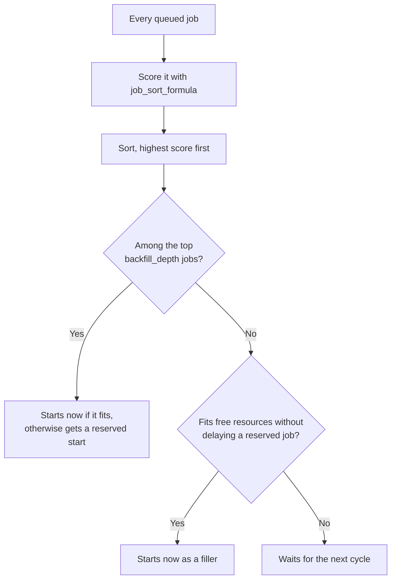

# The Queue Is Not a Line: How Aqua Ranks Your Job

> *Or: first come, first served was never the deal.*

## :material-human-queue: Welcome to the Leaderboard

You submitted hours ago. Your job is still `Q`. A job that looks exactly like yours, submitted after yours, just started. Before you open a ticket: nothing is broken. The queue is not a line. It is a **leaderboard**, PBS rebuilds it every scheduling cycle, and right now you are being outscored.

The good news is that the scoring rule is public. You can read it, and once you can read it, most of the mystery goes away.

---

## :material-function-variant: The Formula on the Wall

PBS Professional lets a site replace its default ordering with a single expression, the server attribute `job_sort_formula`[^2]. Every scheduling cycle it is evaluated for every queued job, and the highest score goes first. Anyone can read it:

```bash
qmgr -c "print server" | grep -iE "job_sort_formula|eligible_time_enable|backfill_depth"
```

At the time of writing, Aqua's looked like this:

```text
set server job_sort_formula = "(48 * fairshare_factor) + ((6 * fairshare_factor) * ((mem/1048576/8) + ncpus + (ngpus*32))) + (0.000278 * eligible_time) + (4 * log(max(fairshare_factor, 1e-7)))"
set server eligible_time_enable = True
set server backfill_depth = 10
```

Writing $f$ for `fairshare_factor`, that is:

$$
\text{score} = 48f \;+\; 6f \left( \frac{\text{mem}}{1048576 \cdot 8} + \text{ncpus} + 32\,\text{ngpus} \right) \;+\; \frac{\text{eligible\_time}}{3600} \;+\; 4 \ln \big( \max(f,\,10^{-7}) \big)
$$

!!! warning "Snapshot, not scripture"
    Sites tune this formula live, and there is no changelog. Run the `qmgr` line above before you quote a coefficient to anyone.

---

## :material-magnify: Reading It: What Each Part Means

The formula uses five variables in three groups. Two groups are simple. One is not, and this page is honest about which.

### :material-package-variant: What you asked for: `mem`, `ncpus`, `ngpus`

Straight off your `select` line. PBS uses what you **requested**, never what you actually used.

Memory arrives in kilobytes, which is why the formula divides it twice: `mem/1048576` gives gigabytes, and the extra `/8` makes 8 GB units. Cores count as themselves. A GPU counts as 32.

So the scheduler's price list is **one GPU = 32 cores = 256 GB**. The single-GPU training request from [Recipe 4](Walltime-by-Recipe.md#recipe-4-single-h100-training), `ncpus=12:ngpus=1:mem=64gb`, comes to 52 points of size, made up of 32 for the GPU, 12 for the cores and 8 for the memory.

Bigger requests score higher. The catch is the multiplier sitting in front of the whole bracket, which is your fair-share factor, so for that request the term is worth 312 points to a fresh account and close to nothing to a heavy one.

### :material-timer-sand: How long you have waited: `eligible_time`

Seconds spent queued while blocked by a lack of resources. The coefficient `0.000278` is $1/3600$, so this is simply **one point per hour of waiting**.

It is the only term that grows on its own, and the only one you can watch directly. It is also the only one you can destroy by accident, which is the next section.

### :material-scale-balance: How heavy a user you have been: `fairshare_factor`

A number between **0 and 1**, where **higher is better**[^2][^3].

$$f = 2^{-\,\text{usage}/\text{share}}$$

**Share** is the slice of the cluster the administrators assign you. It does not move no matter what you submit.

**Usage** is your slice of everyone's recent consumption. It grows while your jobs run, and it fades on its own when they stop.

So the rule is short: **running more drives your factor down, and running nothing lets it climb back up.** The useful anchor is the middle. If your usage matches your share, $f$ is 0.5. Use twice your share and it halves to 0.25. Use almost nothing and it creeps toward 1.

The factor appears three times in the formula, which is why it dominates everything else: as the flat 48-point bonus, as the multiplier on everything you asked for, and inside a logarithm as a penalty worth $0$ at $f = 1$, about $-2.8$ at $0.5$, and about $-12$ at $0.05$. The $10^{-7}$ floor is only there so that an account with no share at all does not feed $\ln 0$ into the maths.

Two more things worth knowing. The factor belongs to you, not to a job, so every job you have queued carries the same value, and your own jobs are ordered among themselves by size and waiting time. And each of Aqua's schedulers keeps its own fair-share records (`qmgr -c "print sched"` shows a separate `sched_priv` directory for each), so CPU batch work does not lower your standing in the GPU batch queue.

!!! note "This is where the page stops being precise"
    The unit your usage is counted in, how quickly it fades, and how large your share is all live in the scheduler's private configuration. That is root-only and not even mounted on the login node, so no user can read it and this page will not guess. Treat the factor as a dial you influence but cannot measure.

### :material-close-circle: What is not in the formula

Your **walltime**, and the job's **`Priority`** attribute. A one-hour and a 48-hour request score identically. Walltime matters enormously for backfilling, which is a different mechanism further down.

---

## :material-calculator: Putting It Together

<!-- markdownlint-disable MD033 -->
<div id="queue-score-explorer" class="qse"></div>
<!-- markdownlint-enable MD033 -->

Waiting does not rescue a low factor, because every queued job earns the same one point per hour. Two identical jobs submitted together keep exactly the same gap however long they both wait. Hours only help you against jobs submitted after yours: a job that starts 100 points behind passes an identical job from a fresh account only if that job arrives more than 100 hours later.

That is the single most useful line on this page: **a fair-share deficit is not something you out-wait.** It shrinks only as your usage fades while you are not running.

---

## :material-timer-sand: The One Clock On Your Side

You can watch your waiting time accrue:

```bash
qstat -f <jobid> | grep -E "eligible_time|comment"
```

The rules[^2]:

- :material-check: **It accrues** while the job is blocked by a lack of resources.
- :material-close: **It does not accrue** while the job is blocked by a run limit, by a user hold, or by a `qsub -a` start time. During those you accrue *ineligible* time instead, and PBS does not show you which state you are in.
- :material-arrow-up-bold: **It only ever goes up** during the life of a job, and a requeue keeps it.
- :material-delete-forever: **`qdel` destroys it.** A resubmission starts from zero.

!!! warning "Chained jobs bank nothing"
    A job that depends on another can only accrue eligible time once the job it depends on has finished. Split a long run into a five-link `afterok` chain ([Recipe 8](Walltime-by-Recipe.md#recipe-8-long-pipeline-with-chained-jobs)) and links two to five sit at zero until the previous link ends, then start from zero. The chain fits under the 48-hour ceiling; it does not stockpile waiting.

!!! warning "Delete-and-resubmit is the most expensive edit you can make"
    Every hour a queued job has waited is a point that nothing else gives back. Realising the walltime should have been 40 h instead of 48 h is rarely worth resetting a day of waiting. `qalter -l walltime=...` changes the queued job in place instead of creating a new one.

---

## :material-view-list: Top Jobs, Backfill, and the Blank `qstat -T`

The score decides the *order* the scheduler tries jobs. Backfilling decides who gets a **reservation**.



Each cycle the scheduler takes the highest-scoring jobs, up to `backfill_depth` of them, and pencils in a start time for each on real nodes. Those are the **top jobs**. Everything below is a **filler**, allowed to run now only if it will not delay a top job's planned start.

That is how PBS behaves when backfilling is switched on. The depths below are readable by anyone, but the scheduler setting that turns reservations on is not, so treat this section as the mechanism rather than a guarantee.

| Scope | `backfill_depth` |
|---|---|
| `gpu_batch_exec` | **5** |
| `cpu_batch_exec` | 60 |
| server default, for queues without their own | 10 |

Five reservations on the GPU batch queue, rebuilt from scratch every cycle. Three consequences:

- :material-eye-off: **`qstat -T` shows an estimated start only for jobs holding a reservation**, and only for your own jobs. A blank estimate is not a bug. Most likely it means "not in the top five right now".
- :material-clock-fast: **A short walltime and a modest footprint are what help a low-ranked job.** A filler has to fit both the time before a top job's planned start and the cores, memory and GPUs that are free, and the scheduler can only judge the time if your walltime is honest. Your score ignores walltime; the backfiller depends on it.
- :material-swap-vertical: **You can be next, and then not.** Your own running jobs keep adding usage, your factor drifts down, and someone fresher takes the slot.

??? info "The comment `Not Running: Insufficient amount of resource: qlist`"
    PBS's generic "a resource did not match" message, with the resource's name on the end. On Aqua `qlist` is a tag on every node saying which queues may use it, and each queue stamps its own name onto your job's chunks. The comment means no node tagged for your queue had room at that cycle. It says nothing about your fair share and nothing about permissions.

---

## :material-eye-off: What You Can See

| You want | Command | You get |
|---|---|---|
| The formula | `qmgr -c "print server" \| grep job_sort_formula` | All of it |
| Your job's score | nothing | It lives inside the scheduler process and its root-owned log |
| Your accrued wait | `qstat -f <jobid>` → `eligible_time` | Yes |
| Why you were skipped this cycle | `qstat -f <jobid>` → `comment` | Yes |
| Where you stand | `qstat -T` | An estimated start only if your job holds a reservation; blank otherwise |
| Your factor, your share, the decay | `pbsfs`, `sched_config` | Root only |
| Anyone else's job | `qstat -u <them>` | Empty. `query_other_jobs` is off |

This is normal for PBS Professional sites, not an Aqua quirk. The product does not expose a job's score or a user's factor, and at least one large centre tells its users so plainly[^4].

---

## :material-chess-knight: Tips From the Queue Whisperers

- :material-link-off: **A chain is a trade-off, not a shortcut.** Short links fit backfill gaps more easily than one 48-hour job, but every link after the first earns no waiting time until the one before it finishes.
- :material-arrow-collapse: **Trim memory and cores for placement, not for points.** Smaller requests fit more gaps, but they also lower your score: only a little when your factor is low, a lot when it is high.
- :material-account-tie: **Make friends with the HPC admin.** They can run `pbsfs`. You can't.

> **Remember:** A long wait is the scheduler doing arithmetic, not holding a grudge. The arithmetic is above. The grudge, if any, is yours.

---

## :material-arrow-right-circle: Where next

- :material-clock-outline: [Guess, Request, Regret: The Art of Walltime](The-Art-of-Walltime.md) — choosing a walltime the backfiller can work with.
- :material-chef-hat: [Walltime by Recipe](Walltime-by-Recipe.md) — copy-paste requests, including the single-GPU training shape used on this page.
- :material-server-network: [Know Your Nodes](Know-Your-Nodes.md) — the hardware behind each queue.
- :material-school: QUT eResearch — [Queues and limits](https://docs.eres.qut.edu.au/hpc-queue-limits)[^1].

[^1]: Access only in QUT network. Please use VPN to access the documentation when off-campus.
[^2]: Altair, "[PBS Professional 2024.1 Administrator's Guide](https://help.altair.com/2024.1.0/PBS%20Professional/PBSAdminGuide2024.1.pdf)". Section 4.9.21 covers the job sorting formula, its terms and their units. Section 4.9.19 covers fair share, including how `fairshare_factor` is defined. Section 4.9.13 covers when eligible time accrues and when it does not.
[^3]: OpenPBS, "[Scheduler source code](https://github.com/openpbs/openpbs/tree/master/src/scheduler)". Where `fairshare_factor` is actually computed.
[^4]: MetaCentrum, "[Fairshare](https://docs.metacentrum.cz/en/docs/computing/resources/fairshare)". Tells users the fair-share value cannot be displayed directly.
