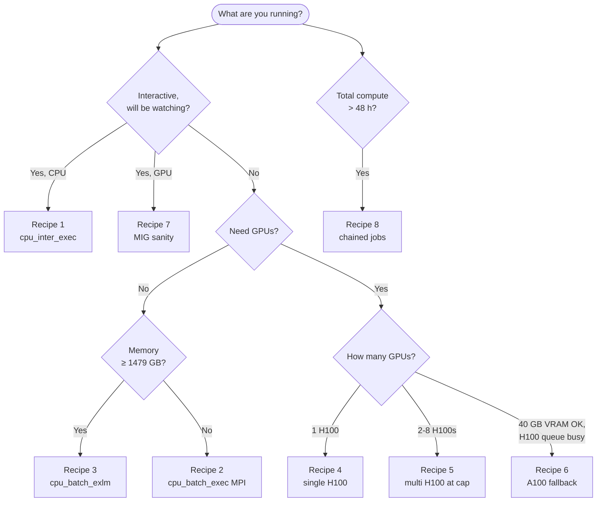

# Walltime by Recipe: Worked Examples for Aqua

So you've read [The Art of Walltime](The-Art-of-Walltime.md) and you understand the rules of the game. Now you need an answer for *your* job — and you don't want to derive scaling factors from first principles every time. Welcome to the **recipe book**: eight Aqua-specific worked examples, each one a copy-paste starting point you can adapt.

Every recipe respects the live queue caps (probed 2026-06-22). If a number here looks wrong, the cluster's specs probably changed — re-probe with `qstat -Qf` and update.

!!! tip "Companion pages"
    - :material-clock-outline: [The Art of Walltime](The-Art-of-Walltime.md) — the theory: queue limits, the 2× rule, scaling-factor menu, recovery toolkit.
    - :material-server-network: [Know Your Nodes](Know-Your-Nodes.md) — the hardware behind each queue (H100s, A100 MIG slices, large-mem boxes, watchdog cores).
    - :material-glass-mug-variant: [PBS Brew Inspector](../pbs-scripts/PBS-Brew-Inspector.md) — extract walltime ground truth from your own job history.
    - :material-school: QUT eResearch — [Queues and limits](https://docs.eres.qut.edu.au/hpc-queue-limits)[^1], [Estimating/optimising resources](https://docs.eres.qut.edu.au/hpc-estimatingoptimising-resources-to-request-for-)[^1], [Running jobs longer than 48 hours](https://docs.eres.qut.edu.au/breaking-the-48hr-barrier)[^1], [Checkpointing](https://docs.eres.qut.edu.au/checkpointing)[^1].

!!! info "Notation"
    Every recipe uses the same notation as Art of Walltime: $T_{\text{est}} = T_{\text{baseline}} \cdot S + \Delta$, where $T_{\text{baseline}}$ is your prior runtime, $S$ the scaling factor, and $\Delta$ a safety margin (1 h short jobs, 4+ h multi-day). Memory request is written **R** (to avoid colliding with the margin). The full symbol legend lives in [Art of Walltime § Symbol legend](The-Art-of-Walltime.md#symbol-legend).

---

## :material-script-text: The standard PBS preamble

Every recipe below assumes this skeleton — only the `#PBS -l` resource lines and the body change.

```bash
#!/bin/bash -l
#PBS -N my_job              # rename per job
#PBS -j oe                  # join stderr into stdout for one log
#PBS -m abe                 # email on abort / begin / end (optional)
# --- per-recipe resource lines go here ---

set -eoux pipefail          # exit on error, undef var, pipe failure; trace every command
cd "$PBS_O_WORKDIR"

# --- your work here ---

qstat -fx "$PBS_JOBID" > "resource_usage_${PBS_JOBID}"   # post-mortem for future walltime tuning
```

What this buys you:

- :material-bug-outline: **`set -x`** — every command and its variable expansion echoed to the log. When walltime kills the job mid-line, you know exactly where you were.
- :material-shield-check: **`set -eou pipefail`** — the script aborts on the first error instead of carrying on with garbage.
- :material-chart-box: **`qstat -fx` postlude** — captures `resources_used.walltime`, `cpupercent`, `mem`, `vmem`. Drop this file beside your output and the next time you submit a similar job, you'll know exactly how much slack the last one had. Same idea as [PBS Brew Inspector](../pbs-scripts/PBS-Brew-Inspector.md) but for a single job. Recommended by [eResearch's Estimating/optimising resources](https://docs.eres.qut.edu.au/hpc-estimatingoptimising-resources-to-request-for-)[^1].

For checkpointable jobs, add `#PBS -c w=N` plus USR1/USR2 traps — see [Art of Walltime § Recovery toolkit](The-Art-of-Walltime.md#step-3-recovery-toolkit-when-walltime-kills-the-job).

---

## :material-map: Pick your recipe



<!-- markdownlint-disable MD033 MD051 -->
<div class="grid cards" markdown>

- :material-flash: **Recipe 1 — Quick CPU test**

    ---

    A shell on a real compute node. Build conda envs, debug scripts, try module combos.

    [:octicons-arrow-right-24: Jump to recipe](#recipe-1-quick-cpu-test-cpu_inter_exec)

- :material-cog: **Recipe 2 — Heavy CPU MPI**

    ---

    Genoa-pinned multi-chunk MPI on `cpu_batch_exec`. The cluster workhorse.

    [:octicons-arrow-right-24: Jump to recipe](#recipe-2-heavy-cpu-mpi-on-cpu_batch_exec)

- :material-database: **Recipe 3 — Large memory**

    ---

    Single-node analysis above 1.5 TB. Auto-routes to `cpu_batch_exlm` (the 6 TB node).

    [:octicons-arrow-right-24: Jump to recipe](#recipe-3-large-memory-analysis-on-cpu_batch_exlm)

- :material-rocket: **Recipe 4 — Single H100**

    ---

    The bread-and-butter ML training job. One full 80 GB H100 card, hours-to-days.

    [:octicons-arrow-right-24: Jump to recipe](#recipe-4-single-h100-training)

- :material-rocket-launch: **Recipe 5 — Multi-GPU H100**

    ---

    Up to 8 H100s across 1–2 nodes (the per-job ceiling). Knows when to stop.

    [:octicons-arrow-right-24: Jump to recipe](#recipe-5-multi-gpu-h100-at-the-per-job-ceiling)

- :material-swap-horizontal: **Recipe 6 — A100 fallback**

    ---

    40 GB VRAM cards on the cheaper-to-queue A100 nodes. When H100 wait isn't worth it.

    [:octicons-arrow-right-24: Jump to recipe](#recipe-6-a100-fallback-when-the-h100-queue-is-busy)

- :material-microscope: **Recipe 7 — MIG sanity check**

    ---

    One 1g.10gb MIG slice (≈ 1/7 of an H100, ~10 GB VRAM). "Does my model load?"

    [:octicons-arrow-right-24: Jump to recipe](#recipe-7-mig-slice-sanity-check)

- :material-link-variant: **Recipe 8 — Chained jobs**

    ---

    Total compute beyond 48 h. Split into stages, chain with `qsub -W depend=afterok`.

    [:octicons-arrow-right-24: Jump to recipe](#recipe-8-long-pipeline-with-chained-jobs)

</div>
<!-- markdownlint-enable MD033 MD051 -->

---

## :material-silverware-fork-knife: The recipes

### :material-flash: Recipe 1 — Quick CPU test (`cpu_inter_exec`) { #recipe-1-quick-cpu-test-cpu_inter_exec }

Interactive shell on a real compute node for setup work — building conda envs, sanity-checking that a script runs, trying module combinations.

=== "Scenario"

    You need a real CPU shell for an hour or two to:

    - Build a new conda environment and verify the install
    - Run a short script with a test input to check it doesn't crash
    - Try a few `module load` combinations to find the working set

    You'll be **at the keyboard the whole time**. Interactive jobs hold their resources for the *full* walltime even if you exit early — be tight with the number.

=== "Scaling"

    Interactive walltime is paced by *you*, not the script. The 2× rule still helps:

    - Estimate how long you'll actually need (e.g. 1 h to set up + 30 min buffer for thinking)
    - Round up to the nearest sensible block (1 h or 2 h)
    - Keep it well under the 12 h queue cap so the queue doesn't think you've gone away

    No formal scaling factor needed.

=== "PBS script"

    Submit directly from the command line, no script file needed:

    ```bash
    qsub -I -l select=1:ncpus=4:mem=16gb -l walltime=02:00:00
    ```

    Lands you in a shell on `cpu1n001` (the only interactive CPU node). Exit with ++ctrl+d++ when done.

=== "Bottom line"

    !!! success "Walltime: 02:00:00 — queue: `cpu_inter_exec`"
        - 4 cores, 16 GB RAM, 2 h interactive
        - Caps: 1–8 cores, 1–34 GB, ≤ 12 h
        - One physical node, shared cluster-wide — **don't book 12 h and walk away**

### :material-cog: Recipe 2 — Heavy CPU MPI on `cpu_batch_exec` { #recipe-2-heavy-cpu-mpi-on-cpu_batch_exec }

Multi-chunk MPI job pinned to AMD Genoa silicon. The workhorse pattern from [Know Your Nodes](Know-Your-Nodes.md#cpu-batch-the-workhorse-49-nodes).

=== "Scenario"

    **Baseline:** A Monte Carlo simulation with 10 M particles took 4 h on 16 cores (1 node, no MPI). Almost-fully parallelisable (only the final reduction is serial).

    **New job:** scale up to 80 M particles across 64 cores (4 chunks × 16 cores) using MPI for the work-stealing scheduler.

=== "Scaling"

    Two scaling factors: **problem** (linear in particles) and **CPU** (Amdahl's law as cores go 16 → 64 with parallel fraction $p \approx 0.95$).

    ??? math "Amdahl derivation"
        Speedup going from $C_{\text{baseline}}$ to $C_{\text{new}}$ cores when fraction $p$ is parallelisable:

        $$ \text{Speedup} = \frac{1}{(1-p) + p \cdot C_{\text{baseline}} / C_{\text{new}}} = \frac{1}{0.05 + 0.95 \cdot \tfrac{16}{64}} = \frac{1}{0.2875} = 3.48\times $$

        So runtime shrinks to $S_{\text{cpu}} = 1/3.48 \approx 0.29\times$ baseline.

    $$
    \begin{aligned}
    S_{\text{problem}} &\approx \frac{80\,\text{M}}{10\,\text{M}} = 8\times \\
    S_{\text{cpu}}     &\approx 0.29\times \quad (\text{Amdahl, see derivation}) \\
    S                  &= S_{\text{problem}} \times S_{\text{cpu}} = 2.3\times \\
    T_{\text{est}}     &= 4\,\text{h} \times 2.3 + 1\,\text{h margin} = 10.2\,\text{h} \to \text{request } 12\,\text{h}
    \end{aligned}
    $$

=== "PBS script"

    ```bash
    #PBS -l walltime=12:00:00
    #PBS -l select=4:ncpus=16:mpiprocs=16:mem=32gb:cpu_id=AMD-25-17
    #PBS -l place=scatter
    ```

    Why each piece:

    - **`select=4`** — four chunks; `scatter` places them on four distinct nodes so ranks don't fight for memory bandwidth.
    - **`cpu_id=AMD-25-17`** — pin every chunk to AMD Genoa-X silicon. Mixed CPU families (Genoa + Sapphire Rapids + Milan) break MPI in subtle ways.
    - **`mpiprocs=16`** — 16 MPI ranks per chunk = 64 ranks total. Match to `ncpus` for full-node parallelism.

=== "Bottom line"

    !!! success "Walltime: 12:00:00 — queue: `cpu_batch_exec` (auto-routed)"
        - 64 cores total across 4 nodes, 128 GB RAM total
        - Caps: ≤ 2048 cores, ≤ 16384 GB, ≤ 48 h
        - Run [`pbs_brew_inspector.sh -c`](../pbs-scripts/PBS-Brew-Inspector.md) after to see if the next one can shrink

### :material-database: Recipe 3 — Large-memory analysis on `cpu_batch_exlm` { #recipe-3-large-memory-analysis-on-cpu_batch_exlm }

The 6 TB single-node analysis case. Auto-routes to the large-memory box when you request enough RAM.

=== "Scenario"

    **Baseline:** Loaded a 1.2 TB protein-interaction graph fully into memory, computed all-pairs shortest paths on 96 cores in 8 h. Single-node, no MPI (the algorithm is shared-memory only).

    **New job:** 3 TB graph (2.5× more nodes/edges) on 180 cores (the full LargeMem node).

=== "Scaling"

    Both the algorithm and memory scale **linearly** in graph size. CPU scaling at 180 cores carries a reduced efficiency ($e \approx 0.7$) from NUMA across sockets.

    $$
    \begin{aligned}
    S_{\text{data}} &\approx \frac{3\,\text{TB}}{1.2\,\text{TB}} = 2.5\times \\
    S_{\text{cpu}}  &\approx \frac{96}{180 \times 0.7} = 0.76\times \\
    S              &= S_{\text{data}} \times S_{\text{cpu}} = 1.9\times \\
    T_{\text{est}} &= 8\,\text{h} \times 1.9 + 3\,\text{h margin} = 18.2\,\text{h} \to \text{request } 24\,\text{h}
    \end{aligned}
    $$

    **Memory** request: $R \approx 1.2\,\text{TB} \times 2.5 = 3.0\,\text{TB}$, round up to **3200 GB** (clears the 1479 GB threshold for `cpu_batch_exlm` auto-routing).

=== "PBS script"

    ```bash
    #PBS -l walltime=24:00:00
    #PBS -l select=1:ncpus=180:mem=3200gb
    ```

    No `-q` needed: PBS auto-routes anything with `mem ≥ 1479 GB` to `cpu_batch_exlm`.

    !!! warning "Below 1479 GB lands you in `cpu_batch_exec` instead"
        Request `mem=1000gb` and you'll go to the regular CPU batch queue (which is fine — it allows up to 16 TB anyway, just not on a single node). Auto-routing only triggers above the threshold. Recipe 2's `select=N:mem=M` pattern is the multi-node alternative when you need more RAM than one regular node has but don't want exlm.

=== "Bottom line"

    !!! success "Walltime: 24:00:00 — queue: `cpu_batch_exlm` (auto-routed)"
        - 180 cores, 3200 GB RAM on `mem1n001`
        - Caps: 1–180 cores, **1479–6015 GB**, ≤ 48 h
        - Single node only (no MPI between LargeMem nodes — there's just one)
        - Per-queue concurrent-running cap is generous now (`max_run=100`), but only one node exists physically

### :material-rocket: Recipe 4 — Single H100 training { #recipe-4-single-h100-training }

The default ML training pattern. One whole H100 (80 GB HBM3), measured hours-to-days. This is the same scenario as the worked example in [Art of Walltime § Worked example: scaling a ResNet finetune](The-Art-of-Walltime.md#worked-example-scaling-a-resnet-finetune) — that one walks through the math, this one shows the full PBS script.

=== "Scenario"

    **Baseline:** ResNet-50 finetune on 10 K images, single H100 80 GB, 30 epochs, **2 h**. GPU VRAM peak: ~16 GB.

    **New job:** 100 K images (10× data) on the same single H100, 30 epochs unchanged.

=== "Scaling"

    Neural networks scale **sub-linearly** in data: $S \approx (N_{\text{new}}/N_{\text{baseline}})^{c}$ with $c \approx 0.85$ (Art of Walltime convention — vectorisation, kernel efficiency, occasional convergence improvements). Apply the 1.5× **convergence buffer** since stochastic training takes 0.5–2× the deterministic estimate.

    $$
    \begin{aligned}
    S              &\approx \left(\frac{100\,000}{10\,000}\right)^{0.85} = 10^{0.85} \approx 7.1\times \\
    T_{\text{est}} &= 2\,\text{h} \times 7.1 \approx 14.2\,\text{h} \\
    T_{\text{est}} \times 1.5 &\approx 21.3\,\text{h} \to \text{request } 24\,\text{h}
    \end{aligned}
    $$

    **Host RAM** ($R$) doesn't scale with the dataset — 16 GB GPU VRAM is used by the model; host memory covers the Python interpreter and data loaders only. 64 GB is generous.

=== "PBS script"

    ```bash
    #PBS -l walltime=24:00:00
    #PBS -l select=1:ncpus=12:ngpus=1:mem=64gb:gpu_id=H100
    #PBS -c w=60                                          # optional: checkpoint every 60 min
    ```

    Why each piece:

    - **`ngpus=1:gpu_id=H100`** — one whole H100 80 GB card (not a MIG slice; MIG only happens in `gpu_inter_exec`).
    - **`ncpus=12`** — generous for data-loader workers. H100 hosts are Sapphire Rapids; 12 cores out of 168 is a small slice.
    - **`mem=64gb`** — host RAM (Python, data pipeline). GPU VRAM is fixed at 80 GB per card by hardware.
    - **`#PBS -c w=60`** — if your training loop checkpoints periodically (PyTorch Lightning, Hugging Face Trainer with `save_strategy`, etc.), this lets PBS auto-resubmit if you bust the walltime. Pair with USR1/USR2 traps in the script body — see [Art of Walltime](The-Art-of-Walltime.md#step-3-recovery-toolkit-when-walltime-kills-the-job).

=== "Bottom line"

    !!! success "Walltime: 24:00:00 — queue: `gpu_batch_exec` (auto-routed)"
        - 1 H100 80 GB, 12 cores host, 64 GB host RAM
        - Caps: 1–8 GPUs/job, ≤ 1920 GB, ≤ 48 h
        - Batch releases the GPU early if you finish at hour 18 — no penalty for over-estimating

### :material-rocket-launch: Recipe 5 — Multi-GPU H100 at the per-job ceiling { #recipe-5-multi-gpu-h100-at-the-per-job-ceiling }

The hard wall is **8 GPUs per job** (`gpu_batch_exec` per-job cap). H100 nodes have 4 cards each, so 8 GPUs = 2 nodes scatter.

=== "Scenario"

    **Baseline:** ResNet-50 finetune on 10 K images, single H100, 2 h (same as Recipe 4).

    **New job:** scale to 8 H100s spanning 2 nodes, run on 1 M images, 30 epochs.

=== "Scaling"

    Data sub-linear (neural net, $c = 0.85$); GPU scaling across 8 cards spanning 2 nodes uses $e_{\text{multi-node}} \approx 0.8$. Apply the 1.5× **convergence buffer** as in Recipe 4.

    $$
    \begin{aligned}
    S_{\text{data}} &\approx \left(\frac{1\,000\,000}{10\,000}\right)^{0.85} = 100^{0.85} \approx 50\times \\
    S_{\text{gpu}}  &\approx \frac{G_{\text{baseline}}}{G_{\text{new}} \cdot e} = \frac{1}{8 \times 0.8} = 0.16\times \\
    S              &= S_{\text{data}} \times S_{\text{gpu}} = 8\times \\
    T_{\text{est}} &= 2\,\text{h} \times 8 + 2\,\text{h margin} = 18\,\text{h} \\
    T_{\text{est}} \times 1.5 &= 27\,\text{h} \to \text{request } 30\,\text{h}
    \end{aligned}
    $$

    **Memory** per GPU: ~32 GB (larger batches per device). Request 240 GB host RAM per chunk → 60 GB per GPU.

=== "PBS script"

    ```bash
    #PBS -l walltime=30:00:00
    #PBS -l select=2:ncpus=16:ngpus=4:mem=240gb:gpu_id=H100
    #PBS -l place=scatter:excl
    ```

    Why each piece:

    - **`select=2:ngpus=4`** — 2 chunks × 4 GPUs/chunk = 8 GPUs total. H100 nodes have 4 cards each, so 4 GPUs/chunk is the per-node ceiling.
    - **`place=scatter:excl`** — `scatter` places the two chunks on distinct nodes (essential for multi-node training); `excl` keeps the entire node dedicated to your job (no noisy neighbour on the same host).
    - **`mem=240gb`** per chunk = 480 GB total host RAM. Well under the 1920 GB per-job cap.

    !!! danger "8 GPUs is the hard ceiling for one job"
        `gpu_batch_exec` per-job: **max 8 GPUs**. PBS rejects `select=4:ngpus=4` (16 GPUs) at submit time. For more than 8 GPUs, you split across multiple jobs — see [Recipe 8](#recipe-8-long-pipeline-with-chained-jobs).

        Per-user concurrent-running cap on the queue is 32 GPUs across all your jobs. So 4 simultaneous 8-GPU jobs is the cluster-wide ceiling.

=== "Bottom line"

    !!! success "Walltime: 30:00:00 — queue: `gpu_batch_exec` (auto-routed)"
        - 8 H100 80 GB across 2 nodes, 32 cores host total, 480 GB host RAM total
        - Caps: 1–8 GPUs/job, ≤ 1920 GB, ≤ 48 h
        - Use `nccl-tests` to verify inter-node bandwidth on first run

### :material-swap-horizontal: Recipe 6 — A100 fallback when the H100 queue is busy { #recipe-6-a100-fallback-when-the-h100-queue-is-busy }

A100 nodes are usually less contested. If your model fits in 40 GB VRAM and you don't need FP8 acceleration, A100 gets you running faster than waiting for H100.

=== "Scenario"

    **Baseline (single H100):** 10 K images, ResNet-50, 1×H100, 2 h.

    **New job:** Same data + model, but you check `qstat -B` and the H100 queue is deep — switch to 8×A100 on one node.

=== "Scaling"

    Rough A100 vs H100 throughput per card (non-FP8 FP16 workloads): **A100 ≈ 0.5× H100** — so the single-A100 baseline is $T_{\text{A100 single}} \approx 2\,\text{h} \times 2 = 4\,\text{h}$. Eight A100s in one node use the full NVLink mesh ($e \approx 0.9$); data unchanged. Apply the 1.5× **convergence buffer**.

    $$
    \begin{aligned}
    S_{\text{gpu}} &= \frac{1}{8 \times 0.9} = 0.139\times \\
    S              &= 1 \times S_{\text{gpu}} = 0.139\times \\
    T_{\text{est}} &= 4\,\text{h} \times 0.139 + 1\,\text{h margin} = 1.6\,\text{h} \\
    T_{\text{est}} \times 1.5 &\approx 2.4\,\text{h} \to \text{request } 4\,\text{h}
    \end{aligned}
    $$

    **Memory check:** model peaks at 16 GB VRAM (per Recipe 4 baseline) → comfortably under 40 GB per A100.

=== "PBS script"

    ```bash
    #PBS -l walltime=04:00:00
    #PBS -l select=1:ncpus=32:ngpus=8:mem=480gb:gpu_id=A100
    ```

    Why each piece:

    - **`gpu_id=A100`** — explicit A100 selection. Without this, PBS picks any GPU model. With H100s in demand, this is the whole point of the recipe.
    - **`ngpus=8`** — A100 nodes (`gpu0n005`–`gpu0n009`) have 8 cards each; one node holds the whole job. No `place=scatter` needed.

    !!! warning "Some A100 nodes are oddballs"
        - **`gpu0n002`** has only **4 A100s** and **470 GB RAM** (half-populated). Ask for `ngpus=8` and the scheduler can't land you here.
        - **`gpu0n004`** has **16 A100s**, 974 GB RAM (double-density). The only place `ngpus=16` lands in one chunk.

        See [Know Your Nodes § GPU A100 Batch](Know-Your-Nodes.md#a100-batch).

=== "Bottom line"

    !!! success "Walltime: 04:00:00 — queue: `gpu_batch_exec` (auto-routed)"
        - 8 A100 40 GB on one node, 32 cores host, 480 GB host RAM
        - **40 GB VRAM ceiling** per card — measure first; if your model overflows, you're back to H100
        - When H100 wait time > A100 runtime, this wins on total time

### :material-microscope: Recipe 7 — MIG slice sanity check { #recipe-7-mig-slice-sanity-check }

The fastest way to confirm your model actually loads on a real Aqua GPU before you queue a real training job. One MIG slice = ~10 GB VRAM, lands almost immediately.

=== "Scenario"

    You've ported a model to a new framework version, or you're using a checkpoint from someone else's run, or you just want `nvidia-smi` to confirm the build environment is sane. The goal is **"does it not crash"**, not "does it train fast".

=== "Scaling"

    No scaling — this is a one-off check, not a workload to scale. Walltime needed is "as long as it takes you to load and run one forward pass". Usually 30 min to 2 h.

=== "PBS script"

    Submit from the command line:

    ```bash
    qsub -I -l select=1:ncpus=6:ngpus=1:mem=32gb -l walltime=02:00:00
    ```

    What `ngpus=1` means in the interactive queue: **one 1g.10gb MIG slice** — roughly 1/7 of an H100, ~10 GB VRAM. The full card is sliced into 28 such instances on `gpu1n001`.

    !!! danger "Don't ask for `ngpus=2` interactively"
        Two MIG slices in one job aren't supported — the slices don't share memory or talk to each other without specialised code. PBS may accept the submit (per-job cap is 1–2), but the workload won't actually distribute across the slices. See [Know Your Nodes § MIG, not a whole GPU](Know-Your-Nodes.md#gpu-interactive-the-tasting-flight-2-nodes-mig-sliced).

        For real multi-GPU work, use Recipe 5 (batch H100) or Recipe 6 (batch A100).

=== "Bottom line"

    !!! success "Walltime: 02:00:00 — queue: `gpu_inter_exec` (auto-routed)"
        - 1 MIG slice (~10 GB VRAM), 6 cores host, 32 GB host RAM, 2 h interactive
        - Caps: 1–2 slices/job (but use 1), 1–12 cores, 1–68 GB, ≤ 12 h
        - Don't book the full 12 h then walk away — the queue holds resources the whole time

### :material-link-variant: Recipe 8 — Long pipeline with chained jobs { #recipe-8-long-pipeline-with-chained-jobs }

Total compute exceeds 48 h. The structural answer is **split into ≤ 48 h stages and chain with dependencies** — *not* the persistent queue (which is for coordination only, capped at 1 CPU / 4 GB).

=== "Scenario"

    Full LLM finetune estimated at 7 days (168 h). The cluster's hard cap is 48 h per job. You split into four 48 h stages and chain them.

=== "Scaling"

    Per-stage estimate (divide total compute by stage count, add per-stage margin for checkpoint reload):

    $$ T_{\text{per stage}} \approx \frac{168\,\text{h}}{4} + 2\,\text{h reload margin} = 44\,\text{h} \to \text{request } 48\,\text{h} $$

    Each stage gets the same resource request — the data location and the checkpoint dir thread the pipeline together.

=== "PBS script"

    Two files: a **wrapper script** that submits the chain, and **stage.pbs** (used by all four stages).

    !!! example "`run_chain.sh` — the wrapper"

        ```bash
        #!/usr/bin/env bash
        set -eoux pipefail

        # Submit stage 1 and capture its full job ID
        JOB1=$(qsub stage.pbs)
        echo "Stage 1: $JOB1"

        # Each subsequent stage depends on the previous one finishing successfully
        JOB2=$(qsub -W depend=afterok:"$JOB1" stage.pbs)
        echo "Stage 2: $JOB2"

        JOB3=$(qsub -W depend=afterok:"$JOB2" stage.pbs)
        echo "Stage 3: $JOB3"

        JOB4=$(qsub -W depend=afterok:"$JOB3" stage.pbs)
        echo "Stage 4: $JOB4"
        ```

        Run with `./run_chain.sh` — *not* `qsub run_chain.sh`. The wrapper itself isn't a PBS job.

    !!! example "`stage.pbs` — used by every stage"

        ```bash
        #!/bin/bash -l
        #PBS -N llm_finetune_stage
        #PBS -j oe
        #PBS -l walltime=48:00:00
        #PBS -l select=2:ncpus=16:ngpus=4:mem=240gb:gpu_id=H100
        #PBS -l place=scatter:excl
        #PBS -c w=60                                          # checkpoint every 60 min

        set -eoux pipefail
        cd "$PBS_O_WORKDIR"

        # Trap PBS's checkpoint signals — must be set BEFORE the work starts
        checkpoint()       { :; }   # save current state (framework-specific)
        checkpoint_abort() { :; }   # save and exit cleanly
        trap checkpoint USR1
        trap checkpoint_abort USR2

        # Your training launcher reads CHECKPOINT_DIR and resumes from latest
        torchrun --nnodes=2 --nproc_per_node=4 train.py \
            --resume-from "${CHECKPOINT_DIR:-checkpoints/latest}" \
            --out-dir "${CHECKPOINT_DIR:-checkpoints/latest}"

        qstat -fx "$PBS_JOBID" > "resource_usage_${PBS_JOBID}"
        ```

    Why the wrapper instead of `#PBS -W depend=afterok:...` inside the script:

    !!! failure "What does **NOT** work"
        Putting the dependency in the script as a PBS directive:

        ```bash
        #PBS -W depend=afterok:${JOB1}   # WRONG — JOB1 is empty at submit time
        ```

        PBS directives are parsed **before** any shell variable expansion. The placeholder is empty when PBS reads the line — dependency silently dropped. Pass the dependency at `qsub` time on the command line, like the wrapper does.

    See [eResearch — Running jobs longer than 48 hours](https://docs.eres.qut.edu.au/breaking-the-48hr-barrier)[^1] for the canonical dependency-chaining pattern, plus the [array jobs](https://docs.eres.qut.edu.au/breaking-the-48hr-barrier#array-job-that-splits-each-input-file)[^1] alternative when stages are independent inputs rather than sequential.

=== "Bottom line"

    !!! success "Walltime per stage: 48:00:00 — queue: `gpu_batch_exec`"
        - 4 sequential 48 h jobs, each 8 H100s across 2 nodes
        - Total wall-clock: ~8 d (jobs queue between stages too)
        - Each stage checkpoints every 60 min, traps USR1/USR2 so PBS auto-resubmits within stage
        - For coordination-only workloads (Nextflow controllers, persistent SSH tunnels), use `cpu_inter_pers` (1 CPU, 4 GB, up to 368 h) — see [Art of Walltime § Pipeline Master](The-Art-of-Walltime.md#walltime-recipes)

---

## :material-dice-multiple: Special case — convergence-unpredictable workloads

Reinforcement learning, hyperparameter searches, anything where the runtime depends on a stochastic convergence signal. You don't know in advance how long it takes. Two-phase approach:

### Phase 1 — probe in MIG

<!-- markdownlint-disable-next-line MD051 -->
Use [Recipe 7](#recipe-7-mig-slice-sanity-check) to load the environment + run a short training (10–30 min). Measure:

- Wall time per training step
- Steps per checkpoint
- Approximate reward / loss slope

You're not training to convergence here — you're calibrating the *rate*.

### Phase 2 — production with checkpointing

Extrapolate from the probe rate. If 10 min got you 1000 steps and prior runs converged in ~50 K steps, project ~500 min ≈ 8 h. Apply the convergence variability rule (Art of Walltime line ~393): **stochastic training takes 0.5–2× the deterministic estimate**, so 8 h × 1.5 = 12 h, round up to 16 h for safety. Implement checkpointing every 30 min so a walltime miss costs at most 30 min of progress.

```bash
#PBS -l walltime=16:00:00
#PBS -l select=1:ncpus=16:ngpus=4:mem=240gb:gpu_id=H100
#PBS -c w=30
# ... trap USR1/USR2 as in Recipe 8 ...
```

If convergence happens early, the batch queue releases the GPUs at exit — no waste. If it doesn't, PBS auto-resubmits from the last checkpoint when walltime expires.

For full RL pipelines that orchestrate many short rollouts, the coordinator can live on `cpu_inter_pers` (1 CPU / 4 GB / up to 368 h) and submit the GPU rollout jobs as it goes. Don't put GPU compute on the persistent queue itself.

---

## :material-arrow-right-circle: Where next

When the recipe doesn't fit:

- :material-clock-outline: [The Art of Walltime](The-Art-of-Walltime.md) — full scaling-factor menu (7 CPU complexity classes, 4 GPU architectures with FLOP formulas), the recovery toolkit, the resource-vs-walltime trade-off table.
- :material-server-network: [Know Your Nodes](Know-Your-Nodes.md) — hardware specs for every node tier, `cpu_id`/`gpu_id` selectors, MIG internals, the auto-routing flowchart.
- :material-glass-mug-variant: [PBS Brew Inspector](../pbs-scripts/PBS-Brew-Inspector.md) — pull your own job history and see where the slack is.
- :material-school: [eResearch — Estimating/optimising resources](https://docs.eres.qut.edu.au/hpc-estimatingoptimising-resources-to-request-for-)[^1] — the vendor's `qstat -fx` + looped-parameter-sweep workflow.
- :material-radar: [eResearch Grafana dashboard](https://hpc-monitoring.eres.qut.edu.au/)[^1] — per-job CPU, memory, GPU utilisation in real time.

!!! tip "When in doubt: probe first"
    The fastest way to a correct walltime is **one short interactive run on real Aqua hardware** (Recipe 1 or Recipe 7), then scale up. Two hours of empirical measurement beats two days of formula-based estimation.

[^1]: Access only in QUT network. Please use VPN to access the documentation when off-campus.
