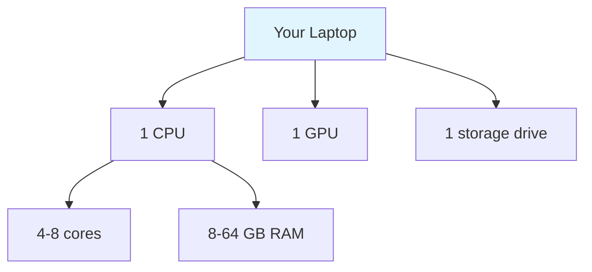
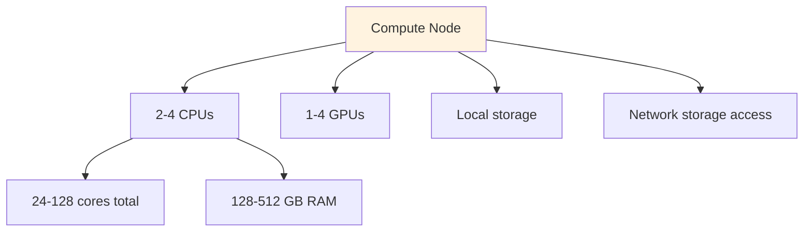
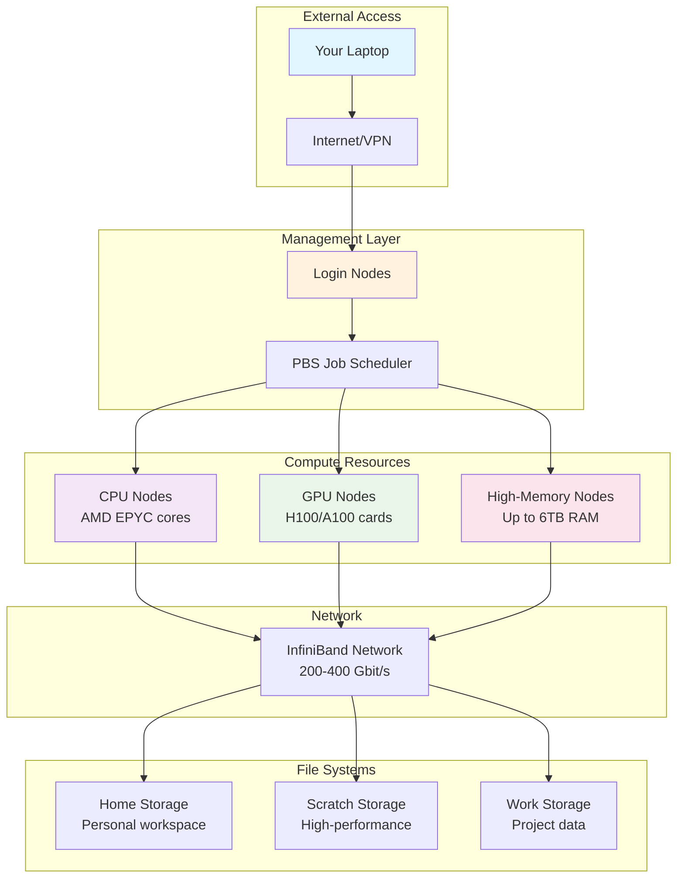
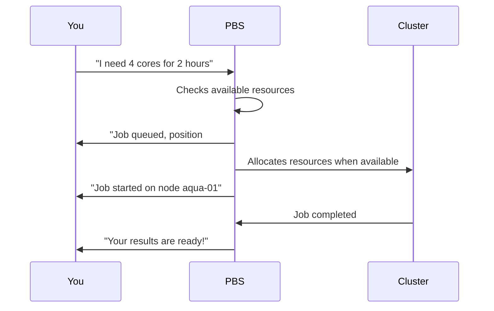
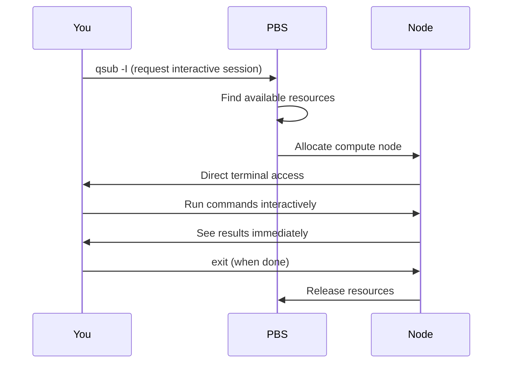
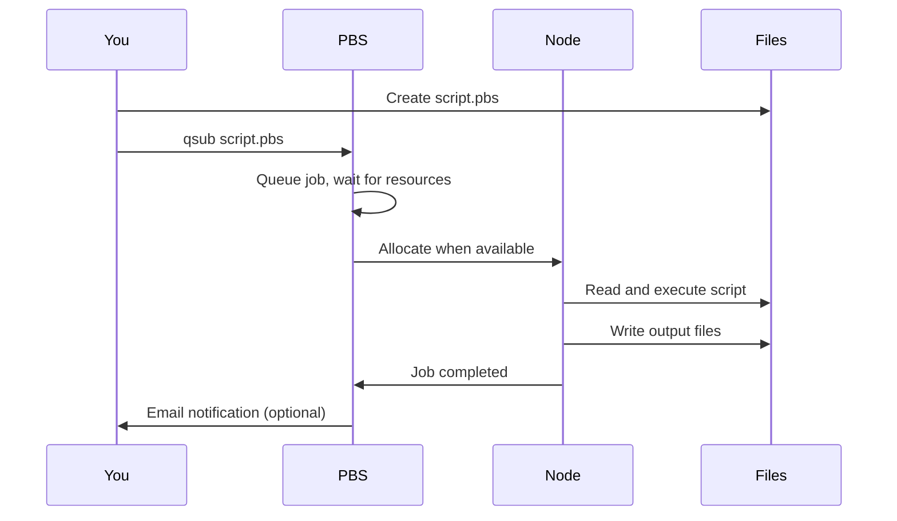
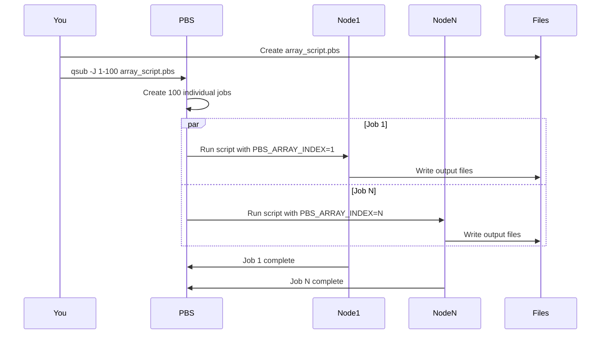

# Lesson 0: HPC Fundamentals

!!! quote "Mission Statement"
    *"What is this magical compute cluster anyway?"* 🏗️✨

Welcome to your introduction to High-Performance Computing! Before we start submitting jobs and using compute resources, let's understand what we're actually working with. Think of this as getting to know the neighborhood before you start visiting.

## 📋 What You'll Accomplish

By the end of this 15-minute lesson, you'll have:

- [ ] **HPC architecture understanding** - from your laptop to QUT Aqua infrastructure
- [ ] **File systems knowledge** - where to store different types of data
- [ ] **PBS job types mastery** - interactive, batch, and array jobs
- [ ] **Resource request basics** - cores, memory, walltime, and hardware IDs
- [ ] **Job scheduling context** - why PBS exists and its benefits

!!! tip "Keep It Conceptual"
    This lesson is all about understanding - no commands to run yet! We're building the mental model you'll need for everything that follows.

---

## 🏗️ Part 1: Understanding QUT Aqua Architecture (7 minutes)

!!! info "What Is a Compute Cluster?"
    A compute cluster is like a **digital apartment building** full of powerful computers, all connected and working together under one management system.

### Scale Comparison: Personal to Supercomputing

#### Your Laptop

This is what you're working with right now - a single computer with limited resources:



#### A Compute Node

Now imagine scaling up to a single node in the HPC cluster - much more powerful hardware in one machine:



#### QUT Aqua: The Complete Infrastructure

Finally, here's how hundreds of these powerful nodes work together as a complete system:



!!! info "QUT Aqua Specifications"
    - **70+ compute nodes** with different capabilities
    - **10,000+ CPU cores** across the cluster
    - **100+ GPU cards** (H100, A100) for AI/ML workloads
    - **High-speed InfiniBand** interconnect for parallel jobs
    - **Petabyte-scale storage** accessible from all nodes

    For detailed hardware specifications, see [QUT eResearch Aqua Hardware Documentation](https://docs.eres.qut.edu.au/about-aqua#hardware)[^1].

### File Systems

!!! info "Complete Documentation"
    For detailed filesystem specifications, quotas, and usage guidelines, see [QUT eResearch Filesystem Documentation](https://docs.eres.qut.edu.au/hpc-filesystem#summary-of-important-filesystems-mounted-on-aqua)[^1].

Files on Aqua are stored in different locations depending on their purpose and access requirements:

**Home Directory (`/home/$USER` or `~`):**

- **Your personal workspace** - only you can access it
- **Lustre filesystem** - reliable storage with good performance
- **Regularly backed up** - safe for important files
- **Use for**: Scripts, configuration files, small personal data
- **Created automatically** when you first log in

**Scratch Storage (`/scratch`):**

- **High-performance temporary workspace** for active computations
- **Weka filesystem** - extremely fast I/O (17 million IOPS, 500GB/s)
- **Not backed up** - data can be lost!
- **Cleaned automatically** - files deleted if inactive after 30 days
- **Use for**: Large datasets during analysis, temporary job files
- **Create project folders**: `mkdir -p /scratch/$USER/project_name`

**Work Storage (`/work`):**

- **Shared project storage** for research groups
- **Lustre filesystem** - reliable and backed up
- **Request via eResearch ticket** - not automatically available
- **Use for**: Long-term research data, shared datasets

**Temporary Storage (`$TMPDIR`):**

- **Job-specific fast storage** - only available during job execution
- **Weka filesystem** - ultra-fast for temporary files
- **Automatically cleaned** when job finishes
- **Use for**: Intermediate calculations, temporary outputs

!!! bug "Home Filesystem Performance Issues (As of September 26, 2025)"
    The home filesystem has been experiencing intermittent issues with processing lots of small files.

    **Examples of problematic operations:**

    - Installing Miniconda (thousands of small Python files)
    - Extracting large archives with many files
    - Building software that creates many temporary files

    **Workaround: Use `/scratch` for operations involving many small files:**

    ```bash
    # Create your working directory on scratch
    mkdir /scratch/$USER/project_work
    ```

    **Important**: Since `/scratch` files may be deleted after a month of inactivity, **backup important files to your home directory regularly**.

!!! tip "Storage Performance Comparison"
    | Filesystem | Speed | Backup | Use Case |
    |------------|-------|--------|----------|
    | **Home** | Good | ✅ Yes | Scripts, configs |
    | **Scratch** | Ultra-fast | ❌ No | Active analysis, many small files |
    | **Work** | Good | ✅ Yes | Project data |
    | **TMPDIR** | Ultra-fast | ❌ No | Job temporaries |

---

## 🧠 Part 2: What PBS Actually Does for You (8 minutes)

### The Problem PBS Solves

Imagine trying to organize shared use of a car among 500 people without any system. Chaos, right?

!!! info "Without Job Scheduling"
    ```mermaid
    graph TB
        A[500 Users] --> B[Physical Hardware]
        C[User 1: Needs all memory] --> B
        D[User 2: Needs all cores] --> B
        E[User 3: Long running job] --> B
        F[...498 more users] --> B

        B --> G[Complete chaos! 🔥]

        style G fill:#ffebee
    ```

### PBS: Your Digital Resource Manager

**PBS (Portable Batch System)** is like having a really smart building manager who handles all the resource allocation and scheduling automatically.

### How PBS Works?

Here's the basic flow of how PBS manages your job from submission to completion:



### Types of PBS Jobs You'll Use

There are three essential types of PBS jobs, each designed for different workflows:

#### Interactive Jobs

When you need to work directly on compute nodes in real-time, interactive jobs give you immediate access:



- **Real-time access** to compute nodes - like SSH into a powerful computer
- **Perfect for**: Testing code, debugging, exploring data interactively
- **Command**: `qsub -I -l walltime=02:00:00 -l select=1:ncpus=4:mem=8GB`
- **Use when**: You need to run commands and see results immediately

#### Batch Jobs

When you need to run longer tasks without staying connected, batch jobs are the solution:



- **Submit and wait** - your script runs when resources become available
- **Perfect for**: Long-running analysis, production workflows, overnight jobs
- **Command**: `qsub my_script.pbs` (submit a script file)
- **Use when**: You have a defined workflow that can run unattended

#### Job Arrays

For processing multiple similar tasks efficiently, job arrays let you scale up your work:



- **Many similar jobs** running the same script with different inputs
- **Perfect for**: Processing multiple files, parameter sweeps, Monte Carlo simulations
- **Command**: `qsub -J 1-100 array_script.pbs` (runs 100 copies)
- **Use when**: You need to repeat the same analysis on different datasets

**Common Resource Requests:**

- **Walltime**: `walltime=02:00:00` (how long your job will run)
- **Cores**: `ncpus=4` (number of CPU cores)
- **Memory**: `mem=8GB` (amount of RAM)
- **GPU**: `ngpus=1` (number of GPU cards for AI/ML work)
- **CPU Type**: `cpu_id=AMD-25-17` (AMD EPYC processors)
- **GPU Type**: `gpu_id=H100` or `gpu_id=A100` (specify GPU model)

### Why Job Scheduling Exists?

Without PBS, 500+ users would compete for the same hardware simultaneously - complete chaos!

!!! success "PBS Benefits"
    ✅ **Fair resource sharing** - Everyone gets their turn based on priority

    ✅ **Predictable access** - You get exactly the resources you request

    ✅ **Efficient usage** - No wasted idle time or resource conflicts

---

## 🎯 Key Takeaways

!!! success "You Now Understand"

    🏗️ **HPC Scale** - From 4-8 cores on your laptop to 10,000+ cores on QUT Aqua

    💾 **Storage Strategy** - Home (backed up), Scratch (fast), Work (shared), TMPDIR (temporary)

    🎯 **Job Types** - Interactive (real-time), Batch (automated), Arrays (parallel processing)

    📊 **Resource Requests** - Walltime, cores, memory, GPU types (H100/A100), CPU types (AMD-25-17)

    ⚖️ **PBS Benefits** - Fair sharing, predictable access, efficient resource usage

!!! info "Ready for Next Steps"

    ✅ **You can choose** the right job type for your work

    ✅ **You understand** where to store your files safely

    ✅ **You know** what resources to request from PBS

    ✅ **You appreciate** why job scheduling prevents chaos

---

## 🔗 What's Next?

!!! info "Coming Up in Lesson 1"
    Now that you understand what you're working with, let's get hands-on! We'll set up your Python environment and take the cluster for a test drive with an interactive session.

    - Environment setup (Miniconda or UV)
    - Your first interactive session
    - Understanding login vs compute nodes
    - Testing your setup

Ready to get your hands dirty? Let's head to [Lesson 1: Environment Setup & First Interactive Session](lesson-1.md)! 🚀

[^1]: Access only in QUT network. Please use VPN to access the documentation when off-campus.
