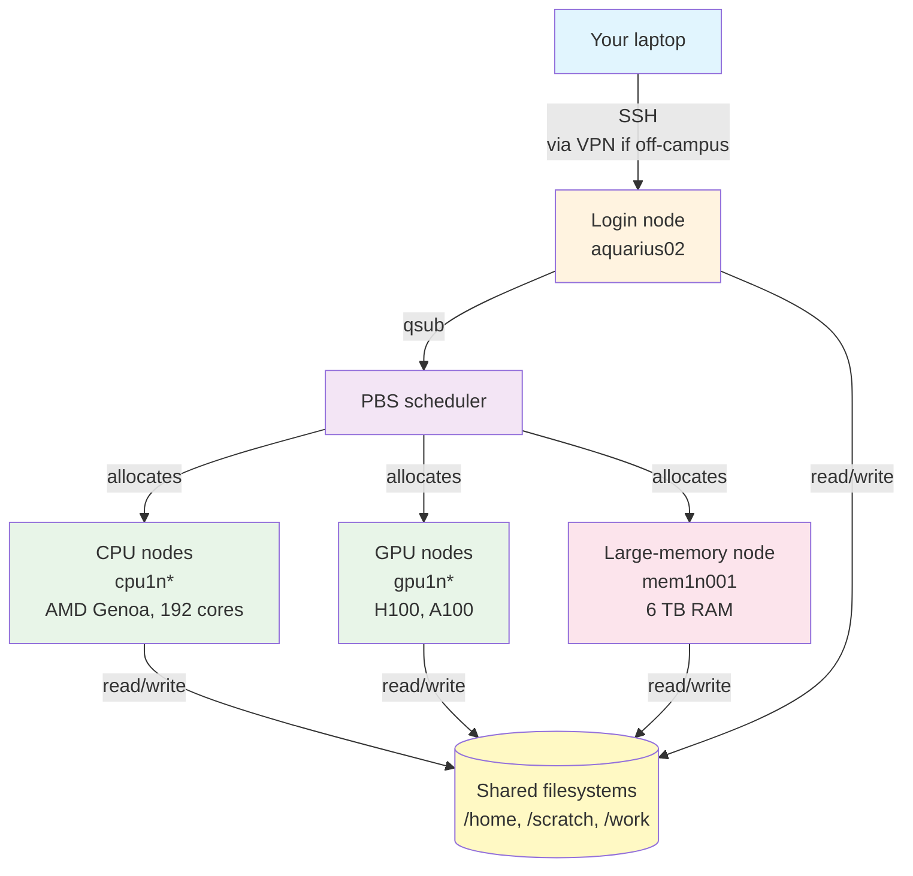

# Lesson 1: Welcome to Aqua

!!! quote "Mission Statement"
    *"From your laptop to a real compute cluster — and back — in 15 minutes."* 🌊

Welcome to Aqua, QUT's central HPC. The first half of this lesson is the mental model you need to stop being confused: what a cluster *is*, where your files live, and why there are two kinds of machine you'll talk to. The second half is the hands-on round-trip — SSH in, ask PBS for a compute node, do nothing useful on it, exit. Once you've done that loop end-to-end, every later lesson is just variations on the same theme.

## 📋 What You'll Accomplish

By the end of this 15-minute lesson, you'll have:

- [ ] **A mental model of Aqua** — what's a node, where files live, who decides when your job runs
- [ ] **SSHed into Aqua** — and confirmed you landed on the login node (`aquarius02`)
- [ ] **Run your first interactive job** — `qsub -I` for 5 minutes on a real compute node
- [ ] **Felt the difference** between login and compute nodes (different hostnames, same files)
- [ ] **Exited cleanly** — resources released back to PBS

!!! tip "Open a terminal now"
    Keep a terminal window handy. Part 1 is conceptual; Part 2 is fingers on keys. You don't want to be hunting for your terminal app halfway through Step 1.

---

## 🌊 Part 1: What is Aqua? (~5 min)

**Aqua** (formally *Aquarius*) is QUT's centrally-funded supercomputer — free to use for QUT researchers. It's built for the workloads your laptop can't handle: training ML models on real datasets, running multi-day simulations, slicing genomes, modelling climate, fitting cosmologically large parameter sweeps. Anything where "let it run overnight on the M2" is no longer a serious plan.

Architecturally, it's a few hundred powerful computers (**nodes**) talking to a shared storage pool over high-speed networking, all coordinated by a job scheduler called **PBS** that hands out resources fairly across the ~hundreds of users competing for them at any given moment.



!!! info "Aqua at a glance"
    - **~70 compute nodes** — 50 CPU (AMD Genoa), 14 H100 GPU hosts, 8 A100 GPU hosts, 1 large-memory node
    - **~10,000 CPU cores** across the cluster
    - **120 GPUs** total (56 H100 + 64 A100)
    - **High-speed InfiniBand** interconnect (200–400 Gbit/s) between nodes and storage
    - **~1 PB Weka scratch storage** on NVMe flash

    Full hardware specs: [About Aqua](https://docs.eres.qut.edu.au/about-aqua#hardware)[^1].

### Where your files live

Aqua mounts four filesystems on every node. Picking the right one for the right job is the difference between "my code is fast" and "my I/O is so slow the cluster operator emails me asking what I'm doing":

| Filesystem | Path | Backed up? | Speed | When to use |
|------------|------|------------|-------|-------------|
| **Home** | `/home/$USER` | ✅ Lustre | Good | Scripts, configs, small personal data |
| **Scratch** | `/scratch/$USER/...` | ❌ Weka | Ultra-fast | Active analysis, large I/O, anything performance-sensitive |
| **Work** | `/work/<project>/...` | ✅ Lustre | Good | Shared project data (request via eResearch ticket) |
| **TMPDIR** | `$TMPDIR` (job-only) | ❌ Weka | Ultra-fast | Per-job intermediates — gone when the job exits |

!!! warning "Two rules to internalise now"
    1. **Scratch isn't backed up** and files inactive for 30+ days get auto-swept. Move anything you want to keep into `/home` or `/work` before that.
    2. **Don't dump millions of small files in `/home`.** Lustre slows to a crawl. If a workflow generates many tiny files (extracting archives, compiling, installing deps), do it on `/scratch` and copy the result back.

For the deeper take — including per-queue node assignments and which filesystem is fastest for which I/O shape — see [Know Your Nodes](../scheduler/Know-Your-Nodes.md). For the official QUT reference: [QUT eResearch — Filesystem and data management](https://docs.eres.qut.edu.au/hpc-filesystem)[^1].

### Login nodes vs compute nodes

Two distinct kinds of machine on Aqua, and the difference matters:

=== "Login node (`aquarius02`)"
    - **Where you land** when you SSH in
    - **Shared** with every other user logged in right now
    - A single 24-core EPYC box with 187 GB RAM — easily overwhelmed
    - Use it for: editing files, submitting jobs, checking job status, light file transfer
    - **Don't** run heavy work here — compiling, training, multi-hour scripts, terabyte copies
    - Think of it as: the reception desk

=== "Compute nodes (`cpu1n*`, `gpu1n*`, `mem1n001`)"
    - **Where PBS sends your job** when resources are free
    - **Dedicated to your job** for its entire walltime
    - Hundreds available, each with 24–192 cores, lots of RAM, sometimes GPUs
    - Hostname format tells you the type: `cpu1nNNN` (CPU), `gpu1nNNN` (GPU), `mem1n001` (the 6 TB monster)
    - This is where the real work happens

The hostname in your shell prompt tells you which one you're on. We'll see this in action below.

---

## 🛠️ Part 2: Your First Interactive Session (~10 min)

Time to SSH in and try a tiny interactive job. The goal isn't to *do* anything useful — it's to feel the **login → request → compute → exit** loop end-to-end before Lesson 3 starts introducing real PBS scripts. If you can do this round-trip, you're 80% of the way to being productive on Aqua.

### Step 1: SSH in

```bash
ssh <your-username>@aqua.qut.edu.au
```

Replace `<your-username>` with your QUT username. You'll see a login banner, then end up at a prompt that looks something like:

```text
[your-username@aquarius02 ~]$
```

The `aquarius02` part is the **login node hostname** — that's how you know you're at the front door, not inside a compute node yet.

!!! example "Sanity checks before you go further"
    ```bash
    hostname    # → aquarius02
    pwd         # → /home/<your-username>
    whoami      # → <your-username>
    ```

!!! warning "Don't run anything heavy here"
    The login node is shared with everyone logged in right now. Compiling a large project, running a Python script for 20 minutes, copying terabytes of data — none of that goes here. PBS exists so you don't have to. We're about to use it.

### Step 2: Ask PBS for a 5-minute interactive job

```bash
qsub -I -l walltime=00:05:00 -l select=1:ncpus=1:mem=1GB
```

!!! example "Command breakdown"
    - `qsub -I` → request an **interactive** job (PBS will give you a shell on a compute node)
    - `-l walltime=00:05:00` → kill the job after 5 minutes if you haven't exited
    - `-l select=1:ncpus=1:mem=1GB` → give me 1 chunk: 1 CPU core, 1 GB RAM

That's the smallest reasonable shape — just enough to see "yes, I'm somewhere different now." Real interactive sessions will ask for more (covered in Lesson 5).

After submitting, you'll see something like:

```text
qsub: waiting for job 12345678.aqua-pbs to start
qsub: job 12345678.aqua-pbs ready

[your-username@cpu1n023 ~]$
```

Two things happened:

1. **Job ID was assigned** (`12345678.aqua-pbs`). You'll see job IDs everywhere — they're how PBS and you refer to the same thing.
2. **Your prompt's hostname changed** from `aquarius02` to a compute node (here, `cpu1n023` — PBS picked whichever was free).

You're on a compute node now. The shell you're typing into is running on a different physical machine from the one you SSHed into.

!!! note "If the wait is long"
    `qsub -I` blocks until PBS finds a free compute node. For a 1-core / 1 GB request it's usually seconds; for bigger asks it can take minutes or hours (peak times). If you're waiting more than 30 seconds for this tiny request, `Ctrl+C` and try again — there might be a maintenance window or an unusually busy stretch.

### Step 3: Confirm you've moved

```bash
hostname    # → cpu1nNNN (different from aquarius02)
pwd         # → /home/<your-username> (same — your home travels with you)
nproc       # → 1 (you asked for 1 core, PBS gave you 1 core)
```

Notice `pwd` is unchanged: your home directory follows you across nodes, because `/home` is a shared filesystem mounted on every node. This is also why `/scratch` and `/work` work the same way — write a file from one node, read it from another.

Try `ls ~/` — same files you'd see from the login node.

### Step 4: Exit cleanly

```bash
exit
```

You're back at the login node prompt (`aquarius02`), and PBS has released your compute node back into the pool. The job is now `F` (finished) in queue state. If you forget to exit, the job dies on its own when walltime expires — but exiting cleanly is polite.

!!! success "You've now done the basic round-trip"
    Log in → request resources → work on a compute node → exit. This is the loop you'll repeat for every interactive session, forever. Batch jobs (Lesson 3) are the same pattern with a script in the middle and no human waiting around for it.

---

## 🎯 Key Takeaways

!!! success "You now know"

    🌊 **What Aqua is** — QUT's centrally-funded HPC, free to researchers, ~70 nodes / 10k CPU cores / 120 GPUs

    📂 **Where files live** — `/home` for code (backed up), `/scratch` for active data (fast, not backed up), `/work` for shared (backed up), `$TMPDIR` for per-job intermediates

    🚪 **Login vs compute** — login is `aquarius02` (shared reception desk, no heavy work); compute is `cpu1n*` / `gpu1n*` / `mem1n*` (dedicated to your job)

    🛠️ **The round-trip** — `ssh` → `qsub -I` → work → `exit`. PBS handles the rest.

---

## 🔗 What's Next?

→ **[Lesson 2: Tooling Setup](lesson-2.md)** — install [uv](https://docs.astral.sh/uv/) or [Miniforge](https://github.com/conda-forge/miniforge) so your next interactive session has a real Python environment to play with.

!!! question "Stuck?"
    - **SSH not working?** Revisit the [Prerequisites Checklist](prerequisites.md).
    - **Want better tooling?** [Cmd+Opt+Remote](../remote-dev/index.md) covers SSHFS, VS Code Tunnel, JupyterHub, and friends — pick a development workflow that doesn't make you cry.
    - **Curious about the hardware?** [Know Your Nodes](../scheduler/Know-Your-Nodes.md) is the deep field guide — per-queue node assignments, GPU/CPU families, the quirks worth knowing.

[^1]: Access only in QUT network. Please use VPN to access the documentation when off-campus.
