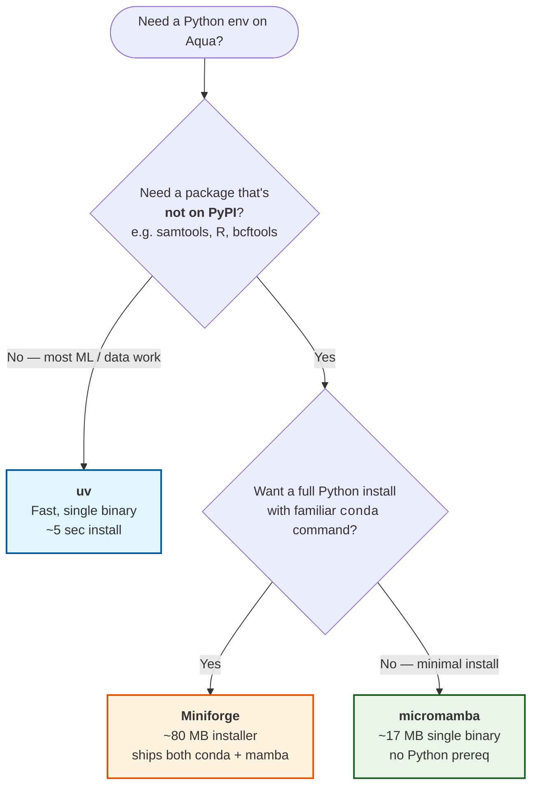

# Lesson 2: Tooling Setup

!!! quote "Mission Statement"
    *"Pick a Python tool, install it once, never fight with system Python again."* 🛠️

You'll spend more of your HPC life inside a Python environment than anywhere else. Aqua ships system Python for the sysadmin's sake, not yours — touching it for your own work is a recipe for permission errors, version conflicts, and "it worked yesterday." This lesson surveys the **four tools** you'll encounter for managing isolated Python on HPC — [uv](https://docs.astral.sh/uv/), [Miniforge](https://github.com/conda-forge/miniforge), [micromamba](https://mamba.readthedocs.io/en/latest/user_guide/micromamba.html), [Miniconda](https://www.anaconda.com/docs/getting-started/miniconda/main) — picks one for your use case, installs it on Aqua, and proves it works.

## 📋 What You'll Accomplish

By the end of this 15–20 minute lesson, you'll have:

- [ ] **Surveyed the four tools** — uv, Miniforge, micromamba, Miniconda — and understood when each fits
- [ ] **Picked one** for your work (default: `uv`; `conda`-family if you need non-PyPI packages)
- [ ] **Installed it on Aqua** (single command for each)
- [ ] **Placed envs on the right filesystem** — knowing where envs go matters more on HPC than on a laptop
- [ ] **Created and verified a test environment** — `python --version` + an import that doesn't crash

!!! tip "You probably only need `uv`"
    ==Most Python work on HPC runs fine on `uv` alone== — including ML with PyTorch / TensorFlow / JAX, data science, anything pip-installable. The `conda`-family tools (Miniforge, micromamba) are for when you need a **non-PyPI** package: bioinformatics tools (samtools, bcftools), R interop, or a precisely-pinned binary stack. Skim the comparison below, install `uv` first, reach for a `conda`-family tool only if you discover you need it.

---

## :material-compass-outline: Decide: which tool?

You'll see four tools floating around HPC Python documentation. The flowchart below covers the decision; the table after it has the why behind each choice.



Here's the honest comparison (the flowchart skips Miniconda — it's the one to avoid; see the *A note on Miniconda* section below for why, and how to migrate off it if you've already got it):

| Tool | Recommendation | Best for | Why / why not |
|---|---|---|---|
| **uv** | ⭐ **Default** | Pure-Python work, ML via pip (PyTorch, TensorFlow, JAX, HuggingFace) | Rust-based, single binary, **10–100× faster** than pip (per Astral's [official benchmarks](https://github.com/astral-sh/uv/blob/main/BENCHMARKS.md)). Limitation: PyPI-only. |
| **Miniforge** | ✓ Recommended for conda needs | Anything on [conda-forge](https://conda-forge.org/) / [bioconda](https://bioconda.github.io/) (samtools, bcftools, R interop, exotic binary stacks) | Open-source, community-maintained, conda-forge default channel, **no Anaconda licensing**. Ships both `conda` and [`mamba`](https://mamba.readthedocs.io/) (mamba = drop-in for conda with the faster [libmamba](https://mamba.readthedocs.io/en/latest/user_guide/concepts.html) solver). ~80 MB installer + Python. |
| **micromamba** | ✓ Recommended (single-binary alternative) | Minimal install — CI pipelines, container base, or personal preference for a single binary | Same conda-forge ecosystem and libmamba solver as Miniforge's `mamba`; packaged as a single statically-linked C++ binary (~17 MB) instead of a full Python install. Commands are `micromamba` (alias to `conda` or `mamba` if you want). |
| **Miniconda** | ✗ **Not recommended** | (Listed for awareness — you'll see it in many tutorials) | Free for accredited universities (incl. QUT) under [Anaconda's Academic Policy](https://www.anaconda.com/legal/terms/academic), but registration + EULA + "non-commercial" restriction make it frictionful in practice. HPC sites are migrating away (LLNL site-wide block of Anaconda paid channels effective **Feb 2027**). See *A note on Miniconda* below — use Miniforge instead. |

---

## 📦 Install

You've picked a tool above (if you skipped the Decide section: **uv** is the default — start there). Each install is a short upstream-installer flow, ~5 to ~30 seconds. Skip to the section for your pick.

### :material-lightning-bolt: uv (the default)

Astral's one-line installer — no Python prerequisite, ~5 seconds:

```bash
curl -LsSf https://astral.sh/uv/install.sh | sh
source ~/.bashrc
```

Verify:

```bash
uv --version
```

!!! example "Expected output"
    ```text
    uv 0.11.x or newer
    ```

That's it. uv is now at `~/.local/bin/uv` and on your PATH.

!!! note "If `uv --version` says command not found"
    Your `~/.bashrc` may have an early `return` for non-interactive shells, in which case `source ~/.bashrc` silently no-ops. **Open a new terminal** so the shell init runs fresh.

### :material-anvil: Miniforge (when you need conda)

The community-maintained, open-source Miniconda alternative. Preconfigures **conda-forge as the default (and only) channel**, so you never touch Anaconda's `defaults` channel by accident — and therefore never hit Anaconda's ToS gate. Installs **both** the `conda` command and `mamba` — `mamba` is a drop-in for `conda` that uses the [libmamba](https://mamba.readthedocs.io/en/latest/user_guide/concepts.html) solver (the same fast solver behind micromamba). Use whichever you prefer; they share the same envs.

```bash
# Download the latest Linux x86_64 installer
cd ~ && wget https://github.com/conda-forge/miniforge/releases/latest/download/Miniforge3-Linux-x86_64.sh

# Run the installer (-b: batch mode, -p: install path)
bash Miniforge3-Linux-x86_64.sh -b -p ~/miniforge3
rm Miniforge3-Linux-x86_64.sh

# Activate base + initialize shell + persist for future logins
source ~/miniforge3/bin/activate
conda init bash
source ~/.bashrc
```

Verify:

```bash
conda --version
which conda
```

!!! example "Expected output (versions move; the path is what matters)"
    ```text
    conda 26.x       # Miniforge ships whatever conda-forge has packaged most recently
    /home/your-username/miniforge3/bin/conda
    ```

!!! tip "Miniforge gives you both `conda` and `mamba`"
    Every conda tutorial you find online uses `conda create`, `conda activate`, etc. — those work identically on Miniforge, no relearning. Miniforge **also** installs `mamba`, a drop-in replacement with the faster libmamba solver: `mamba create -n ...` works exactly like `conda create -n ...` but resolves dependencies faster. Use whichever you prefer; envs created with one are usable from the other.

    The only difference from Anaconda's Miniconda: the default channel is `conda-forge` (no Anaconda licensing) instead of `defaults`.

### :material-feather: micromamba (single-binary Miniforge alternative)

A single statically-linked C++ binary — ~17 MB, no Python prerequisite, fast solver (uses [libmamba](https://mamba.readthedocs.io/en/latest/user_guide/concepts.html), the same solver that powers mamba).

```bash
"${SHELL}" <(curl -L micro.mamba.pm)
```

The installer asks **three to four short questions** (the fourth — Prefix location — only appears if you accept shell init); defaults are sensible (press Enter through each):

| Prompt | Default | What it does |
|---|---|---|
| `micromamba binary folder?` | `~/.local/bin` | Where the `micromamba` binary lands |
| `Init shell (bash)?` | `Y` | Adds the mamba shell-init block to `~/.bashrc` (or your equivalent rc file) |
| `Configure conda-forge?` | `Y` | Sets conda-forge as the default channel (no Anaconda's ToS gate — recommended) |
| `Prefix location?` | `~/micromamba` | Where envs live by default |

Then re-source your shell:

```bash
source ~/.bashrc
```

Verify:

```bash
micromamba --version
```

!!! example "Expected output"
    ```text
    2.x.x
    ```

!!! tip "micromamba commands are mostly drop-in for `conda`"
    `micromamba create / activate / deactivate / install / remove` all work the same way as `conda`. If your fingers want `conda`, alias it: `alias conda=micromamba` in your `~/.bashrc`. The default channel is conda-forge (same as Miniforge, no Anaconda).

### :material-cancel: A note on Miniconda (not recommended)

You'll see Miniconda referenced everywhere — most existing Python-on-HPC tutorials (including [QUT eResearch's own conda guide](https://docs.eres.qut.edu.au/hpc-conda-package-and-environment-manager)[^1]) recommend it. **We don't, for two real reasons:**

**1. Commercial Terms of Service — Miniconda is legal, but frictionful.** Anaconda's current [Terms of Service](https://www.anaconda.com/legal/terms/terms-of-service) (15 July 2025) allow QUT — and all accredited universities — to use the Anaconda repository free under the [Academic Policy](https://www.anaconda.com/legal/terms/academic); the 200-employee threshold for paid licensing applies only to for-profit organisations.

So why not just use Miniconda? **Three points of friction:**

- **Registration overhead.** Each user must register with an academic email and accept a separate Academic EULA, renewable annually.
- **Use-case grayzone.** Free use is restricted to "non-commercial educational and research purposes" — uncertain for industry-funded research, commercialisation work, or consulting that QUT staff often do.
- **The ToS prompt.** Recent Anaconda / Miniconda installations ship the [`conda-anaconda-tos`](https://www.anaconda.com/blog/conda-anaconda-tos-plugin) plugin (2025), which interrupts `conda create` / `install` / `search` against `pkgs/main` or `pkgs/r` to demand ToS acceptance — ==accepting it isn't proof of academic eligibility==, and the prompt fires whether you're entitled to free use or not.

Miniforge sidesteps all of this. Its default channel (conda-forge) isn't governed by Anaconda's ToS at all.

**2. HPC sites are migrating away.** LLNL announced a site-wide block of Anaconda's paid channels effective **February 2027** (see [LLNL Technical Bulletin 602](https://hpc.llnl.gov/technical-bulletins/bulletin-602)), recommending Miniforge as the drop-in replacement. [OLCF's Python docs](https://docs.olcf.ornl.gov/software/python/index.html) now recommend `miniforge3` modules on Frontier and Andes (as of mid-2026), targeting conda-forge by default — Anaconda modules remain loadable but aren't the documented entry point. This is the direction the HPC community is heading.

??? tip "If you've already installed Miniconda — here's the migration to Miniforge"
    The migration is essentially: install Miniforge alongside (per the Install Miniforge section above), recreate your envs from scratch, then remove the old Miniconda install. The `conda` command and your scripts don't change — only the default channel does (conda-forge instead of Anaconda's `defaults`).

    For each env you want to keep:

    ```bash
    # 1. From your existing Miniconda, snapshot ONLY the packages you explicitly
    #    requested (--from-history) and strip channel metadata (--ignore-channels).
    #    This is what makes the migration actually move to conda-forge — a plain
    #    `conda env export` would pin "channels: [defaults]" into the YAML.
    conda activate <your-env-name>
    conda env export --from-history --ignore-channels > <your-env-name>.yml
    conda deactivate

    # 2. Switch shells / re-source so the Miniforge conda takes over
    source ~/miniforge3/bin/activate

    # 3. Recreate the env on Miniforge (resolves fresh from conda-forge)
    conda env create -f <your-env-name>.yml
    ```

    !!! note "Trade-off: `--from-history` loses exact pins"
        With `--from-history`, the YAML lists only the packages you explicitly asked for, not the full dependency tree your old Miniconda had resolved. The recreated env may have **newer transitive dependency versions** than the original. That's usually fine (and is the point — you're migrating to a fresh resolve on conda-forge), but if you need bit-for-bit reproduction, export both forms (with and without `--from-history`) and reconcile differences manually.

    Once everything's migrated, remove the old Miniconda:

    ```bash
    rm -rf ~/miniconda3
    # ...and remove the "# >>> conda initialize >>>" block from ~/.bashrc
    # (or just restore your pre-Miniconda .bashrc from backup if you have one)
    ```

---

## 🗂️ Where to put environments on Aqua

This is where most HPC users get burned. Python environments are **lots of small files**, and ==lots of small files on `/home` (Lustre) are surprisingly slow== — [OLCF Frontier benchmarks](https://docs.olcf.ornl.gov/software/python/sbcast_conda.html) report **2 seconds on node-local NVMe vs 57 seconds on Lustre** (a ~28× slowdown) for the same Python import. Aqua's `/home` is also Lustre; the same physics applies.

| Filesystem | Best for | Why |
|---|---|---|
| `/home/$USER` | ✅ uv venvs, small conda envs (< 1 GB) | Backed up, Lustre — fine if you don't accumulate hundreds of envs |
| `/scratch/$USER` | ✅ Large conda envs (multi-GB PyTorch + CUDA, scientific stacks) | Weka (Aqua's NVMe-backed fast storage). **But: auto-cleaned after 30 days of inactivity** |
| `/work/<project>` | ✅ Long-lived shared envs | Backed up, persistent, but requires a QUT eResearch ticket |

**Rules of thumb:**

- **uv venvs:** `/home` is fine. They live in `<project>/.venv/` and are typically MB to hundreds of MB.
- **Small conda env** (< 1 GB, scripting / data wrangling): `/home` is fine.
- **Large conda env** (multi-GB, PyTorch + CUDA, scientific stack): use `/scratch/$USER/envs/`. Set a calendar reminder to **touch the env directory monthly** so it doesn't get purged after 30 days inactive. Or rebuild from `env.yml` when you need it.
- **Long-lived shared env**: ask QUT eResearch for a `/work/<project>` allocation.

!!! tip "Redirect conda package cache off home"
    For conda-family tools, the **package cache** (downloaded `.conda` / `.tar.bz2` files) can grow to multi-GB. Redirect it to scratch by creating `~/.condarc`:

    ```yaml
    pkgs_dirs:
      - /scratch/${USER}/conda/pkgs
    ```

    Same idea works for `envs_dirs` if you want all envs on scratch (with the 30-day caveat).

See [Know Your Nodes — File systems](../scheduler/Know-Your-Nodes.md) for the full filesystem reference and [QUT eResearch — Filesystem and data management](https://docs.eres.qut.edu.au/hpc-filesystem)[^1] for the official line.

---

## :material-test-tube: Test Drive: Create a Project Environment

Now prove your install works. Pick the tab matching the tool you installed, run the commands, and you're done.

=== "uv"
    ```bash
    # Make a project folder + a venv inside it (with an explicit Python version)
    mkdir -p ~/hello-aqua && cd ~/hello-aqua
    uv venv .venv --python 3.13

    # Activate it — your prompt should now show (.venv) at the front
    source .venv/bin/activate

    # Install a package (watch how fast)
    uv pip install requests

    # Prove Python and the package both work
    python -c "import requests, sys; print('Python', sys.version.split()[0], '/ requests', requests.__version__)"

    # Drop back out when done (the venv lives in ~/hello-aqua/.venv)
    deactivate
    ```

    !!! note "First-run Python download"
        The first time you ask uv for a specific Python version (here, 3.13), it downloads a standalone CPython build (~33 MiB) into `~/.local/share/uv/python/`. Subsequent `uv venv --python 3.13` calls reuse it instantly. Without `--python`, uv picks whatever Python is on your PATH (on Aqua that's the system Python 3.9.x).

    !!! example "Expected output"
        ```text
        Python 3.13.x / requests 2.34.x or newer
        ```

=== "Miniforge"
    ```bash
    # Create an isolated environment with Python 3.13 and one package
    # (or use `mamba create -n ...` — same result, faster solver)
    conda create -n hello-aqua python=3.13 requests -y

    # Activate it — your prompt should now show (hello-aqua) at the front
    conda activate hello-aqua

    # Prove Python and the package both work
    python -c "import requests, sys; print('Python', sys.version.split()[0], '/ requests', requests.__version__)"

    # Drop back out when done (the env still exists for next time)
    conda deactivate
    ```

    !!! example "Expected output"
        ```text
        Python 3.13.x / requests 2.34.x or newer
        ```

=== "micromamba"
    ```bash
    # Create an isolated environment with Python 3.13 and one package
    micromamba create -n hello-aqua python=3.13 requests -y

    # Activate it — your prompt should now show (hello-aqua) at the front
    micromamba activate hello-aqua

    # Prove Python and the package both work
    python -c "import requests, sys; print('Python', sys.version.split()[0], '/ requests', requests.__version__)"

    # Drop back out when done
    micromamba deactivate
    ```

    !!! example "Expected output"
        ```text
        Python 3.13.x / requests 2.34.x or newer
        ```

---

## 🎯 Key Takeaways

!!! success "You now have"

    🐍 **An isolated Python** that won't conflict with the system Python or other users

    🧪 **A working test environment** with at least one package installed

    🛠️ **A reproducible setup** — re-running `uv venv` / `conda create` / `micromamba create` will reproduce the same shape next time

    🗂️ **A filesystem strategy** — small envs on `/home`, big ones on `/scratch`, shared ones on `/work` (via ticket)

    📦 **Four tools you can identify** — even though you picked one, you know what each is for and which to avoid

---

## 🔗 What's Next?

→ **[Lesson 3: Your First Batch Job](lesson-3.md)** — now that you have Python ready, time to wrap a job script around it and submit to PBS for real.

!!! question "Stuck?"
    - **`uv` / `conda` / `micromamba` not found after install?** Re-source `~/.bashrc`, or open a new terminal so the shell init runs.
    - **Hit the `conda-anaconda-tos` plugin prompt on first `conda create`?** You're on Miniconda (or an Anaconda-shipped conda) accessing `pkgs/main` / `pkgs/r`. Switch to Miniforge — its conda-forge default channel isn't governed by the plugin. Migration steps in *A note on Miniconda*.
    - **Want the official QUT reference?** [QUT eResearch — Conda package and environment manager](https://docs.eres.qut.edu.au/hpc-conda-package-and-environment-manager)[^1]. Note: it recommends Miniconda; we don't, for the reasons in the *A note on Miniconda* section.
    - **Need a different tool entirely?** Aqua also has system Python via `module load Python/3.x` — but you'll be sharing it with everyone else. Stick with isolated envs.

---

## 📝 Quick Reference

=== "uv"
    ```bash
    uv venv .venv                          # new venv (uses system Python)
    uv venv .venv --python 3.13            # ...or pin a Python version (auto-downloads)
    source .venv/bin/activate              # enter venv
    uv pip install <pkg>                   # add a package (fast)
    uv pip install -r requirements.txt     # install from requirements
    deactivate                             # leave venv
    ```

=== "Miniforge (conda + mamba)"
    ```bash
    conda create -n <name> python=3.13           # new env (or: mamba create -n ... — faster solver)
    conda activate <name>                         # enter env
    conda deactivate                              # leave env
    conda env list                                # see all envs
    conda env remove -n <name>                    # delete env
    conda install -c conda-forge <pkg>            # add a package (conda-forge default for Miniforge)
    mamba install <pkg>                           # ...or `mamba` for the faster libmamba solver
    conda env export -n <name> > env.yml          # snapshot env to file
    conda env create -f env.yml                   # recreate env from file (reproducibility)
    ```

=== "micromamba"
    ```bash
    micromamba create -n <name> python=3.13      # new env (conda-forge by default)
    micromamba activate <name>                    # enter env
    micromamba deactivate                         # leave env
    micromamba env list                           # see all envs
    micromamba env remove -n <name>               # delete env
    micromamba install -n <name> <pkg>            # add a package to a named env
    ```

=== "File locations"
    ```bash
    ~/miniforge3/                  # Miniforge install
    ~/miniforge3/envs/             # Miniforge / conda environments
    ~/micromamba/                  # micromamba install (default prefix)
    ~/micromamba/envs/             # micromamba environments
    ~/.local/bin/uv                # uv binary (standalone install)
    ~/.local/bin/micromamba        # micromamba binary
    ~/.local/share/uv/python/      # uv-managed Python versions (one dir per version)
    ~/.cache/uv/                   # uv's package cache
    ~/.condarc                     # Conda config (channels, pkgs_dirs, envs_dirs)
    ```

[^1]: Access only in QUT network. Please use VPN to access the documentation when off-campus.
