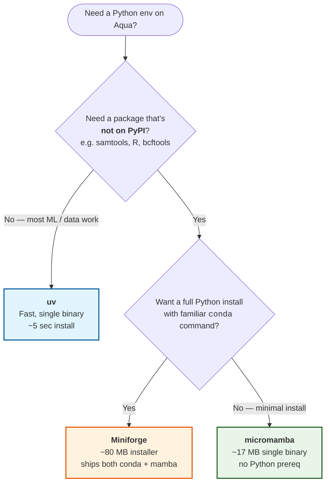

# Lesson 2: Tooling Setup

!!! quote "Mission Statement"
    *"One tool, two files, and an environment you can throw away and rebuild in a second."* 🛠️

You'll spend more of your HPC life inside a Python environment than anywhere else. Aqua ships system Python for the sysadmin's sake, not yours — touching it for your own work is a recipe for permission errors, version conflicts, and "it worked yesterday." This lesson installs [uv](https://docs.astral.sh/uv/), turns a folder into a project that records its own environment, rebuilds that environment from the record, and shows where environments belong on Aqua. It ends with the four tools you'll meet in HPC Python documentation and the conda route for packages that aren't on PyPI.

## 📋 What You'll Accomplish

By the end of this 15–20 minute lesson, you'll have:

- [ ] **Installed `uv` on Aqua** — one command, no QUT module
- [ ] **Created a project** — `pyproject.toml` says what you asked for, `uv.lock` says exactly what you got
- [ ] **Rebuilt the environment from the lock file** and verified it works
- [ ] **Placed envs on the right filesystem** — knowing where envs go matters more on HPC than on a laptop
- [ ] **Surveyed the four tools** — uv, Miniforge, micromamba, Miniconda — and understood when each fits

!!! tip "You probably only need `uv`"
    ==Most Python work on HPC runs fine on `uv` alone==, including ML with PyTorch / TensorFlow / JAX, data science, and anything pip-installable. The conda family (Miniforge, micromamba) is for **non-PyPI** packages: bioinformatics tools such as samtools and bcftools, R interop, or a precisely pinned binary stack. Install `uv` first; reach for conda only if you discover you need it (Part 4).

---

## 📦 Part 1: Install uv (~2 min)

Astral's one-line installer, no Python prerequisite, about five seconds:

```bash
curl -LsSf https://astral.sh/uv/install.sh | sh
source ~/.bashrc
```

Verify:

```bash
uv --version
```

!!! example "Expected output"
    ```text
    uv 0.12.x or newer
    ```

That's it. uv is now at `~/.local/bin/uv` and on your PATH.

!!! note "If `uv --version` says command not found"
    Your `~/.bashrc` may have an early `return` for non-interactive shells, in which case `source ~/.bashrc` silently no-ops. **Open a new terminal** so the shell init runs fresh.

---

## 🧪 Part 2: Create a project (~10 min)

An environment you built by hand is a memory: yours, and only until you forget. A project is a file. Two files, in fact, and by the end of this part you will have both.

### Step 1: Initialise

```bash
mkdir -p ~/hello-aqua && cd ~/hello-aqua
uv init --bare --pin-python --python 3.13
ls -A
```

!!! example "Expected output"
    ```text
    Initialized project `hello-aqua`
    .python-version  pyproject.toml
    ```

!!! note "Command breakdown"
    - `--bare` → only the files this lesson needs; no README, no sample code, no git repository
    - `--pin-python --python 3.13` → writes `.python-version` so that every rebuild uses Python 3.13, not whichever version is newest on the day
    - `pyproject.toml` → the project's description of itself; `cat` it and you will see an empty `dependencies = []`

### Step 2: Add a package

```bash
uv add pandas
```

!!! example "Expected output (first time on a fresh account)"
    ```text
    Downloading cpython-3.13.15-linux-x86_64-gnu (download) (33.2MiB)
     Downloaded cpython-3.13.15-linux-x86_64-gnu (download)
    Using CPython 3.13.15
    Creating virtual environment at: .venv
    Resolved 6 packages in 79ms
    Downloading numpy (15.9MiB)
    Downloading pandas (10.4MiB)
     Downloaded numpy
     Downloaded pandas
    Prepared 4 packages in 1.26s
    Installed 4 packages in 1.35s
     + numpy==2.5.3
     + pandas==3.0.5
     + python-dateutil==2.9.0.post0
     + six==1.17.0
    ```

Four things happened in about six seconds:

1. **Python 3.13 was downloaded** (33 MiB, into `~/.local/share/uv/python/`). Aqua's system Python is 3.9, so uv fetched the version you pinned. This happens once per version, never again.
2. **`.venv` was created** next to your files.
3. **`pandas` and the three packages it depends on were installed** into it.
4. **Two files changed.** `pyproject.toml` now lists `pandas>=3.0.5` under `dependencies`, and a new `uv.lock` appeared.

```bash
ls -A
```

!!! example "Expected output"
    ```text
    .python-version  .venv  pyproject.toml  uv.lock
    ```

!!! info "Two files, two jobs"
    - **`pyproject.toml`** is what you asked for: `pandas`, any version from 3.0.5 up. Nothing about numpy or the other two; they follow. You edit this file, usually through `uv add` and `uv remove`.
    - **`uv.lock`** is what you got: every package, direct or not, at an exact version, with a checksum. uv writes it; you never edit it. It is the part that makes "the same environment on another node next month" a fact rather than a hope.

    Keep both. If the project is in git, commit both.

### Step 3: Run something in it

```bash
uv run python -c "import pandas as pd, sys; print('Python', sys.version.split()[0], '/ pandas', pd.__version__); print(pd.DataFrame({'cores': [1, 4, 8], 'seconds': [96, 25, 13]}))"
```

!!! example "Expected output"
    ```text
    Python 3.13.x / pandas 3.0.x or newer
       cores  seconds
    0      1       96
    1      4       25
    2      8       13
    ```

`uv run` runs a command inside the project's environment without activating anything. For a longer session at the keyboard, activate the way every Python tutorial does:

```bash
source .venv/bin/activate     # prompt now starts with (hello-aqua)
python --version              # → Python 3.13.x
deactivate
```

Lesson 3 uses the activated form; batch jobs later in the course use `uv run`. Both point at the same `.venv`.

### Step 4: Throw the environment away and rebuild it

This is the step that makes the two files worth having.

```bash
rm -rf .venv
uv sync --frozen
```

!!! example "Expected output"
    ```text
    Using CPython 3.13.15
    Creating virtual environment at: .venv
    Installed 4 packages in 1.93s
     + numpy==2.5.3
     + pandas==3.0.5
     + python-dateutil==2.9.0.post0
     + six==1.17.0
    ```

Two seconds, and the same four packages at the same four versions. `--frozen` means "install exactly what `uv.lock` says, do not resolve anything". Run it on a different node, or in six months, and you get this environment again. Run it when nothing has changed and it says so:

```bash
uv sync --frozen
```

!!! example "Expected output"
    ```text
    Checked 4 packages in 1ms
    ```

That command, `uv sync --frozen`, is what a batch job runs before your program. The `.venv` directory is disposable; the two files are the thing you keep.

---

## 🗂️ Part 3: Where it lives (~3 min)

One rule: **keep uv's cache and your `.venv` on the same filesystem.** uv installs packages by linking them from its cache (`~/.cache/uv`) into the environment: a copy-on-write clone where the filesystem allows it, a hardlink otherwise. Across filesystems neither is possible, so uv warns (`Failed to hardlink files; falling back to full copy`) and copies every file, which on Aqua is about eight to nine times slower.

For this lesson, both are on `/home` and that is fine: the environment you just built is 98 MB. It stops being fine when a project grows. PyTorch with CUDA is gigabytes, and `/home` is Lustre, which is slow at exactly the many-small-files pattern a Python environment is. Then move **both** halves to `/scratch`:

```bash
# Once, in ~/.bashrc:
export UV_CACHE_DIR="/scratch/${USER}/uv/cache"

# Then keep big projects on /scratch too, so the venv sits beside the cache:
cd /scratch/${USER}/my-project && uv sync --frozen
```

Two caveats come with `/scratch`, and Part 2 has already answered both. Files untouched for 30 days are swept, and nothing there is backed up. Neither matters for a `.venv` that `uv sync --frozen` rebuilds in seconds from two files you keep in `/home` or in git.

!!! note "Where the rest of uv's files go"
    - Downloaded Pythons: `~/.local/share/uv/python/`, about 110 MB per version. Leave them on `/home`.
    - Long-lived shared environments for a team: `/work/<project>`, which needs a QUT eResearch ticket. The [uv on Aqua](../scheduler/uv-on-aqua.md) guide shows how to keep a shared project on `/work` with per-user environments on `/scratch`.

The full picture, with the measurements behind the "eight to nine times" and the traps people fall into, is in **[uv on Aqua: Cache + Envs Placement](../scheduler/uv-on-aqua.md)**.

---

## 🧬 Part 4: If you need conda

uv covers PyPI, which covers most of Python. Some things are not on PyPI: samtools, bcftools, R and its packages, and a fair amount of compiled scientific software live on [conda-forge](https://conda-forge.org/) and [bioconda](https://bioconda.github.io/). If your work needs one of those, install **Miniforge** as well. It is the community-maintained conda, defaults to conda-forge, and involves no Anaconda licensing.


```mermaid
graph TD
    Start([Need a Python env on Aqua?]) --> Q1{Need a package that's<br/><b>not on PyPI</b>?<br/>e.g. samtools, R, bcftools}
    Q1 -->|No — most ML / data work| uv[<b>uv</b><br/>Fast, single binary<br/>~5 sec install]
    Q1 -->|Yes| Q2{Want a full Python install<br/>with familiar <code>conda</code> command?}
    Q2 -->|Yes| Miniforge[<b>Miniforge</b><br/>~80 MB installer<br/>ships both conda + mamba]
    Q2 -->|No — minimal install| micromamba[<b>micromamba</b><br/>~17 MB single binary<br/>no Python prereq]

    style uv fill:#e1f5fe,stroke:#01579b,stroke-width:2px
    style Miniforge fill:#fff3e0,stroke:#e65100,stroke-width:2px
    style micromamba fill:#e8f5e8,stroke:#1b5e20,stroke-width:2px
```

The comparison behind the chart (the chart skips Miniconda; the box further down says why):

| Tool | Recommendation | Best for | Why / why not |
|---|---|---|---|
| **uv** | ⭐ **Default** | Pure-Python work, ML via pip (PyTorch, TensorFlow, JAX, HuggingFace) | Rust-based, single binary, **10–100× faster** than pip (per Astral's [official benchmarks](https://github.com/astral-sh/uv/blob/main/BENCHMARKS.md)). Limitation: PyPI-only. |
| **Miniforge** | ✓ Recommended for conda needs | Anything on [conda-forge](https://conda-forge.org/) / [bioconda](https://bioconda.github.io/) (samtools, bcftools, R interop, exotic binary stacks) | Open-source, community-maintained, conda-forge default channel, **no Anaconda licensing**. Ships both `conda` and [`mamba`](https://mamba.readthedocs.io/) (mamba = drop-in for conda with the faster [libmamba](https://mamba.readthedocs.io/en/latest/user_guide/concepts.html) solver). ~80 MB installer + Python. |
| **micromamba** | ✓ Recommended (single-binary alternative) | Minimal install: CI pipelines, container base, or personal preference for a single binary | Same conda-forge ecosystem and libmamba solver as Miniforge's `mamba`; packaged as a single statically-linked C++ binary (~17 MB) instead of a full Python install. Commands are `micromamba` (alias to `conda` or `mamba` if you want). |
| **Miniconda** | ✗ **Not recommended** | (Listed for awareness; you'll see it in many tutorials) | Free for accredited universities (incl. QUT) under [Anaconda's Academic Policy](https://www.anaconda.com/legal/terms/academic), but registration + EULA + "non-commercial" restriction make it frictionful in practice. HPC sites are migrating away (LLNL site-wide block of Anaconda paid channels effective **Feb 2027**). Use Miniforge instead. |

??? note "Miniforge: install, describe the environment in a file, verify"
    **Install.** About 30 seconds:

    ```bash
    # Download the latest Linux x86_64 installer
    cd ~ && wget https://github.com/conda-forge/miniforge/releases/latest/download/Miniforge3-Linux-x86_64.sh

    # Run the installer (-b: batch mode, -p: install path)
    bash Miniforge3-Linux-x86_64.sh -b -p ~/miniforge3
    rm Miniforge3-Linux-x86_64.sh

    # Activate base + initialize shell + persist for future logins
    source ~/miniforge3/bin/activate
    conda init bash
    source ~/.bashrc
    ```

    ```bash
    conda --version
    which conda
    ```

    !!! example "Expected output (versions move; the path is what matters)"
        ```text
        conda 26.x
        /home/your-username/miniforge3/bin/conda
        ```

    Miniforge ships both `conda` and `mamba`; `mamba` is a drop-in with a faster solver, and environments made with one are usable from the other.

    **Describe the environment in a file.** The conda equivalent of `pyproject.toml` is `environment.yml`. In `~/hello-aqua`:

    ```yaml
    # environment.yml
    name: hello-aqua
    channels:
      - conda-forge
    dependencies:
      - python=3.13
      - pandas
    ```

    ```bash
    conda env create -f environment.yml
    conda activate hello-aqua
    python -c "import pandas as pd, sys; print('Python', sys.version.split()[0], '/ pandas', pd.__version__); print(pd.DataFrame({'cores': [1, 4, 8], 'seconds': [96, 25, 13]}))"
    conda deactivate
    ```

    !!! example "Expected output (after about 25 seconds of solving and downloading)"
        ```text
        Python 3.13.x / pandas 3.0.x or newer
           cores  seconds
        0      1       96
        1      4       25
        2      8       13
        ```

    !!! warning "`environment.yml` pins less than `uv.lock`"
        The file above records what you asked for, not what you got; a rebuild next month may resolve newer versions of everything you did not pin. For an exact record, run `conda env export > environment.lock.yml` inside the environment: it lists every package at its exact build, and `conda env create -f environment.lock.yml` recreates that. Keep the short file as the one you edit and the exported one as the one you rebuild from.

    **Where it lives.** A conda environment is far larger than a uv one (this one is 425 MB before its package cache), so put both on `/scratch` once your environments are more than toys. Create `~/.condarc`:

    ```yaml
    pkgs_dirs:
      - /scratch/${USER}/conda/pkgs
    envs_dirs:
      - /scratch/${USER}/conda/envs
    ```

    The 30-day sweep applies; `conda env create -f` rebuilds a swept environment from the file.

    **micromamba** is the single-binary variant of the same thing (17 MB, no Python prerequisite). Install with `"${SHELL}" <(curl -L micro.mamba.pm)`, accept the defaults it asks about, then use every command above with `micromamba` in place of `conda`.

??? note "Already on Miniconda? Why this course doesn't use it, and how to move"
    You'll see Miniconda referenced everywhere; most existing Python-on-HPC tutorials, including [QUT eResearch's own conda guide](https://docs.eres.qut.edu.au/hpc-conda-package-and-environment-manager)[^1], recommend it. This course doesn't, for two reasons.

    **1. Anaconda's Terms of Service make it frictionful.** Anaconda's [Terms of Service](https://www.anaconda.com/legal/terms/terms-of-service) (15 July 2025) let accredited universities, QUT included, use the Anaconda repository free under the [Academic Policy](https://www.anaconda.com/legal/terms/academic). Free, but with strings: each user registers with an academic email and accepts a separate Academic EULA, renewable annually; free use is restricted to "non-commercial educational and research purposes", which is unclear for industry-funded or commercialisation work; and recent installs ship the [`conda-anaconda-tos`](https://www.anaconda.com/blog/conda-anaconda-tos-plugin) plugin, which interrupts `conda create` / `install` / `search` against `pkgs/main` or `pkgs/r` to demand acceptance whether you are entitled to free use or not. Miniforge's default channel, conda-forge, is not governed by any of this.

    **2. HPC sites are migrating away.** LLNL announced a site-wide block of Anaconda's paid channels effective **February 2027** ([LLNL Technical Bulletin 602](https://hpc.llnl.gov/technical-bulletins/bulletin-602)), recommending Miniforge as the drop-in replacement. [OLCF's Python docs](https://docs.olcf.ornl.gov/software/python/index.html) now recommend `miniforge3` modules on Frontier and Andes (as of mid-2026).

    **Moving.** Install Miniforge alongside (block above), recreate each environment you want to keep, then remove Miniconda. The `conda` command and your scripts don't change; only the default channel does.

    ```bash
    # 1. From your existing Miniconda, snapshot ONLY the packages you explicitly
    #    requested (--from-history) and strip channel metadata (--ignore-channels).
    #    This is what makes the migration actually move to conda-forge; a plain
    #    `conda env export` would pin "channels: [defaults]" into the YAML.
    conda activate <your-env-name>
    conda env export --from-history --ignore-channels > <your-env-name>.yml
    conda deactivate

    # 2. Switch shells / re-source so the Miniforge conda takes over
    source ~/miniforge3/bin/activate

    # 3. Recreate the env on Miniforge (resolves fresh from conda-forge)
    conda env create -f <your-env-name>.yml
    ```

    `--from-history` keeps only what you asked for, so the recreated environment may carry newer transitive versions than the original. That is usually the point. If you need bit-for-bit reproduction, export both forms and reconcile by hand.

    Once everything is migrated:

    ```bash
    rm -rf ~/miniconda3
    # ...and remove the "# >>> conda initialize >>>" block from ~/.bashrc
    ```

---

## 🎯 Key Takeaways

!!! success "You now have"

    🐍 **An isolated Python 3.13** that ignores the system Python and everyone else's

    📄 **Two files that define an environment** — `pyproject.toml` is what you asked for, `uv.lock` is exactly what you got

    ♻️ **A disposable `.venv`** — `uv sync --frozen` rebuilds it in under a second, on any node, from those two files

    🗂️ **One filesystem rule** — cache and environment together; `/home` for small, `/scratch` for big, with `UV_CACHE_DIR` moved alongside

    🧬 **A conda branch** — Miniforge plus `environment.yml` when a package is not on PyPI, with the honest note that the file pins less

---

## 🔗 What's Next?

→ **[Lesson 3: Working Interactively](lesson-3.md)** — now that you have Python ready, take it to a compute node by hand and learn when a session should become a batch job instead.

!!! question "Stuck?"
    - **`uv` not found after install?** Re-source `~/.bashrc`, or open a new terminal so the shell init runs.
    - **`uv add` or `uv sync` printed `Failed to hardlink files; falling back to full copy`?** Cache and `.venv` are on different filesystems. Move both to the same side (Part 3), or accept the slower copy.
    - **`uv sync --frozen` says there is no lock file, or `uv sync --locked` says it is out of date?** Run `uv lock` once (it writes `uv.lock` from `pyproject.toml`), then `uv sync --frozen` again. `--frozen` never checks whether the lock is stale; `--locked` does.
    - **Hit the `conda-anaconda-tos` prompt on first `conda create`?** You're on Miniconda, or an Anaconda-shipped conda, touching `pkgs/main` / `pkgs/r`. Switch to Miniforge; the box in Part 4 has the steps.
    - **Want the official QUT reference?** [QUT eResearch — Conda package and environment manager](https://docs.eres.qut.edu.au/hpc-conda-package-and-environment-manager)[^1]. It recommends Miniconda; Part 4 says why this course doesn't.
    - **Tempted by `module load Python`?** That is the shared system Python. Stick with an isolated environment.

---

## 📝 Quick Reference

=== "uv"
    ```bash
    uv init --bare --pin-python --python 3.13   # new project: pyproject.toml + .python-version
    uv add <pkg>                                # add a dependency (edits pyproject.toml, updates uv.lock, installs)
    uv remove <pkg>                             # the reverse
    uv lock                                     # (re)write uv.lock without installing
    uv sync --frozen                            # build .venv exactly as uv.lock says; what a job runs
    uv run <command>                            # run inside the project env, no activation
    source .venv/bin/activate                   # enter the env for a session
    deactivate                                  # leave it
    ```

=== "Miniforge (conda + mamba)"
    ```bash
    conda create -n <name> python=3.13           # new env (or: mamba create -n ... — faster solver)
    conda env create -f environment.yml           # env from file (name comes from the file)
    conda activate <name>                         # enter env
    conda deactivate                              # leave env
    conda env list                                # see all envs
    conda env remove -n <name>                    # delete env
    conda install <pkg>                           # add a package (conda-forge is the default channel)
    mamba install <pkg>                           # ...or `mamba` for the faster libmamba solver
    conda env export --from-history > environment.yml       # what you asked for
    conda env export > environment.lock.yml                 # exactly what you got
    ```

=== "micromamba"
    ```bash
    micromamba create -n <name> python=3.13      # new env (conda-forge by default)
    micromamba env create -f environment.yml     # env from file
    micromamba activate <name>                    # enter env
    micromamba deactivate                         # leave env
    micromamba env list                           # see all envs
    micromamba env remove -n <name>               # delete env
    micromamba install -n <name> <pkg>            # add a package to a named env
    ```

=== "File locations"
    ```bash
    ~/.local/bin/uv                # uv binary (standalone install)
    ~/.local/share/uv/python/      # uv-managed Python versions (one dir per version)
    ~/.cache/uv/                   # uv's package cache (or $UV_CACHE_DIR)
    <project>/.venv/               # the project's environment, disposable
    <project>/pyproject.toml       # what you asked for
    <project>/uv.lock              # what you got
    ~/miniforge3/                  # Miniforge install
    ~/miniforge3/envs/             # conda environments (or envs_dirs in ~/.condarc)
    ~/.condarc                     # conda config (channels, pkgs_dirs, envs_dirs)
    ```

[^1]: Access only in QUT network. Please use VPN to access the documentation when off-campus.
