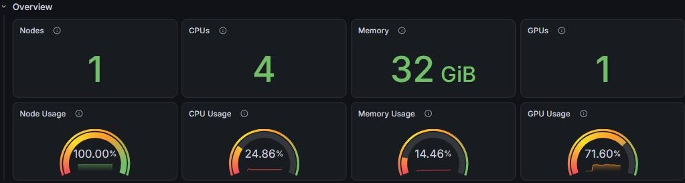
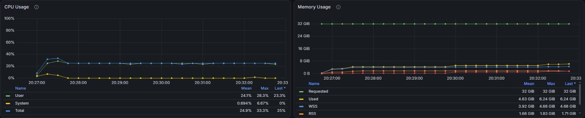
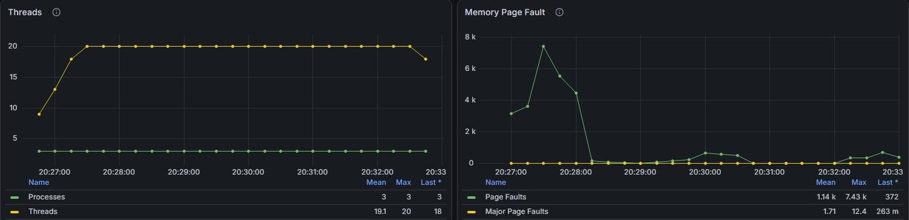
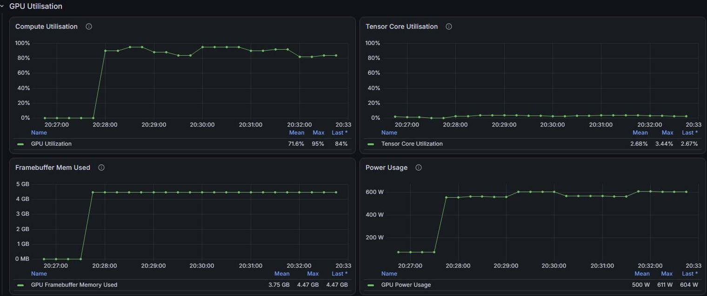

# Lesson 6: Right-sizing Requests

!!! quote "Mission Statement"
    *"How much computer do I actually need?"* ⚖️

Lesson 4's job asked for 4 cores, 32 GB of memory, a GPU and an hour, and said at the time that this was generous. Lesson 5 showed the other side: ask for too little walltime or memory, and PBS stops the job. This lesson finds the middle from evidence. You'll open the Lesson 4 job on QUT's HPC Monitoring Dashboard, see what it actually used, and write each line of its next request from a reading, starting with the resource that matters most.

## 📋 What You'll Accomplish

By the end of this 15–20 minute lesson, you'll have:

- [ ] **Weighed what a request costs** — too little stops the job; too much waits longer and holds what others need
- [ ] **Put the resources in order** — why a GPU job is sized GPU first
- [ ] **Read a finished job on the HPC Monitoring Dashboard** — cores, memory and GPU, against what was requested
- [ ] **Written a request from the readings** — every `#PBS -l` value with its reason
- [ ] **Kept the record** — a job script that saves what it used

!!! info "You need Lesson 4"
    Part 3 opens the `imdb_sentiment` job from [Lesson 4](lesson-4.md) on the dashboard, which keeps finished jobs for about 30 days. Any job of your own from the last 30 days works as well. The dashboard needs the QUT network, or the VPN when you are off campus.[^1]

---

## ⚖️ Part 1: What a request costs (~3 min)

A request is three things at once:

- **A limit.** Go past the walltime or the memory and PBS stops the job ([Lesson 5](lesson-5.md), Part 3).
- **A booking.** What you request is kept for your job alone for as long as it runs, whether the job uses it or not.[^1]
- **Room PBS has to find.** The job starts only when one node has all of it free at the same time.[^2]

So a request can go wrong in both directions:

| | Too little | Too much |
|---|---|---|
| **Walltime** | PBS stops the job, and results it would have written at the end are never written | fits fewer of the gaps PBS finds between other jobs, so it can wait longer ([backfill](../scheduler/The-Queue-Is-Not-a-Line.md#backfill)) |
| **Memory** | PBS stops the job (`137`) | waits for a node with that much free, then holds what it does not use |
| **Cores** | the job runs slower, but is not stopped | waits for a node with that many free, then leaves them idle |
| **GPUs** | the program fails or crawls | waits for more free cards, then leaves them idle |

What a job holds and does not use adds up when there are many jobs. The Lesson 4 job left about 25 GB of its 32 GB unused; [Lesson 7](lesson-7.md) runs one job script as a hundred jobs, and a hundred copies of that request would hold 2,500 GB that none of them uses.

QUT's target is to use at least 80% of each resource you request.[^1]

!!! note "A smaller request does not rank higher"
    Aqua orders waiting jobs partly by the size of what they request, so trimming a request lowers that part of its score a little. It can still start sooner, because it fits where a bigger request does not. [The Queue Is Not a Line](../scheduler/The-Queue-Is-Not-a-Line.md) explains both.

---

## 🧮 Part 2: Not all resources are equal (~3 min)

A GPU batch node has a few GPUs and many cores and gigabytes to go with them ([Know Your Nodes](../scheduler/Know-Your-Nodes.md)):

| GPU batch node | GPUs | Cores | Memory | One GPU's share |
|---|---|---|---|---|
| **H100** (13 nodes) | 4 | 168 | 974 GB | about 42 cores and 240 GB |
| **A100** (5 nodes) | 8 | 120 to 124 | 974 GB | about 15 cores and 120 GB |

The GPUs run out first. `pbsnodeinfo` shows each node's use right now:

```bash
pbsnodeinfo
```

!!! example "Two GPU nodes in `pbsnodeinfo`, 15 September 2026"
    ```text
    Node      :     cpu_id    | cpu usage | cpu% | mem usage | mem% |  gpu; gpu usage
      gpu1n003:   Intel-6-143 |   48/168  |  28  |  356/ 974 |  36  | H100; 4/ 4 gpus
      gpu0n007:      AMD-25-1 |   65/120  |  54  |  672/ 974 |  68  | A100; 8/ 8 gpus
    ```

That morning every H100 and A100 batch node looked like these two: all of their GPUs taken, while only 13 to 54% of their cores and 10 to 68% of their memory were in use. PBS values them differently too: when it orders waiting jobs by the size of their request, one GPU counts as much as 32 cores or 256 GB ([the formula](../scheduler/The-Queue-Is-Not-a-Line.md#formula)).

So size a GPU job in this order:

1. **The GPU.** Does the program use it, how much GPU memory does it need (an A100 has 40 GB, an H100 80 GB), and does it use more than one card?
2. **Walltime.** When a card frees up, it is often already booked for a higher-ranked job that starts later. A job can use it until then only if its walltime is short enough.
3. **Cores and memory.** What the program uses, and no more than the "One GPU's share" in the table above. A job that takes more leaves the node's other GPUs short of cores or memory, so no one else can use them: one GPU and 120 cores on an A100 node leaves its other seven GPUs with no cores at all.

A CPU job has no card to share out: its cores and memory decide which nodes can take it, and Part 1's table is the whole story.

---

## 📊 Part 3: What the Lesson 4 job used (~5 min)

### Step 1: The quick look

The summary at the end of the job's `.o` file has three numbers:

```bash
cd ~/hello-aqua
grep -A3 "PBS Job" imdb_sentiment.o*
```

!!! example "The Lesson 4 job's summary"
    ```text
    PBS Job 12345679.aqua
    CPU time         : 00:06:00
    Wall time        : 00:06:07
    Mem usage        : 1313588kb
    ```

Six minutes of CPU time in six minutes of wall time means about one core was busy, not four. That is all the summary can say: not whether the core was busy steadily or in bursts, not how much of the GPU was used, and not how memory rose and fell. The dashboard shows all three.

### Step 2: Open the job on the dashboard

1. Go to the [HPC Monitoring Dashboard](https://hpc-monitoring.eres.qut.edu.au) and log in with your QUT username (not your email address) and password.[^1] It opens on the **PBS User** page.
2. At the top right, set the time range to cover the day the job ran, for example **Last 30 days**.
3. Scroll to **Completed Jobs**, filter the `name` column to `imdb_sentiment`, and click the job ID.

That opens the **PBS Job** page for that job, with the time range set to exactly when it ran.

!!! tip "Jobs that are still running"
    They are listed under **Running Jobs** on the same page, and their page refreshes by itself. A look in the first few minutes of a long job shows a request that is far off before the job ends.

### Step 3: Read it



The top row repeats the request. The gauges below it show how much of each resource was used, on average, while the job ran:

| Gauge | Reading | What it means |
|---|---|---|
| **CPU Usage** | 24.86% | about 1 of the 4 cores was busy |
| **Memory Usage** | 14.46% | on average, about a seventh of the 32 GiB was in use |
| **GPU Usage** | 71.60% | the GPU was busy for most of the run |

The gauges are red below 30%, yellow from 30%, orange from 60% and green from 90%, so a job that meets QUT's 80% target still shows orange.



The graphs show the same thing over time, each with a table of **Mean**, **Max** and **Last** underneath:

- **CPU Usage:** `Total` sat at 25% from start to finish, with a `Max` of 33.3%. The job used one core steadily.
- **Memory Usage:** `Used` peaked at 6.24 GiB (its `Max`), against 32 GiB `Requested`. `Used` counts everything charged to the job, including files it read, which is why it is larger than the `.o` summary's number. Size memory from this `Max`; the other lines are parts of it.



- **Threads:** up to 20 threads in 3 processes, on 4 cores. More threads than cores can look like a job that wants more cores, but CPU Usage stayed at 25%: most of those threads were waiting, not working. QUT's rule is to add cores only when threads outnumber cores **and** CPU usage is at 100%.[^1]



- **Compute Utilisation:** 0% for the first minute, while the program started, then 82 to 95% until the end.
- **Framebuffer Mem Used:** the GPU's memory in use, which peaked at 4.47 GB of the H100's 80 GB.

Put together:

| | Requested | Used |
|---|---|---|
| **GPU** | 1 card | 72% busy on average; at most 4.47 GB of its memory |
| **Walltime** | 1 hour | 6 minutes 7 seconds (from the `.o` summary) |
| **Cores** | 4 | about 1 (CPU Usage 25%, `Max` 33%) |
| **Memory** | 32 GB | at most 6.24 GiB |

PBS's `GB` is the dashboard's `GiB`: the request of `32GB` shows as 32 GiB.

---

## ✏️ Part 4: Turn the readings into a request (~4 min)

### Step 1: One line at a time

In the order from Part 2:

- **GPU: keep one card.** It was busy for most of the run, and the script uses one card.
- **Walltime: `00:15:00`.** The job used six minutes. Doubling that leaves room for a run that goes slower, and rounding up gives 15 minutes ([The Art of Walltime](../scheduler/The-Art-of-Walltime.md) has the theory behind doubling). QUT lists 10 minutes as the shortest walltime its queues take.[^2]
- **Cores: `2`.** One core was busy, with a peak of a third of four, about 1.3. One core would be short at that peak; two covers it.
- **Memory: `8GB`.** The peak was 6.24 GiB. 8 GB is the next round size, with about 30% room above the peak.
The Lesson 4 script with the new request:

```bash title="~/hello-aqua/imdb_sentiment.pbs"
#!/bin/bash
#PBS -N imdb_sentiment
#PBS -l select=1:ncpus=2:ngpus=1:mem=8GB:gpu_id=H100
#PBS -l walltime=00:15:00
#PBS -m abe

cd "$PBS_O_WORKDIR"
nvidia-smi --query-gpu=name,memory.total,driver_version --format=csv
uv run python imdb_sentiment.py
```

### Step 2: When the run changes

A reading is only good for the run it came from. The script's settings, listed in Lesson 4's Quick Reference, say which line each one moves:

| You change | The line that moves | For example |
|---|---|---|
| `--epochs` or `--limit` | walltime, roughly in proportion | `--epochs 3` is one and a half times the work: 6 minutes becomes about 9, so ask for `00:20:00` |
| `--batch` | GPU memory | measure it again |
| the model or the data | all of them | measure it again |

!!! tip "Keep one request when timings are results"
    If how long runs take is part of what you report, give every run in that comparison the same request. Trim between experiments, not in the middle of one.

---

## 🔁 Part 5: Run it, check it, keep the record (~3 min)

### Step 1: Save the record in the job

Add one line to the end of the job script:

```bash
qstat -xf $PBS_JOBID > resource_usage_$PBS_JOBID
```

It writes the job's record, with what was requested next to what was used, into a file named after the job.[^3] PBS forgets a job four days after it ends and the dashboard after about 30. The file lasts for as long as you keep it, and it is what the next request starts from.

### Step 2: Submit it and check

```bash
qsub imdb_sentiment.pbs
```

When it ends, open it on the dashboard as in Part 3 and compare its gauges with the Lesson 4 job's.

Not every gauge will reach 80%, and that is fine. One busy core out of two should read about 50%, but one core would leave nothing for the peak. Adjust once, not endlessly: if a reading is still far below its request, trim that line again; if a reading came close to its limit, give that line more room.

---

## 🎯 Key Takeaways

!!! success "You now know"

    ⚖️ **A request is a limit, a booking and room to find** — too little stops the job, too much waits longer and holds what others need

    🎮 **Size a GPU job GPU first** — then walltime, then cores and memory within one GPU's share of the node

    📊 **The dashboard shows what a job used** — the gauges give averages, the graph tables give the `Max`

    ✏️ **Every line from a reading** — cores busy rounded up, memory `Max` plus room, walltime doubled

    🔁 **When the run changes, its line changes** — epochs move walltime, batch size moves GPU memory

    🗂️ **Save the record in the job** — `qstat -xf $PBS_JOBID > resource_usage_$PBS_JOBID`

---

## 🔗 What's Next?

→ **[Lesson 7: Job Arrays](lesson-7.md)** — one script, many runs, each with the request you sized here.

For the estimation theory behind walltime, see [The Art of Walltime](../scheduler/The-Art-of-Walltime.md); for the shape of every node, [Know Your Nodes](../scheduler/Know-Your-Nodes.md).

!!! question "Stuck?"
    - **The dashboard does not load?** It needs the QUT network or the VPN, and an account with HPC access.
    - **Completed Jobs is empty?** Widen the time range at the top right to cover the day the job ran. Jobs older than about 30 days are gone from the dashboard; a `resource_usage_` file is what remains.
    - **The graphs are empty or a single dot?** The time range is much longer than the job. Click the job ID in Completed Jobs, which sets the range to the job's own run.
    - **Killed after trimming?** This run needed more than the one you measured. Give that line back some room ([Lesson 5](lesson-5.md), Part 3).
    - **GPU Usage near 0%?** The job held a GPU without using it. If the log says the device is `cpu`, see Lesson 4's Stuck box.

---

## 📝 Quick Reference

=== "Reading to request"
    ```text
    GPU        used at all? memory Max fits which card? one card unless the program uses more
    walltime   wall time x 2, rounded up (QUT queues start at 10 minutes)
    cores      CPU Usage % x cores requested = cores busy; round up
    memory     Memory Usage graph, Used, Max; add room, round up
    ```

=== "Job script"
    ```bash
    #!/bin/bash
    #PBS -N my_job
    #PBS -l select=1:ncpus=2:ngpus=1:mem=8GB:gpu_id=H100
    #PBS -l walltime=00:15:00
    #PBS -m abe

    cd "$PBS_O_WORKDIR"
    uv run python my_program.py
    qstat -xf $PBS_JOBID > resource_usage_$PBS_JOBID
    ```

=== "Commands"
    ```bash
    grep -A3 "PBS Job" my_job.o*                         # CPU time, wall time, memory
    qstat -xf <job-id> | grep -E "resources_used|Resource_List"   # used and requested, for four days
    pbsnodeinfo                                          # every node's use right now
    ```

=== "Dashboard"
    ```text
    https://hpc-monitoring.eres.qut.edu.au   (QUT network or VPN)
    PBS User -> time range -> Completed Jobs -> job ID -> PBS Job
    ```

[^1]: QUT eResearch, "[Monitoring Job Resource Usage](https://docs.eres.qut.edu.au/hpc-job-monitoring)". Exclusive use of requested resources, the HPC Monitoring Dashboard and its pages, the rule for adding cores, and the 80% target. Access only on the QUT network; use the VPN off campus.
[^2]: QUT eResearch, "[Queues and limits](https://docs.eres.qut.edu.au/hpc-queue-limits)". The 10-minute minimum walltime, and a request having to fit on one node.
[^3]: QUT eResearch, "[Estimating/optimising resources to request for a job](https://docs.eres.qut.edu.au/hpc-estimatingoptimising-resources-to-request-for-)". Saving `qstat -fx $PBS_JOBID` to `resource_usage_$PBS_JOBID` at the end of a job script.
