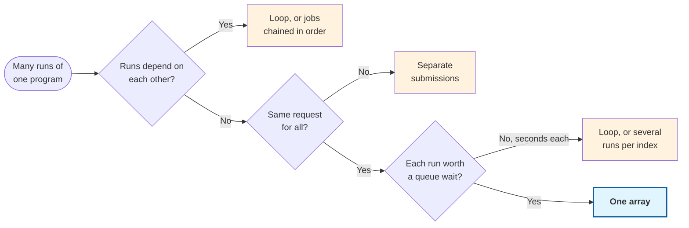
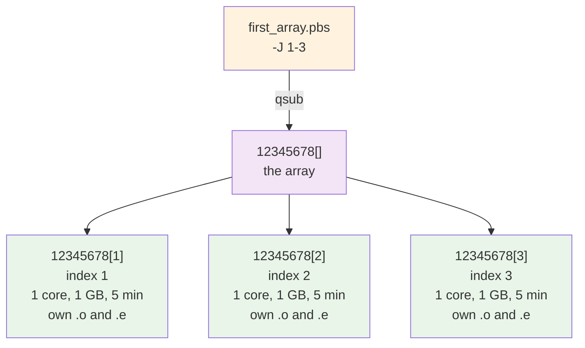

# Lesson 7: Job Arrays

!!! quote "Mission Statement"
    *"One script, many runs, and one number to tell them apart."* 🔁

Lesson 4 ended by saying that anything you will run again with different inputs belongs in a job script. This lesson is what happens when "again" means eight times, or eighty: one script and one `qsub` still, but PBS makes a job out of every run and tells each which run it is. By the end you can turn a list of seeds, files or settings into one submission, watch it as one thing, and rerun only the runs that failed.

## 📋 What You'll Accomplish

By the end of this 15–20 minute lesson, you'll have:

- [ ] **Chosen between an array, a loop and separate jobs** — from what each costs you
- [ ] **Submitted an array** — three subjobs from one `qsub`, and read what each of them saw
- [ ] **Mapped the index to your inputs** — a seed, a file from a list, a row of settings, or a slice of a long list
- [ ] **Run a real workload as an array** — eight MCMC chains, each with its own seed and its own file
- [ ] **Watched it and repaired it** — the tally rather than one line per run, and a rerun that skips finished work

!!! info "You need Lessons 2 and 4"
    Everything below assumes the `~/hello-aqua` project from [Lesson 2](lesson-2.md), which gains three libraries in Part 2, and that a `#PBS` header, `qsub`, and finding a job again with `qstat` and `qdel` feel familiar ([Lesson 4](lesson-4.md)).

---

## 🧮 Part 1: Many runs, one submission (~6 min)

### Step 1: Three ways to run the same program many times

You have one program and many runs of it: one per seed, one per parameter value, one per input file. There are three ways to get them onto the cluster.

=== "Separate submissions"
    > Edit the script, `qsub`, edit it again, `qsub` again.

    N independent jobs. You type the same thing N times, and nothing afterwards records which output came from which edit.

=== "One job that loops"
    > One script with a `for` loop in the body.

    One job, one queue wait, one log. The runs happen in sequence inside it, so one walltime has to cover all of them.

=== "One array"
    > One script, one `qsub`, and a directive saying how many.

    N subjobs under one job id. PBS schedules each subjob on its own, and each one is told which run it is.

From the outside all three are the same program running N times. They differ in what each costs you:

| | Separate submissions | One job that loops | One array |
|---|---|---|---|
| What you type | one script edited N times, N `qsub` | one script, one `qsub` | one script, one `qsub` |
| Queue waits | N, a slot per run | one, a slot long enough for all the runs | N, a slot per subjob |
| The walltime covers | one run | all the runs together | one run |
| Runs can overlap | yes | no | yes |
| The request | can differ per run | one, sized for the largest run | one, shared by every subjob |
| One failure costs | that run | that run, and the rest if the job stops | that subjob |
| Log files | a pair per run | one pair | a pair per subjob |
| Which run is which | whatever you wrote down | the loop variable | the index PBS hands each subjob |

Three rows decide it. Subjobs overlap and start in whatever order PBS finds room, so the runs must not depend on each other. They share one request, so they must want the same machine. And each pays its own queue wait, so each has to be worth one.



Seeds, chains and parameter sweeps take the bottom path, which is why arrays are the usual answer for that kind of work. The rest of Part 1 builds one.

### Step 2: One directive, many jobs

An array is Lesson 4's script with one line added:

=== "Lesson 4: one job"
    ```bash
    #PBS -N first
    #PBS -l select=1:ncpus=1:mem=1GB
    #PBS -l walltime=00:05:00
    #PBS -P ABCDEF1234
    ```

=== "This lesson: three subjobs"
    ```bash
    #PBS -N first_array
    #PBS -J 1-3
    #PBS -l select=1:ncpus=1:mem=1GB
    #PBS -l walltime=00:05:00
    #PBS -P ABCDEF1234
    ```

That one line turns one submission into one job id and three **subjobs**:



Two things in that picture matter for the rest of the lesson. The request belongs to each subjob, not to the array: three one-core subjobs take three cores when they run together, and five minutes of walltime is five minutes each. And the index is the only thing that differs, so the design question for any array is what the index should select.

??? info "Other forms of `-J`"
    | Directive | What it does |
    |---|---|
    | `-J 1-8` | subjobs 1 to 8 |
    | `-J 0-9` | ten subjobs, numbered from zero |
    | `-J 1-100:2` | every second index: 1, 3, 5, … |
    | `-J 1-100%10` | a hundred subjobs, at most ten running at once |

    `-J` also works on the `qsub` command line, like every other directive. Aqua's documentation puts the practical ceiling for one array at about 5000 subjobs.[^1]

### Step 3: Write and submit a throwaway array

The script computes nothing: each subjob prints what it can see, which is what a first array is for. On the login node:

```bash
mkdir -p ~/hello-aqua/jobs && cd ~/hello-aqua/jobs
nano first_array.pbs
```

```bash title="first_array.pbs"
#!/bin/bash
#PBS -N first_array
#PBS -J 1-3
#PBS -l select=1:ncpus=1:mem=1GB
#PBS -l walltime=00:05:00
#PBS -P ABCDEF1234
#PBS -m abe

echo "index     $PBS_ARRAY_INDEX"
echo "job id    $PBS_JOBID"
echo "host      $(hostname)"
```

!!! note "Command breakdown"
    - `-J 1-3` → three subjobs, with indices 1, 2 and 3
    - `-l select=...`, `-l walltime=...` → what **each** subjob gets, exactly as in Lesson 4
    - `-m abe` → one set of emails for the array, not one set per subjob[^4]
    - `$PBS_ARRAY_INDEX` → which subjob this is, set by PBS inside every subjob

```bash
qsub first_array.pbs
```

!!! example "Expected output"
    ```text
    12345678[].aqua
    ```

The empty brackets are how PBS writes "the array, all of it". `qstat` shows it the same way while it waits:

```bash
qstat -u $USER
```

!!! example "Expected output"
    ```text
    aqua:
                                                                     Req'd  Req'd   Elap
    Job ID               Username Queue    Jobname    SessID NDS TSK Memory Time  S Time
    -------------------- -------- -------- ---------- ------ --- --- ------ ----- - -----
    12345678[].aqua      your-us* cpu_bat* first_arr*    --    1   1    1gb 00:05 Q   --
    ```

One line, however many subjobs there are.

### Step 4: Read what the subjobs wrote

When the end email arrives:

```bash
ls
```

!!! example "Expected output"
    ```text
    first_array.e12345678.1  first_array.e12345678.2  first_array.e12345678.3
    first_array.o12345678.1  first_array.o12345678.2  first_array.o12345678.3
    first_array.pbs
    ```

```bash
head -3 first_array.o*
```

!!! example "Expected output"
    ```text
    ==> first_array.o12345678.1 <==
    index     1
    job id    12345678[1].aqua
    host      cpu1n044

    ==> first_array.o12345678.2 <==
    index     2
    job id    12345678[2].aqua
    host      cpu1n047

    ==> first_array.o12345678.3 <==
    index     3
    job id    12345678[3].aqua
    host      cpu1n050
    ```

    Below those three lines each file carries Aqua's summary, as every `.o` file does ([Lesson 4](lesson-4.md), Part 1).

Three things in there are worth a second look:

1. **Each subjob wrote its own log files**, `.o` and `.e`, named with the job's sequence number and then the index. Three subjobs leave six files; a hundred leave two hundred.
2. **The job id carries the index.** The array is `12345678[]`, and subjob 2 is `12345678[2]`. `qstat` and `qdel` both accept that form, so you can ask about or cancel one subjob without touching the others.
3. **The only difference between the three is the index.** Same script, same request, same everything else. PBS placed them on three different nodes, and none of them knew or cared.

That is the whole mechanism. What makes an array useful is what the index selects, and the rest of the lesson is one real case of it.

---

## 🔗 Part 2: Run eight chains as one array (~8 min)

### Step 1: What the runs are

The job follows [PyMC's own primer on multilevel modelling](https://www.pymc.io/projects/examples/en/latest/generalized_linear_models/multilevel_modeling.html), which fits a Bayesian model to radon measurements from 919 households across 85 Minnesota counties, asking how much of the radon in a house is explained by the county it sits in.[^2]

The fit is done by MCMC, which explores the model's parameters by wandering through them one step at a time. A single wander proves nothing, because it may have settled somewhere plausible and stayed there. So a fit runs several **chains**, each from its own seed, and compares them at the end: agreement between chains is the evidence that the answer is real.

Chains take the bottom path of Step 1's chart. They never look at each other while they run, and they want the same one core and memory. On the third question they are borderline: a chain of this model takes about twelve seconds, four of them compiling, which is short for a queue wait. Eight of them still finished 31 seconds after the array started, because eight nodes ran them at once, and the same script is what you want when a chain takes an hour. The closing tip comes back to the short case.

### Step 2: Prepare once on the login node

**Whatever your program sets up before it can start, N subjobs will set up N times, at the same moment, on the same shared filesystem.** Do it once, before you submit.

For this workload that is three libraries and a check that the model builds. The libraries, with `netcdf4` for the file format the chains are saved in:

```bash
cd ~/hello-aqua
uv add pymc arviz netcdf4
```

!!! example "Expected output"
    ```text
    Resolved 98 packages in 687ms
    Installed 14 packages in 849ms
     + arviz==1.3.0
     + arviz-base==1.3.0
     + arviz-plots==1.3.1
     + arviz-stats==1.3.2
     + cachetools==6.2.6
     + cftime==1.6.5
     + lazy-loader==0.5
     + llvmlite==0.49.0
     + netcdf4==1.7.4
     + numba==0.67.0
     + pymc==6.3.2
     + pytensor==3.3.2
     + xarray==2026.7.0
     + xarray-einstats==0.11.0
    ```

The radon data is two files from PyMC's examples repository, fetched below alongside the script, so no subjob touches the network. The compilation is the part to get right:

!!! warning "Eight subjobs compiling at once"
    PyMC builds the model through PyTensor and caches the compiled result under `~/.pytensor`. Processes compiling at the same moment contend for that cache's lock, which is what eight subjobs starting together would do. The PyMC developers' advice for many processes at once is a compile directory unique to each.[^3] So in Step 4 each subjob compiles into its own directory inside `$TMPDIR`, the scratch PBS gives every job. That costs each chain four seconds and saves it from waiting on the other seven.

`--compile-only` builds and compiles the model, then stops. It is the Lesson 5 habit of testing before queuing, applied to a script that is about to be queued eight times:

```bash
wget https://raw.githubusercontent.com/ZhipengHe/Walltime-Chronicles/main/docs/tutorials/scripts/radon_chains.py
wget https://raw.githubusercontent.com/pymc-devs/pymc-examples/main/examples/data/srrs2.dat
wget https://raw.githubusercontent.com/pymc-devs/pymc-examples/main/examples/data/cty.dat
uv run python radon_chains.py --compile-only
```

!!! example "Expected output"
    ```text
    host      aquarius01
    seed      0  draws 4000  tune 2000
    data      919 households in 85 counties
    compiled  in 9.2s
    done      model built and compiled; nothing sampled (--compile-only)
    ```

[Download the script](scripts/radon_chains.py), or read it here:

??? example "`radon_chains.py`"

    ```python title="radon_chains.py"
    --8<-- "docs/tutorials/scripts/radon_chains.py"
    ```

### Step 3: Let the index choose the run

Part 1 ended on the question every array has to answer: what does the index select? The answer is one line in the job body, and it takes one of four shapes.

| What varies between runs | The line that selects it |
|---|---|
| A seed | `--seed "$PBS_ARRAY_INDEX"` |
| A file from a list | `f=$(sed -n "${PBS_ARRAY_INDEX}p" files.txt)` |
| A row of settings | `args=$(sed -n "${PBS_ARRAY_INDEX}p" settings.txt)` |
| A slice of a long list | `from=$(( (PBS_ARRAY_INDEX - 1) * 10 + 1 ))`, then `sed -n "${from},$((from + 9))p" files.txt` |

The second and third read line N of a text file, which is worth more than it looks: the file records which run was which, you can check it before submitting, and a repair starts from it. The fourth is for runs too short to queue on their own.

Here the index is the seed, and it also names the chain's output file:

```bash
uv run python radon_chains.py --seed "$PBS_ARRAY_INDEX" --out "chains/chain_${PBS_ARRAY_INDEX}.nc"
```

### Step 4: Write the job script

```bash title="~/hello-aqua/radon_chains.pbs"
#!/bin/bash
#PBS -N radon_chains
#PBS -J 1-8
#PBS -l select=1:ncpus=1:mem=4GB
#PBS -l walltime=00:30:00
#PBS -P ABCDEF1234
#PBS -m abe

set -e
cd "$PBS_O_WORKDIR"
export PYTENSOR_FLAGS="compiledir=$TMPDIR/pytensor"

mkdir -p chains
uv run python radon_chains.py --seed "$PBS_ARRAY_INDEX" --out "chains/chain_${PBS_ARRAY_INDEX}.nc"
```

!!! note "Command breakdown"
    - `-J 1-8` → eight chains, and the index is the seed each one starts from
    - `-l select=...` → one core and 4 GB **per chain**, so eight cores and 32 GB with all eight running
    - `PYTENSOR_FLAGS` → this subjob's own compile directory, from Step 2
    - `--out chains/chain_${PBS_ARRAY_INDEX}.nc` → one file per index, which is what Part 3 depends on
    - `set -e` → stop this subjob at the first command that fails ([Lesson 5](lesson-5.md))

!!! note "Where the numbers came from"
    Generous on purpose, as Lesson 4's first job was: each chain used about 12 seconds of its 30 minutes and 335 MB of its 4 GB. Sized the [Lesson 6](lesson-6.md) way that is `mem=1GB` and `walltime=00:10:00`, Aqua's minimum. Two things are particular to arrays. The walltime has to fit the **slowest** chain rather than the one you measured, and the memory is reserved eight times over, so what Lesson 6 sizes is what you then multiply.

!!! warning "Sized for the slowest run"
    One walltime applies to every subjob. Chains that adapt badly take longer than chains that do not, and PBS stops any subjob that goes past the limit, so the walltime has to fit the slowest chain you expect, not the one you measured.

!!! tip "Holding back how many run at once"
    `#PBS -J 1-8%4` would let only four of the eight run at a time. At eight it makes little difference. At eight hundred it is the difference between a mistake in the mapping costing two subjobs and costing all of them, and between taking a slice of a shared cluster and a shelf of it.

### Step 5: Submit and read the results

```bash
qsub radon_chains.pbs
```

!!! example "Expected output"
    ```text
    12345679[].aqua
    ```

One `qsub`, one job id, eight chains. The begin and end emails cover the array, not each chain.

??? info "Mail from an array"
    `-m abe` on an array is about the array, not its subjobs: one email when the array begins, one when it finishes, and nothing per subjob.[^4] The two arrays in this lesson sent four emails between them. Adding `j` (`-m abej`) turns that into one set per subjob, which is 24 emails for eight chains and a flood for eight hundred. Keep `-m abe` as it has been since Lesson 4, and add `j` only when you want to hear about individual runs.

    If one subjob is stopped from outside, the array's own record ends "terminated" with `Exit_status = 1`, and that is what its end email says.

When the end email arrives, on the login node:

```bash
ls chains/
```

!!! example "Expected output"
    ```text
    chain_1.json  chain_2.nc    chain_4.json  chain_5.nc    chain_7.json  chain_8.nc
    chain_1.nc    chain_3.json  chain_4.nc    chain_6.json  chain_7.nc
    chain_2.json  chain_3.nc    chain_5.json  chain_6.nc    chain_8.json
    ```

    Each chain is a `.nc` file of 3.5 MB, and beside it a small `.json` saying what that run used: `elapsed_s`, `peak_rss_mb`, and its `job_id` with the index in it.

Eight files are not the answer; what they say together is. Combining them takes seconds, so the login node is the right place:

```bash
uv run python - <<'EOF'
import glob
import arviz as az
import xarray as xr

files = sorted(glob.glob("chains/chain_*.nc"))
posts = [az.from_netcdf(f)["posterior"].to_dataset() for f in files]
post = xr.concat(posts, dim="chain").assign_coords(chain=range(len(posts)))
print(az.summary(post))
EOF
```

!!! example "Expected output"
    ```text
                             mean      sd eti89_lb eti89_ub ess_bulk ess_tail r_hat mcse_mean  mcse_sd
    mu_a                    1.492  0.0506      1.4      1.6    14774    19325  1.00   0.00042  0.00025
    a[AITKIN]                1.23   0.244     0.84      1.6    38501    23493  1.00    0.0012   0.0015
    ...
    a[YELLOW MEDICINE]      1.416   0.273     0.98      1.9    34176    23274  1.00    0.0015   0.0016
    b                     -0.6625  0.0678    -0.77    -0.55    21594    21812  1.00   0.00046  0.00034
    sigma_a                0.3198  0.0448     0.25      0.4     8342    11065  1.00   0.00048  0.00026
    sigma                  0.7266  0.0178      0.7     0.76    32779    23881  1.00   9.8e-05   0.0001
    ```

    `b` is the floor effect: a reading taken on the first floor rather than the basement is lower by 0.66 on the log scale, the number the primer arrives at.

The `r_hat` column is why the chains had to be combined. It compares the chains with each other and sits near 1.0 when they agree, so a chain on its own cannot tell you whether the fit converged. A missing chain is not just a missing file; it weakens the answer the others give, and Part 3 shows by how much.

---

## 🧭 Part 3: Keeping track, and repairing the gaps (~4 min)

### Step 1: Watch it as one thing

While the array runs, `qstat -u $USER` shows it as one line ending in `[]`. To see the subjobs, name the array and ask for them:

```bash
qstat -t '12345679[]'
```

!!! example "Expected output"
    ```text
    Job id                 Name             User              Time Use S Queue
    ---------------------  ---------------- ----------------  -------- - -----
    12345679[].aqua        radon_chains     your-username            0 Q cpu_batch_exec
    12345679[1].aqua       radon_chains     your-username            0 Q cpu_batch_exec
    12345679[2].aqua       radon_chains     your-username            0 Q cpu_batch_exec
    12345679[3].aqua       radon_chains     your-username            0 Q cpu_batch_exec
    12345679[4].aqua       radon_chains     your-username            0 Q cpu_batch_exec
    12345679[5].aqua       radon_chains     your-username            0 Q cpu_batch_exec
    12345679[6].aqua       radon_chains     your-username            0 Q cpu_batch_exec
    12345679[7].aqua       radon_chains     your-username            0 Q cpu_batch_exec
    12345679[8].aqua       radon_chains     your-username            0 Q cpu_batch_exec
    ```

The quotes matter, because brackets are shell characters. That list is fine for eight and useless for eight hundred; the tally is the view that keeps working:

```bash
qstat -fw '12345679[]' | grep array_state_count
```

!!! example "Expected output, before and after the subjobs start"
    ```text
    array_state_count = Queued:8 Running:0 Exiting:0 Expired:0
    array_state_count = Queued:0 Running:8 Exiting:0 Expired:0
    ```

`Expired` is where finished subjobs are counted while the array is still going. Once the whole array has finished, `qstat` needs `-x` to see it, and `qstat -xt` then shows every subjob as `F` with the time each one used. If fewer are running than you expected, your run limits ([House Rules](../scheduler/Know-Your-Nodes.md#house-rules)) are the usual reason: the rest wait in `Q` and start as earlier ones finish.

To take work back:

```bash
qdel '12345679[]'      # the whole array
qdel '12345679[3]'     # just the third chain
```

### Step 2: Find the runs that failed

One index, one file, so the failures are the gaps. The script writes a chain under its final name only once it is complete, so a file that exists is a finished chain. Ask over the same range the `-J` line used:

```bash
for i in $(seq 1 8); do [ -f "chains/chain_$i.nc" ] || echo "missing $i"; done
```

!!! example "Expected output, from a run in which subjob 3 was taken back"
    ```text
    missing 3
    ```

    This run was the array submitted again into an empty `chains/`, with `qdel '12345680[3]'` typed three seconds after the chains started, so that there would be a real gap to read. A chain stopped at the walltime, or crashing on its own, leaves the same gap.

Each subjob has its own `.e` file. Read that one the way [Lesson 5](lesson-5.md) does. Here subjob 3's `.o` has nothing from the script above Aqua's summary, its `.e` has nothing above Aqua's notice, and its record says `Exit_status = 143`: stopped from outside, Lesson 5's `qdel` row. Nothing the other seven did was touched.

What the gap costs is visible in the summary. Combined from seven chains, `mu_a` has an effective sample size of 12874, against 14774 from eight. The answer is still there, and it is weaker.

### Step 3: Repair without redoing the rest

`-J` takes a range, not a list,[^5] so scattered failures cannot be resubmitted as they stand. Three lines solve it: a subjob that stops as soon as it sees its own output.

=== "First submission"
    ```bash
    mkdir -p chains
    uv run python radon_chains.py --seed "$PBS_ARRAY_INDEX" --out "chains/chain_${PBS_ARRAY_INDEX}.nc"
    ```

=== "Resubmission"
    ```bash
    mkdir -p chains
    out="chains/chain_${PBS_ARRAY_INDEX}.nc"
    [ -f "$out" ] && exit 0
    uv run python radon_chains.py --seed "$PBS_ARRAY_INDEX" --out "$out"
    ```

Submit the same array again, and look at what each subjob used afterwards:

```bash
qsub radon_chains.pbs
qstat -xt '12345681[]'
```

!!! example "Expected output"
    ```text
    12345681[].aqua
    Job id                 Name             User              Time Use S Queue
    ---------------------  ---------------- ----------------  -------- - -----
    12345681[].aqua        radon_chains     your-username            0 F cpu_batch_exec
    12345681[1].aqua       radon_chains     your-username     00:00:00 F cpu_batch_exec
    12345681[2].aqua       radon_chains     your-username     00:00:00 F cpu_batch_exec
    12345681[3].aqua       radon_chains     your-username     00:00:06 F cpu_batch_exec
    12345681[4].aqua       radon_chains     your-username     00:00:00 F cpu_batch_exec
    12345681[5].aqua       radon_chains     your-username     00:00:00 F cpu_batch_exec
    12345681[6].aqua       radon_chains     your-username     00:00:00 F cpu_batch_exec
    12345681[7].aqua       radon_chains     your-username     00:00:00 F cpu_batch_exec
    12345681[8].aqua       radon_chains     your-username     00:00:00 F cpu_batch_exec
    ```

Seven subjobs started, saw their file and exited within two seconds, leaving a `.o` with nothing but Aqua's summary. Subjob 3 did the work, and the gap loop now prints nothing. QUT eResearch's checkpointing example uses the same idea, testing for its output before redoing it.[^1]

!!! tip "The Aqua-specific part of the choice"
    Step 1's chart decides the pattern. Two things on Aqua sharpen it:

    - **How short is too short to queue.** QUT eResearch's own array example answered it by rewriting itself: one image per subjob was "too small of an input size", each converting in under a second, so they put ten images in each subjob.[^1] That is the fourth row of Part 2's table, a slice per index. This lesson's twelve-second chains sit near that line: as an array they took 31 seconds of wall time, as a loop they would take about ninety, and either is fine at this size.
    - **A whole GPU changes the arithmetic.** The queue wait is paid once per job, and whole cards are the most contested thing on Aqua, so twenty short GPU runs as twenty subjobs pay that wait twenty times over. For GPU work, fewer and bigger jobs usually win, with the runs looped inside.

---

## 🎯 Key Takeaways

!!! success "You now know"

    🔁 **One directive makes the subjobs** — `#PBS -J`, and `$PBS_ARRAY_INDEX` tells each one which run it is

    🧭 **An array wants independent, alike runs that are each worth a queue wait** — otherwise a loop or separate jobs

    📇 **The index selects the run** — a seed, line N of a file, or a slice, and the file is the record of which run was which

    ⚖️ **The request belongs to each subjob** — so what [Lesson 6](lesson-6.md) sizes is what you multiply, and the walltime must fit the slowest run

    🧯 **Set-up happens once, not N times** — N subjobs starting together will repeat it and contend with each other

    📂 **One output file per index** — it makes the failures findable and the repair cheap

---

## 🔗 What's Next?

→ **[Lesson 8: Long Jobs](lesson-8.md)** — for the run that does not fit inside one walltime at all.

!!! question "Stuck?"
    - **The array sits in `Q` and nothing starts?** Each subjob carries the whole request, so check that one node can satisfy it, then read the `comment` line ([Lesson 5](lesson-5.md), Part 4).
    - **Every subjob failed the same way?** That is the mapping, not the cluster. Run the body once by hand with `PBS_ARRAY_INDEX=1` in an interactive session.
    - **All the runs wrote to one file?** The output name has to contain the index.
    - **`qstat` shows one line?** That is the array. `qstat -t '<jobid>[]'` shows the subjobs, and `qstat -xt` once it has finished.
    - **Five lines about a project id in every `.e`?** Aqua's accounting notice, added to every job at the moment. Your program's errors are above it.
    - **An email per subjob?** A `j` in the `-m` line. `-m abe` mails you about the array instead.
    - **Compile or cache lock errors when the subjobs start together?** They are sharing one set-up directory. Give each its own under `$TMPDIR` (Part 2, Step 4).
    - **`cannot write NetCDF files` when a chain finishes?** The file format needs `netcdf4` in the project (Part 2, Step 2).

---

## 📝 Quick Reference

=== "Array directives"
    ```bash
    #PBS -J 1-8           # subjobs 1 to 8
    #PBS -J 0-9           # ...numbered from zero
    #PBS -J 1-100:2       # every second index
    #PBS -J 1-100%10      # at most 10 running at once
    #PBS -m abe           # mail about the array; a j in there mails every subjob
    ```

=== "Selecting the run"
    ```bash
    --seed "$PBS_ARRAY_INDEX"                              # a seed
    f=$(sed -n "${PBS_ARRAY_INDEX}p" files.txt)            # a file from a list
    args=$(sed -n "${PBS_ARRAY_INDEX}p" settings.txt)      # a row of settings
    from=$(( (PBS_ARRAY_INDEX - 1) * 10 + 1 ))             # a slice of ten
    ```

=== "Watching"
    ```bash
    qstat -u $USER                                  # the array, one line
    qstat -t '<jobid>[]'                            # its subjobs; -xt once finished
    qstat -fw '<jobid>[]' | grep array_state_count  # the tally
    qdel '<jobid>[]'                                # take back all of it
    qdel '<jobid>[3]'                               # take back one subjob
    ```

=== "Repair a part-finished array"
    ```bash
    out="chains/chain_${PBS_ARRAY_INDEX}.nc"
    [ -f "$out" ] && exit 0
    ```

=== "radon_chains.py knobs"
    ```bash
    python radon_chains.py --compile-only                  # build the model, sample nothing
    python radon_chains.py --seed 3 --out chains/chain_3.nc
    python radon_chains.py --draws 500 --tune 500          # a shorter chain
    ```

[^1]: QUT eResearch, "[Submitting jobs on Aqua](https://docs.eres.qut.edu.au/hpc-submitting-jobs-on-aqua)" and "[Running jobs longer than 48 hours](https://docs.eres.qut.edu.au/breaking-the-48hr-barrier)". `array_state_count`, the `%N` limit, the ceiling of about 5000 subjobs, the rebatched array example, and the job that tests for its output before redoing it. Access only in QUT network; use the VPN off campus.
[^2]: PyMC, "[A Primer on Bayesian Methods for Multilevel Modeling](https://www.pymc.io/projects/examples/en/latest/generalized_linear_models/multilevel_modeling.html)". The radon measurements come from Gelman and Hill, *Data Analysis Using Regression and Multilevel/Hierarchical Models* (2006), and ship with PyMC.
[^3]: PyMC Discourse, "[Recommended way to run many PyMC models in parallel without triggering compiledir cache lock errors](https://discourse.pymc.io/t/recommended-way-to-run-many-pymc-models-in-parallel-joblib-without-triggering-compiledir-cache-lock-errors/17440)". A PyMC developer's advice is a compile directory unique per process.
[^4]: OpenPBS, "[qsub man page](https://github.com/openpbs/openpbs/blob/master/doc/man1/qsub.1B)". The `-m` sub-options, where `j` means "Mail is sent for subjobs".
[^5]: OpenPBS, "[qstat man page](https://github.com/openpbs/openpbs/blob/master/doc/man1/qstat.1B)". Job array, subjob and subjob-range identifiers, and what `-t` displays.
