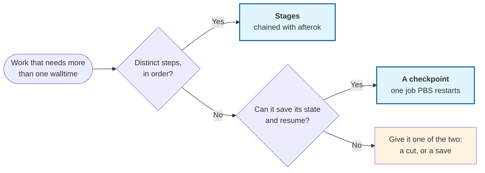
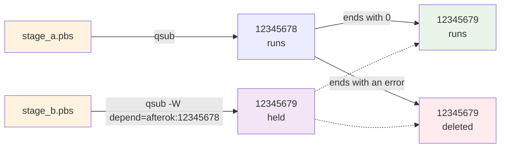

# Lesson 8: Long Jobs

!!! quote "Mission Statement"
    *"When one walltime ceiling isn't enough"* ⏰

Lesson 5 showed the ending where PBS stops a job at its walltime, and said that work which cannot fit inside one has to be split. Lesson 7 split work that was many independent runs. This lesson is for work that is one thing: steps that must follow each other, or one computation that has to keep going past the point where PBS stops it. By the end you can chain jobs so that each waits for the last, make a long run survive its walltime, and read from the records what happened to each.

## 📋 What You'll Accomplish

By the end of this 15–20 minute lesson, you'll have:

- [ ] **Told stages from a checkpoint** — the two shapes of work that outgrow a walltime, and which one yours is
- [ ] **Chained two jobs** — the second waits in the queue until the first has finished without error
- [ ] **Watched PBS stop a job at its walltime and start it again** — and seen what the log and the record keep of the first run
- [ ] **Made a program restartable** — save as you go, look before you start, aim at a total
- [ ] **Trained a robot to hop for twenty minutes on a ten-minute walltime** — scored by a job that waited for it
- [ ] **Read a broken link** — a stage that fails, and a restart that does not resume

!!! info "You need Lessons 4 and 5"
    Everything below assumes the `~/hello-aqua` project from [Lesson 2](lesson-2.md), which gains two libraries in Part 4, that a `#PBS` header, `qsub` and `qstat` feel familiar ([Lesson 4](lesson-4.md)), and that you have read a job's ending in its record ([Lesson 5](lesson-5.md)).

---

## ⏳ Part 1: Two mechanisms (~3 min)

Aqua's batch queues give a job at most 48 hours,[^1] and the first sign that work needs more is Lesson 5's ending: `=>> PBS: job killed: walltime`. Aqua's documentation gives three answers: make the work faster, split it, or checkpoint it.[^2] Faster is [Lesson 6](lesson-6.md)'s business, and [Lesson 7](lesson-7.md) split work that was many independent runs. What is left is work that is one thing, and PBS has two mechanisms for it.

- **Stages.** The work has distinct steps, each starting from what the one before it wrote: prepare, then train, then evaluate. Each step becomes its own job, submitted with the id of the job before it, and PBS holds it until that job has finished without error. What the program needs is a cut between the steps, with files carrying the work across it.
- **A checkpoint.** The work is one computation with an outer loop, a training run or a simulation, that can write down where it is. The job says so with one directive; PBS stops it at its walltime and submits it again, and the program continues from what it saved. What the program needs is a way to save its state, and to start from a saved state.

The two are not rivals: a long stage can carry a checkpoint. Which one a piece of work needs is decided by its shape.



A program that can do neither has to be changed before PBS can help it. Aqua provides a generic checkpointing script that can freeze a single-node, CPU-only command without the program's help; it is the last resort, not the first.[^3] Parts 2 and 3 show each mechanism on a job small enough to read whole, and Part 4 runs real work through both.

---

## 🔗 Part 2: A job that waits for another (~3 min)

### Step 1: Submit the second job with the first job's id

A dependency is not a line in the script. It is given to `qsub` when the second job is submitted, naming the first job's id. PBS holds the second job until the first has finished, and releases it only if the first ended without error.



Two throwaway scripts show it. On the login node:

```bash
mkdir -p ~/hello-aqua/jobs && cd ~/hello-aqua/jobs
nano stage_a.pbs
```

```bash title="stage_a.pbs"
#!/bin/bash
#PBS -N stage_a
#PBS -l select=1:ncpus=1:mem=1GB
#PBS -l walltime=00:10:00
#PBS -m abe

echo "host      $(hostname)"
echo "started   $(date +%T)"
sleep 60
echo "finished  $(date +%T)"
```

```bash title="stage_b.pbs"
#!/bin/bash
#PBS -N stage_b
#PBS -l select=1:ncpus=1:mem=1GB
#PBS -l walltime=00:10:00
#PBS -m abe

echo "host      $(hostname)"
echo "started   $(date +%T)"
```

Submit the first, keep its id, and hand it to the second:

```bash
A=$(qsub stage_a.pbs)
qsub -W depend=afterok:$A stage_b.pbs
qstat -u $USER
```

!!! example "Expected output"
    ```text
    12345679.aqua
    aqua:
                                                                     Req'd  Req'd   Elap
    Job ID               Username Queue    Jobname    SessID NDS TSK Memory Time  S Time
    -------------------- -------- -------- ---------- ------ --- --- ------ ----- - -----
    12345678.aqua        your-us* cpu_bat* stage_a       --    1   1    1gb 00:10 Q   --
    12345679.aqua        your-us* cpu_bat* stage_b       --    1   1    1gb 00:10 H   --
    ```

!!! note "Command breakdown"
    - `A=$(qsub stage_a.pbs)` → `qsub` prints the job id, and the shell keeps it in `A`
    - `-W depend=afterok:$A` → this job may start only after job `A` has ended with exit status `0`[^4]
    - `H` → held: Lesson 5's table listed the state, and this is the first job you have seen in it

!!! warning "Why the dependency is not a `#PBS` line"
    Lesson 4 said it: PBS reads `#PBS` lines before any shell exists, so a variable in one is never expanded. The first job's id does not exist until its `qsub` returns, so it can only reach the second `qsub` from the shell, on the command line, as above. A wrapper script that submits every stage this way is [Walltime by Recipe](../scheduler/Walltime-by-Recipe.md#recipe-8-long-pipeline-with-chained-jobs)'s Recipe 8.

### Step 2: Read what it is waiting for

`H` is not `Q`. The job is not waiting for a node; it is waiting for another job, and its record says which:

```bash
qstat -f 12345679 | grep -E "job_state|depend|Hold_Types"
```

!!! example "Expected output"
    ```text
        job_state = H
        depend = afterok:12345678.aqua@aqua
        Hold_Types = d
    ```

The first job runs for a minute. When both have finished:

```bash
head -3 stage_a.o* stage_b.o*
```

!!! example "Expected output"
    ```text
    ==> stage_a.o12345678 <==
    host      cpu1n040
    started   21:30:19
    finished  21:31:19

    ==> stage_b.o12345679 <==
    host      cpu1n040
    started   21:32:24

    ```

The second job started 65 seconds after the first finished: the time for PBS to see the ending, release the hold and find the job a slot. Every stage pays that wait, when the stage before it ends.

??? info "Other dependency types"
    | Dependency | The job may start |
    |---|---|
    | `afterok:<id>` | after `<id>` has ended without error |
    | `afternotok:<id>` | after `<id>` has ended with an error |
    | `afterany:<id>` | after `<id>` has ended, either way |
    | `after:<id>` | once `<id>` has started |

    Several ids go in one list, `afterok:<id1>:<id2>`.[^5] `afterany` is for a step that should run whatever happened, such as a report or a clean-up.

---

## 🔁 Part 3: A job that starts again (~5 min)

### Step 1: Say the job can be restarted

One directive does it: `#PBS -c w=N`, checkpoint every N minutes of walltime. On Aqua that line does three things.[^3] Every N minutes, PBS sends the job's shell a `USR1` signal. When the walltime runs out, PBS stops the job and submits it again. And the script then runs again from the top, so the program has to notice that it has been here before. The saving, and the noticing, are the program's job.

The throwaway counts to 900, one second at a time, and writes its count to a file at every step. On a ten-minute walltime, the shortest a queue accepts,[^1] it cannot finish in one run.

```bash title="counter.pbs"
#!/bin/bash
#PBS -N counter
#PBS -l select=1:ncpus=1:mem=1GB
#PBS -l walltime=00:10:00
#PBS -c w=2
#PBS -m abe

cd "$PBS_O_WORKDIR"

# PBS sends USR1 at each checkpoint interval and USR2 when it is about to stop the job.
# Without traps, bash would quit on either. Here each one is written to the log,
# along with whether a child Python process survived it.
/usr/bin/python3 -c "import time; time.sleep(3600)" &
child=$!
report() { kill -0 "$child" 2>/dev/null && echo "child     python $child alive" || echo "child     python $child gone"; }
trap 'echo "signal    USR1 at $(date +%T), step $step"; report' USR1
trap 'echo "signal    USR2 at $(date +%T), step $step"; report' USR2

echo "host      $(hostname)"
echo "job       $PBS_JOBID"
echo "started   $(date +%T)"

step=0
if [ -f counter.state ]; then
    step=$(cat counter.state)
    echo "resume    from counter.state at step $step"
fi

while [ "$step" -lt 900 ]; do
    step=$((step + 1))
    echo "$step" > counter.state.partial && mv counter.state.partial counter.state
    if [ $((step % 60)) -eq 0 ]; then echo "step      $step at $(date +%T)"; report; fi
    sleep 1
done

echo "done      900 steps at $(date +%T)"
kill "$child" 2>/dev/null
```

!!! note "Command breakdown"
    - `-c w=2` → PBS treats the job as restartable, and signals it every two minutes of walltime
    - `trap '...' USR1`, `trap '...' USR2` → what the shell does when a signal arrives; without these lines bash quits on the first one
    - the Python child and `report` → a probe, to see whether the signal reaches a program the shell started, or only the shell
    - `counter.state` → the saved state, written into place by rename so a half-written file is never read back ([Lesson 7](lesson-7.md), Part 3)
    - `if [ -f counter.state ]` → the noticing: a run that finds the file continues from it

### Step 2: Watch it stop and start again

```bash
qsub counter.pbs
```

!!! example "Expected output"
    ```text
    12345682.aqua
    ```

Ten minutes later, `qstat` shows something Lesson 4 never did:

```bash
qstat -u $USER
qstat -f 12345682 | grep -E "job_state|run_count|Exit_status"
```

!!! example "Expected output"
    ```text
    aqua:
                                                                     Req'd  Req'd   Elap
    Job ID               Username Queue    Jobname    SessID NDS TSK Memory Time  S Time
    -------------------- -------- -------- ---------- ------ --- --- ------ ----- - -----
    12345682.aqua        your-us* cpu_bat* counter    16054*   1   1    1gb 00:10 Q   --
        job_state = Q
        run_count = 1
        Exit_status = -18
    ```

The job is back in `Q`, with an exit status already: `-18` is PBS's code for "a hook asked for this job to be requeued",[^6] and the hook is Aqua's checkpointing. Two minutes later it ran again, and when it had finished:

```bash
cat counter.o12345682
```

!!! example "Expected output"
    ```text
    host      cpu1n040
    job       12345682.aqua
    started   21:42:57
    resume    from counter.state at step 614
    step      660 at 21:43:43
    child     python 1632053 alive
    step      720 at 21:44:43
    child     python 1632053 alive
    signal    USR1 at 21:44:58, step 734
    child     python 1632053 alive
    step      780 at 21:45:43
    child     python 1632053 alive
    step      840 at 21:46:43
    child     python 1632053 alive
    signal    USR1 at 21:47:04, step 859
    child     python 1632053 alive
    step      900 at 21:47:44
    child     python 1632053 alive
    done      900 steps at 21:47:45

    PBS Job 12345682.aqua
    CPU time         : 00:00:01
    Wall time        : 00:04:48
    Mem usage        : 5696kb
    ```

Three things in there are worth a second look:

1. **The log holds only the second run.** It starts at 21:42:57 and resumes at step 614. The first run's 614 steps, and PBS's kill message at the end of them, are not in this file or in `.e`. A restarted job's logs are its last run's; the state file, and `run_count = 2` in the record, are the evidence that there was a first.
2. **The signal reached the shell, and only the shell.** `USR1` arrived about every two minutes of walltime, and the Python child ran through every one untouched. So the shell needs the traps, or the job ends at its first interval, and the program needs nothing: it sees no signal, and its only duties are to save and to resume.
3. **The record counts the last run too.** `run_count = 2`, `Exit_status = 0`, and `resources_used.walltime` is the second run's 4 minutes 48 seconds, not the fifteen the work took.

### Step 3: What your program must do

The counter had two lines of state and one `if`. A real program needs the same three things, and any program that has them can be run this way.

- **Save as it goes.** Write the state at every natural point, an epoch, an iteration, a step count, to a file named for how far it has come, and write it into place only once it is complete. Whatever was saved last is where the next run begins, so the interval is what a kill costs you.
- **Look before it starts.** On start, check for a saved state; if there is one, load it and continue from there, and if not, start from scratch. PBS's restart runs the same script with the same command line, so this check is the only thing that tells the two apart.
- **Aim at a total.** Take the amount of work as a target to reach, not an amount to do this time, so a restart with the same command line knows how much is left.

!!! info "Where the checkpoint lives"
    The restart runs from the same `$PBS_O_WORKDIR`, on whatever node is free. The saved state is what connects one run to the next, so it belongs in the project, where the next run finds it, not in `$TMPDIR`, which belongs to one node and one run.

---

## 🦘 Part 4: Train past the walltime, then evaluate (~6 min)

### Step 1: What the runs are

The job is reinforcement learning with [Stable-Baselines3](https://stable-baselines3.readthedocs.io/), the standard library for it, on Gymnasium's **Hopper**: a one-legged robot rewarded for moving forward without falling over.[^7] The learner, PPO, tries a movement, is scored, and adjusts, two million times. That is one computation with an outer loop, Part 1's second shape: nothing in it can be cut into stages, and at every point it can be written down, the network's weights, the optimizer's state, and how far it has come. Stable-Baselines3 saves all of that in one `.zip`, and ships a callback for doing so every so many steps.[^8]

Scoring the result afterwards is a distinct step that needs the training to be finished: the first shape. So the case has both, a checkpointed training job and an evaluation job chained behind it.

On a compute node the training runs about 1,600 steps a second, so two million steps take about twenty minutes. [Lesson 6](lesson-6.md) would give that a walltime of thirty. This lesson gives it ten, the shortest a queue allows, so that the restart happens while you watch. A real job asks for the whole time and carries `-c` as insurance; nothing else about the scripts changes.

### Step 2: Prepare once on the login node

Two libraries, the second with the physics engine the Hopper runs in:

```bash
cd ~/hello-aqua
uv add stable-baselines3 "gymnasium[mujoco]"
```

!!! example "Expected output"
    ```text
    Resolved 110 packages in 706ms
    Installed 10 packages in 1.47s
     + absl-py==2.5.0
     + etils==1.14.0
     + farama-notifications==0.0.6
     + glfw==2.10.2
     + gymnasium==1.3.0
     + imageio==2.37.4
     + mujoco==3.13.0
     + pyopengl==3.1.10
     + stable-baselines3==2.9.0
     + zipp==4.1.0
    ```

PyTorch is already here from Lesson 3, and nothing is downloaded at run time. Then the script, and the Lesson 5 habit of running it small before it is queued:

```bash
wget https://raw.githubusercontent.com/ZhipengHe/Walltime-Chronicles/main/docs/tutorials/scripts/hopper_ppo.py
uv run python hopper_ppo.py --timesteps 4096 --save-every 2048 --checkpoints test_ckpt
```

!!! example "Expected output"
    ```text
    host      aquarius01  job -
    env       Hopper-v5  seed 0
    start     no checkpoint in test_ckpt/; training from scratch
    saved         2,048 steps  mean reward    11.9  at 1s  -> test_ckpt/hopper_2048_steps.zip
    saved         4,096 steps  mean reward    26.8  at 2s  -> test_ckpt/hopper_4096_steps.zip
    done      4,096 steps trained in 3s, peak memory 714 MB
    ```

Three seconds, two checkpoint files, and a mean reward of 12, which is a hopper falling over. Remove `test_ckpt/` afterwards; the job keeps its own directory. The script is Part 3's three duties in Python: it saves every `--save-every` steps into `checkpoints/`, named by step count and renamed into place; it loads the file with the most steps if there is one, `PPO.load(latest, env=env)`, and continues with `learn(remaining, reset_num_timesteps=False)`; and `--timesteps` is the total to reach.

[Download the script](scripts/hopper_ppo.py), or read it here:

??? example "`hopper_ppo.py`"

    ```python title="hopper_ppo.py"
    --8<-- "docs/tutorials/scripts/hopper_ppo.py"
    ```

### Step 3: Write the two job scripts

```bash title="~/hello-aqua/hopper_ppo.pbs"
#!/bin/bash
#PBS -N hopper_ppo
#PBS -l select=1:ncpus=2:mem=2GB
#PBS -l walltime=00:10:00
#PBS -c w=2
#PBS -m abe

cd "$PBS_O_WORKDIR"

# PBS sends USR1 at each checkpoint interval and USR2 when it is about to stop the job.
# Without these traps, bash would quit on either.
trap 'echo "signal    USR1 at $(date +%T)"' USR1
trap 'echo "signal    USR2 at $(date +%T)"' USR2

uv run python hopper_ppo.py --timesteps 2000000
```

```bash title="~/hello-aqua/hopper_eval.pbs"
#!/bin/bash
#PBS -N hopper_eval
#PBS -l select=1:ncpus=1:mem=2GB
#PBS -l walltime=00:10:00
#PBS -m abe

set -e
cd "$PBS_O_WORKDIR"
uv run python hopper_ppo.py --evaluate
```

!!! note "Command breakdown"
    - `-c w=2` and the two `trap` lines → Part 3's directive and the shell's part; the Aqua documentation's rule is an interval about as long as the time between the program's own saves, and any `-c` line makes the restart happen[^3]
    - `walltime=00:10:00` → short on purpose (Step 1); the run below used 1.4 of its 2 cores and under half a gigabyte of its 2 GB, so a real request is `ncpus=2`, `mem=1GB`, `walltime=00:30:00`
    - `--timesteps 2000000` → the total to reach, across restarts
    - `--evaluate` → the second stage: load the latest checkpoint, run the policy ten times, write `results.json`
    - `set -e` in the evaluation only → the training job's shell has to stay alive through the signals, and the evaluation's has to stop at the first error ([Lesson 5](lesson-5.md))

### Step 4: Submit both, and read the run

```bash
T=$(qsub hopper_ppo.pbs)
qsub -W depend=afterok:$T hopper_eval.pbs
qstat -u $USER
```

!!! example "Expected output, a few minutes in"
    ```text
    12345684.aqua
    aqua:
                                                                     Req'd  Req'd   Elap
    Job ID               Username Queue    Jobname    SessID NDS TSK Memory Time  S Time
    -------------------- -------- -------- ---------- ------ --- --- ------ ----- - -----
    12345683.aqua        your-us* cpu_bat* hopper_ppo 16044*   1   2    2gb 00:10 R 00:03
    12345684.aqua        your-us* cpu_bat* hopper_ev*    --    1   1    2gb 00:10 H   --
    ```

The trainer runs and the evaluator waits on it. Ten minutes after the trainer started:

```bash
qstat -u $USER
ls checkpoints | tail -2
```

!!! example "Expected output"
    ```text
    aqua:
                                                                     Req'd  Req'd   Elap
    Job ID               Username Queue    Jobname    SessID NDS TSK Memory Time  S Time
    -------------------- -------- -------- ---------- ------ --- --- ------ ----- - -----
    12345683.aqua        your-us* cpu_bat* hopper_ppo 16044*   1   2    2gb 00:10 Q   --
    12345684.aqua        your-us* cpu_bat* hopper_ev*    --    1   1    2gb 00:10 H   --
    hopper_900000_steps.zip
    hopper_950000_steps.zip
    ```

The trainer is back in `Q`, as the counter was, with 950,000 steps saved; the evaluator has not moved. When the evaluator's end email arrives, on the login node:

```bash
cat hopper_ppo.o12345683
```

!!! example "Expected output"
    ```text
    host      cpu1n040  job 12345683.aqua
    env       Hopper-v5  seed 0
    resume    from checkpoints/hopper_950000_steps.zip: 950,000 of 2,000,000 steps done
    saved     1,000,000 steps  mean reward  1808.6  at 29s  -> checkpoints/hopper_1000000_steps.zip
    saved     1,050,000 steps  mean reward  2135.8  at 58s  -> checkpoints/hopper_1050000_steps.zip
    ...
    saved     1,950,000 steps  mean reward  2069.7  at 583s  -> checkpoints/hopper_1950000_steps.zip
    saved     2,000,000 steps  mean reward  1731.1  at 612s  -> checkpoints/hopper_2000000_steps.zip
    saved     2,000,624 steps  mean reward  1757.8  at 612s  -> checkpoints/hopper_2000624_steps.zip
    done      2,000,624 steps trained in 612s, peak memory 715 MB
    signal    USR1 at 21:52:48

    PBS Job 12345683.aqua
    CPU time         : 00:13:56
    Wall time        : 00:10:19
    Mem usage        : 425284kb
    ```

As in Part 3, this is the second run: it opens by resuming from the 950,000 steps the first run saved, and finishes the rest in 612 seconds. That is past the ten minutes, and the wall time of 10:19 is Lesson 5's point that PBS checks every so often rather than every second: the run ended before the check that would have stopped it. The record has the rest:

```bash
qstat -xf 12345683 | grep -E "run_count|Exit_status|resources_used.walltime"
```

!!! example "Expected output"
    ```text
        resources_used.walltime = 00:10:19
        run_count = 2
        Exit_status = 0
    ```

And the stage behind it:

```bash
cat hopper_eval.o12345684
cat results.json
```

!!! example "Expected output"
    ```text
    host      cpu1n040  job 12345684.aqua
    env       Hopper-v5  seed 0
    policy    checkpoints/hopper_2000624_steps.zip (2,000,624 steps)
    reward    1593.9 +/- 352.6 over 10 episodes
    done      mean reward 1593.9 -> results.json

    PBS Job 12345684.aqua
    CPU time         : 00:00:04
    Wall time        : 00:00:06
    Mem usage        : 388992kb
    ```
    ```json
    {
      "env": "Hopper-v5",
      "timesteps": 2000624,
      "checkpoint": "checkpoints/hopper_2000624_steps.zip",
      "episodes": 10,
      "mean_reward": 1593.9,
      "std_reward": 352.6,
      "job_id": "12345684.aqua"
    }
    ```

The evaluator started 74 seconds after the trainer finished, took six seconds, and scored the final policy at 1594 over ten hops, against 12 for the untrained one in Step 2. The `mean reward` column of the training log, which peaked near 2450 at 1,150,000 steps and ended at 1758, is a reminder that the latest checkpoint is not always the best one; `checkpoints/` keeps all 41, 155 KB each, for exactly that reason.

---

## 🧭 Part 5: When a link breaks (~3 min)

### Step 1: A stage fails

Part 2's pair again, with a first stage that fails on purpose:

```bash title="stage_fail.pbs (body)"
echo "host      $(hostname)"
echo "started   $(date +%T)"
sleep 30
echo "this stage fails on purpose"
exit 1
```

```bash
F=$(qsub stage_fail.pbs)
qsub -W depend=afterok:$F stage_b.pbs
```

Once the first has run, `qstat -u $USER` shows neither job. The first ended with `Exit_status = 1`, and the second:

```bash
qstat -xf 12345681 | grep -E "job_state|depend|Exit_status|comment"
```

!!! example "Expected output"
    ```text
        job_state = F
        depend = afterok:12345680.aqua@aqua
    ```

No exit status, no `comment`, and no log files: the job never ran. PBS deleted it the moment its condition became impossible, which is what the `qsub` man page promises.[^4] A failure costs the stage and everything waiting behind it. Fix the stage, then submit the chain again from that stage. For a step that should run whatever happened, `afterany` is the dependency instead.

### Step 2: A restart that does not resume

The other link is the one between a job's runs. If the second run's log opens with `start` rather than `resume`, the program did not find its checkpoint, and every restart will start from scratch while `run_count` climbs. The usual reason is that the checkpoint was written somewhere the next run does not look: a different directory, a name without the run's own progress in it, or `$TMPDIR`. PBS does not wait forever for this to be noticed. After 21 attempts it puts the job on hold, `H` in `qstat`, and `run_count` in the record is where it counts.[^3]

The test is the one this lesson has just run: submit the job once with a short walltime, and read the second run's first lines. A `resume` line means the link holds.

That short walltime is for the test only. A checkpointed job with a 48-hour walltime can be restarted twenty times, so the mechanism covers work of any length, and what each restart costs is a queue wait: two minutes here, and hours for a GPU job when the cards are busy. So ask for the whole time, and let `-c` be the insurance that pays out only when the walltime actually runs out. It pays out in other cases as well: [Lesson 5](lesson-5.md)'s failed node puts a job back in the queue the same way, and the Aqua documentation's reasons for checkpointing include a job surviving its node being taken down for maintenance. That is why it recommends `-c` on any job that can save its state, whether or not it fits.[^3]

---

## 🎯 Key Takeaways

!!! success "You now know"

    ⏳ **Two shapes of work, two mechanisms** — stages chained with `afterok`, or one job that PBS restarts with `-c`

    🔗 **A dependency is given to `qsub`, not written in the script** — `qsub -W depend=afterok:$A stage_b.pbs`, and the job waits in `H`

    🔁 **`-c` makes PBS restart the job; resuming is the program's job** — save as you go, look before you start, aim at a total

    📡 **The signal reaches the shell, not the program** — the shell traps it, and the program needs nothing

    📜 **A restarted job's log is its last run's** — the state file and `run_count` are the evidence of the others

    🧯 **A failed stage deletes what waits on it; a run that opens with `start` has lost its checkpoint** — read the record, fix the link, submit from there

---

## 🔗 What's Next?

→ **[Lesson 9: Working with an AI Agent on Aqua](lesson-9.md)** — putting an agent inside this loop without handing it the `qsub` button.

For the full chained-stage pattern, see [Walltime by Recipe](../scheduler/Walltime-by-Recipe.md#recipe-8-long-pipeline-with-chained-jobs); for what happens when a walltime is exceeded, [The Art of Walltime](../scheduler/The-Art-of-Walltime.md).

!!! question "Stuck?"
    - **A job sits in `H` and never starts?** `Hold_Types = d` in its record means it is waiting on another job, named on its `depend` line. If that job is gone, so is the reason to wait.
    - **The second job vanished without running?** Its predecessor ended with an error. `qstat -xf` still shows the `depend` line, with no exit status.
    - **The job ended at its first checkpoint interval, with nothing in `.e`?** Bash quit on `USR1`. The two `trap` lines are missing from the job script.
    - **Every run starts from scratch?** The checkpoint is not where the next run looks. Save into the project directory, and make the program look there before it starts.
    - **`qstat` shows the job in `Q` with an `Exit_status` of `-18`?** That is the restart. It has been requeued and will run again.
    - **The log is shorter than the job ran?** It is the last run's only. `run_count` says how many there were.
    - **The job went to `H` after many restarts?** PBS gives up after 21 attempts. Something is stopping the run from finishing; read the last run's ending.
    - **`Wall time` in the summary is above the walltime?** PBS checks every so often, not every second; the job finished before the check.

---

## 📝 Quick Reference

=== "Stages"
    ```bash
    A=$(qsub stage_a.pbs)                        # keep the first job's id
    qsub -W depend=afterok:$A stage_b.pbs        # start only after A ends with 0
    qsub -W depend=afterany:$A report.pbs        # ...after A ends, either way
    qstat -f <job-id> | grep -E "depend|Hold_Types"   # what a held job waits on
    ```

=== "A checkpointed job"
    ```bash
    #!/bin/bash
    #PBS -N my_job
    #PBS -l select=1:ncpus=2:mem=1GB
    #PBS -l walltime=48:00:00
    #PBS -c w=30
    #PBS -m abe

    cd "$PBS_O_WORKDIR"
    trap 'echo "signal    USR1 at $(date +%T)"' USR1
    trap 'echo "signal    USR2 at $(date +%T)"' USR2
    uv run python my_program.py --checkpoints checkpoints
    ```

=== "Reading a restart"
    ```bash
    qstat -f <job-id> | grep -E "job_state|run_count|Exit_status"   # Q with -18: requeued
    head -3 my_job.o<job-id>                     # 'resume' means the link held
    qstat -xf <job-id> | grep run_count          # how many runs there were
    ```

=== "hopper_ppo.py knobs"
    ```bash
    python hopper_ppo.py --timesteps 4096 --save-every 2048 --checkpoints test_ckpt   # a short check
    python hopper_ppo.py --timesteps 2000000     # train; resumes from checkpoints/ if any
    python hopper_ppo.py --evaluate --episodes 10 # score the latest checkpoint -> results.json
    ```

[^1]: QUT eResearch, "[Queues and limits](https://docs.eres.qut.edu.au/hpc-queue-limits)". The 10-minute minimum and 48-hour maximum walltime of the batch queues. Access only on the QUT network; use the VPN off campus.
[^2]: QUT eResearch, "[Running jobs longer than 48 hours](https://docs.eres.qut.edu.au/breaking-the-48hr-barrier)". The three answers, the dependent-jobs example and the checkpointed example. Access only on the QUT network; use the VPN off campus.
[^3]: QUT eResearch, "[Introduction to Checkpointing](https://docs.eres.qut.edu.au/checkpointing)" and "[Implementing Checkpointing](https://docs.eres.qut.edu.au/implementing-checkpointing)". The `-c` forms, automatic resubmission at the walltime, the `USR1` and `USR2` signals, bash quitting on them without traps, the interval rule, the 21-attempt limit with `run_count`, why checkpointing is recommended, and the generic (CRIU) script. Access only on the QUT network; use the VPN off campus.
[^4]: OpenPBS, "[qsub man page](https://github.com/openpbs/openpbs/blob/master/doc/man1/qsub.1B)". The `-c` checkpoint options, the `-W depend` types, and "if an error is detected, the new job is deleted by the server".
[^6]: OpenPBS, "[job.h](https://github.com/openpbs/openpbs/blob/master/src/include/job.h)". `JOB_EXEC_HOOK_RERUN = -18`, "a hook requested for job to be requeued"; also `-20` for a failed node and `-29` for the walltime, the codes Lesson 5 uses.
[^7]: Gymnasium, "[Hopper](https://gymnasium.farama.org/environments/mujoco/hopper/)". The environment, its reward for forward motion, and the MuJoCo engine it runs in.
[^8]: Stable-Baselines3, "[Callbacks](https://stable-baselines3.readthedocs.io/en/master/guide/callbacks.html)" and "[Examples](https://stable-baselines3.readthedocs.io/en/master/guide/examples.html)". `CheckpointCallback` and its file naming, `PPO.load` with an environment for further training, `learn` with `reset_num_timesteps`, and `evaluate_policy`.
